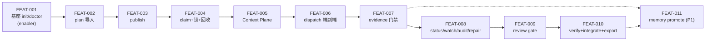

# 05-features — P5 交付目录

## Feature DAG（实现顺序权威，2026-07-10 开工前定稿）

主链线性（每个 FEAT 依赖前序的状态文件与原语）；FEAT-011 依赖 007/010，排 MVP 后首位。**无环**（G4-3）。执行纪律：按序单开、每个 FEAT 走满两阶段（代码+测试 → verification/知识/commit）、任一 gate FAIL 不进下一个。

**尚无 FEAT 开工**（P5 未开始；前置 = P1/P2 补齐，见 [../02-phases/progress.md](../02-phases/progress.md)）。

FEAT 清单与依赖：[../02-phases/P4-feature.md](../02-phases/P4-feature.md)（FEAT-001…011）。

每个 FEAT 开工时在此建 `FEAT-XXX/`，按 phase-5 标准产出：`README.md`、`mvp-scope.md`、`implementation-plan.md`（细粒度/高风险时）、失败测试先行、`verification.md`、`self-check.md`、`knowledge.md`，并回填 [../02-phases/traceability-matrix.md](../02-phases/traceability-matrix.md)。

实现代码就在本仓库（`Multi-Agent/sigmarun/`）根部生长：TS monorepo 按 [../20 §3](../20-c4-l2-l3-component-contracts.md) 建 `packages/` 九包；`05-features/` 与代码同库演进（2026-07-10 项目根建立，已就位）。
