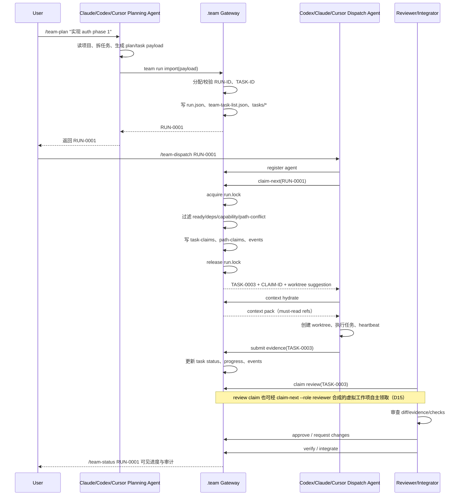
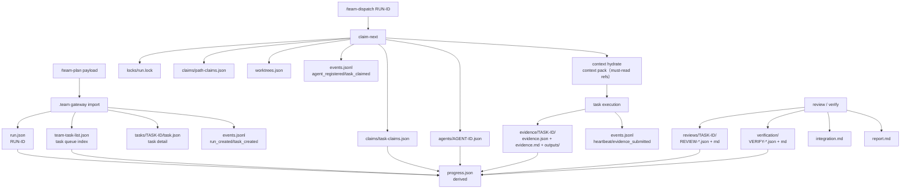
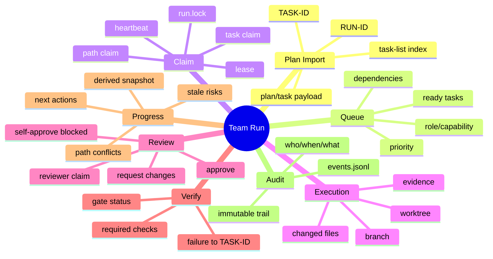
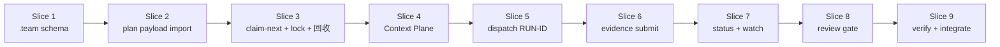

# 06. User Journey Visual Breakdown

> 目标：按用户旅途拆解 Team Run，不从内部对象出发。每一步都标清楚：用户做什么、Claude/Codex/Cursor 做什么、`.team gateway` 记录什么、产出什么 ID。

---

## 1. 总览：从计划到交付

```mermaid
flowchart LR
  U["User"] --> P["/team-plan goal<br/>in Claude Code"]
  P --> A1["Planning agent<br/>reads repo and breaks down work"]
  A1 --> G1[".team gateway<br/>imports run/task payload"]
  G1 --> R["RUN-ID"]
  R --> D["/team-dispatch RUN-ID<br/>in Codex / Claude / Cursor"]
  D --> G2[".team gateway<br/>claim-next with lock"]
  G2 --> T["TASK-ID + CLAIM-ID + WORKTREE"]
  T --> E["Agent executes task<br/>in isolated worktree"]
  E --> S["submit evidence"]
  S --> RV["review / verify / integrate"]
  RV --> REP["run report + progress + audit trail"]
```



最关键的产品动作：

- `/team-plan` 输出 `RUN-ID`，它是跨工具协作入口。
- `/team-dispatch RUN-ID` 输出 `TASK-ID`，它是当前 agent 的工作入口。
- `.team gateway` 不拆任务，只负责导入、记录、发布、认领、锁、审计和进度。

---

## 2. 泳道图：谁负责什么



---

## 3. 用户旅途拆解表

| 阶段 | 用户动作 | Coding Agent 做什么 | `.team gateway` 做什么 | 主要记录 | 输出 |
|---|---|---|---|---|---|
| 1. Plan | 在 Claude Code 输入 `/team-plan "目标"` | 读项目、拆任务、生成 plan/task payload | 导入 payload，分配/校验 ID，写 run/task list | `run.json`, `plan.md`, `team-task-list.json`, `tasks/*`, `events.jsonl` | `RUN-ID` |
| 2. Confirm / Publish | 用户确认任务图可以执行，`/team-publish RUN-ID` | 可根据反馈调整任务 payload | 将任务状态从 `draft/planned` 发布为 `ready` | `team-task-list.json`, `events.jsonl` | ready task queue |
| 3. Dispatch | 在 Codex 输入 `/team-dispatch RUN-ID` | 注册当前 agent，请求领取任务 | 加锁，执行 `claim-next`，写 task/path claim | `agents/*`, `task-claims.json`, `path-claims.json`, `events.jsonl` | `TASK-ID`, `CLAIM-ID` |
| 4. Execute | 用户等待或继续启动更多 agent | 创建 worktree，修改代码，heartbeat | 记录心跳和状态变化 | `agents/*`, `worktrees.json`, `events.jsonl` | working task |
| 5. Submit | agent 完成任务 | 收集 diff、测试、验收结果 | 接收 evidence，推进状态到 `submitted` | `evidence/TASK-ID/`（evidence.json + evidence.md + outputs/）, `team-task-list.json`, `events.jsonl` | submitted task |
| 6. Review | 用户或 reviewer agent 启动 review | 审查 diff/evidence/risk | 记录 review claim 和结果 | `reviews/TASK-ID/`（REVIEW-*.json + md，多轮）, `events.jsonl` | approved / changes requested |
| 7. Verify | 用户或 integrator 启动验证 | 跑 focused/full checks | 记录 gate 结果，映射失败到 TASK-ID | `verification/`（VERIFY-*.json + md）, `events.jsonl` | verified / failed |
| 8. Integrate | 用户触发集成 | 合并 worktree，处理冲突 | 记录 integration 状态和报告 | `integration.md`, `report.md`, `events.jsonl` | run report |
| 9. Status | 任意时候 `/team-status RUN-ID` | 不需要智能推理也可展示 | 从事实重算 progress | `progress.json` 可重建 | progress/risk/next actions |

---

## 4. `.team` 记录流



---

## 5. 任务队列在哪里

任务队列不是聊天上下文，也不是 dashboard 里的临时列表。它在：

```text
.team/runs/RUN-0001/team-task-list.json
```

它索引所有任务：

```text
RUN-0001
  team-task-list.json
    TASK-0001 ready
    TASK-0002 ready
    TASK-0003 claimed by AGENT-codex-001
    TASK-0004 blocked by TASK-0001
```

每个任务详情在：

```text
.team/runs/RUN-0001/tasks/TASK-0003/task.json
```

所有查询都围绕 ID：

```text
/team-status RUN-0001
/team-tasks RUN-0001
/team-task RUN-0001 TASK-0003
/team-evidence RUN-0001 TASK-0003
/team-review RUN-0001 TASK-0003
```

---

## 6. 从旅途反推需要的功能



---

## 7. MVP 主链路



（切片编号与 [05](05-mvp-feature-slices.md) 九切片对齐。）

MVP 判断标准：

> 一个 Claude Code 生成的 `RUN-ID`，能被 Codex 用 `/team-dispatch RUN-ID` 加入，并且 Codex 能领取唯一 `TASK-ID`、写回 evidence，用户能用 `/team-status RUN-ID` 查到可信 progress。

---

## 8. 还需要继续细拆的问题

> 以下问题在本文档写作时开放，现已全部被后续文档关闭，逐条标注归属。

1. `plan/task payload` 输入 schema：coding agent 提交给 `.team gateway` 的结构。——已由 [09](09-team-run-import-payload-schema.md) 关闭。
2. `claim-next` 选择算法：priority、依赖、capability、path conflict 怎么排序。——已由 [10](10-claim-next-lock-and-conflict-rules.md) §7 关闭。
3. path claim 粒度：glob、文件、模块、目录如何表达。——已由 [10](10-claim-next-lock-and-conflict-rules.md) §8 + D3（minimatch 语义）关闭。
4. evidence 最小格式：必须记录哪些命令、diff、验收和风险。——已由 [14](14-evidence-review-verification-contract.md) 关闭。
5. progress 派生规则：blocked/stale/reviewing 如何影响进度和风险。——已由 [15](15-run-task-state-machine-and-lifecycle.md) §3.4 + [02](02-domain-model-and-team-storage.md) 关闭。
6. review gate：MVP 是否强制 reviewer 不是 owner。——已由 D6 + [14](14-evidence-review-verification-contract.md) 关闭（require_review 默认开、policy 可关；self-approval 禁令不受开关影响）。
