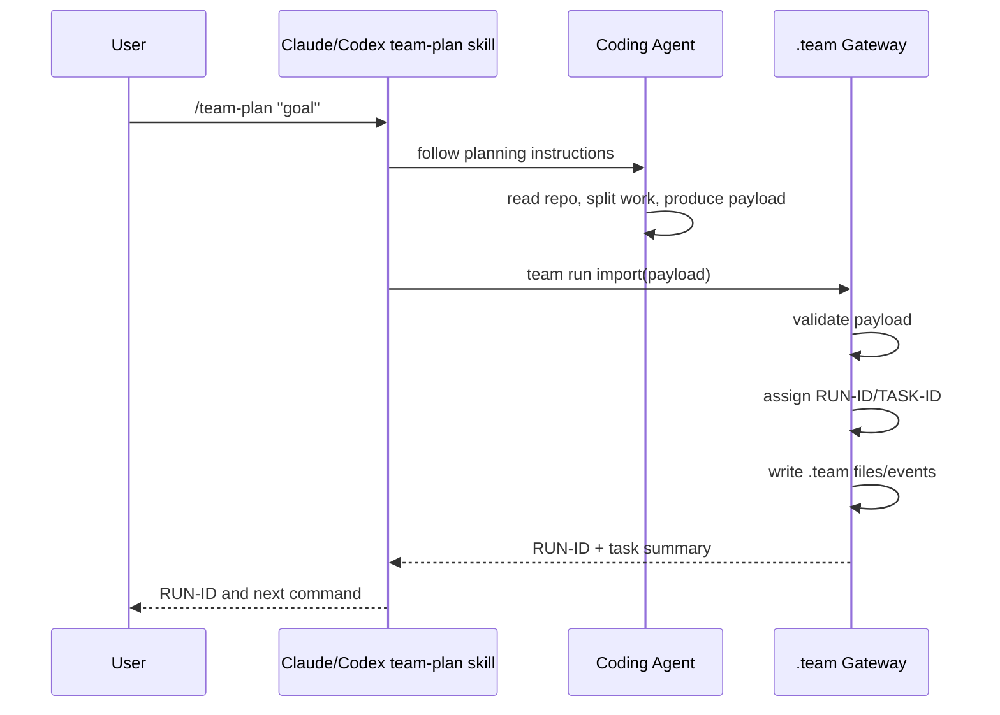
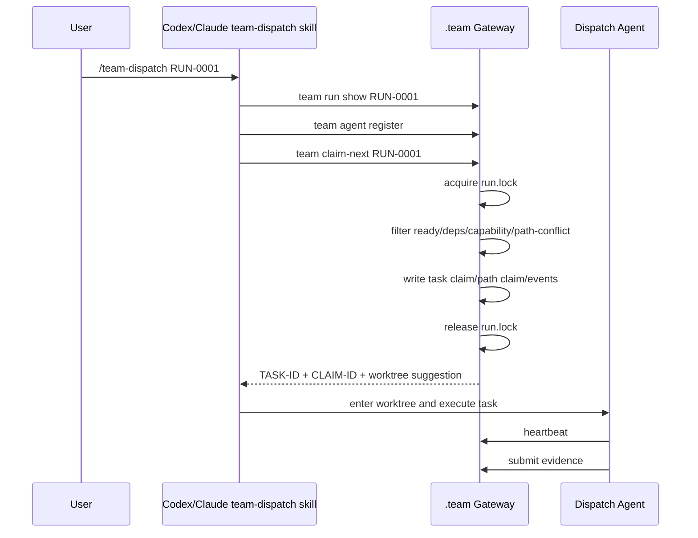

# 07. Skill / Plugin Execution Form

> 目标：说明 Team Run Protocol 如何被固定成 Claude Code、Codex、Cursor 都能执行的过程。结论：用 Skill/Slash Command 固定 agent 行为，用 `.team gateway` CLI/MCP 固定状态变更。

---

## 1. 核心结论

这个过程可以做成固定化工作流，但必须分三层：

```text
Agent Skill / Slash Command
  -> 约束 Claude Code / Codex / Cursor 怎么思考、怎么调用工具、什么时候停止

.team Gateway CLI / MCP
  -> 提供确定性原语：import run、claim-next、heartbeat、submit、review、progress

.team Files
  -> repo-local 事实源：run、task-list、claims、events、evidence、progress
```

Skill 不能保证并发安全，CLI/MCP gateway 才能保证并发安全。  
因此：**Skill 固定流程，gateway 固定状态。**

---

## 2. 推荐落地形态

**D1 已裁决：三个形态不是三选一，而是 A → B → C 演进路线**（[13](13-design-audit-and-next-breakdown.md) §2.1 D1；路线图与各阶段进入/退出判据详见 22 号 packaging 文档）。三个小节保留如下，作为各阶段的目标形状。

### 形态 A：最小本地版（MVP 阶段）

适合先验证产品链路。

```text
repo/
  .team/
  .claude/
    commands/
      team-plan.md
      team-dispatch.md
      team-status.md
      team-review.md
  AGENTS.md
  tools/
    team-gateway/
      team                 # CLI binary/script
```

特点：

- Claude Code 用 `.claude/commands/*.md` 固定 `/team-*` 命令。
- Codex 通过 prompt/skill 读取同一套协议，调用 `team` CLI。
- gateway CLI 写 `.team/`。
- 不需要先做 MCP server。

### 形态 B：插件版（分发期）

适合分发给多个项目。

```text
team-run-plugin/
  .codex-plugin/
    plugin.json
  skills/
    team-run-plan/
      SKILL.md
      references/
        payload-schema.md
    team-run-dispatch/
      SKILL.md
      references/
        dispatch-flow.md
    team-run-review/
      SKILL.md
  claude-code/
    commands/
      team-plan.md
      team-dispatch.md
      team-status.md
      team-review.md
  mcp/
    team-gateway-server    # 形态 C 预留：MVP 只随 17 §9 定契约，不实现 server（20 §2）
  scripts/
    team
```

特点：

- Codex 通过插件 skills 固定流程。
- Claude Code 通过 slash commands 固定流程。
- 两边都调用同一个 `.team gateway` CLI/MCP。
- 插件只负责安装命令、skill、MCP 配置，不替代项目内 `.team/`。

### 形态 C：MCP-first 版（强一致期）

适合需要结构化工具调用和更强一致性时。

```text
team-gateway-mcp tools:
  team_run_import(payload)
  team_run_show(run_id)
  team_task_list(run_id)
  team_claim_next(run_id, agent)
  team_heartbeat(run_id, task_id, agent)
  team_submit_evidence(run_id, task_id, evidence)
  team_review_task(run_id, task_id, decision)
  team_progress(run_id)
```

特点：

- agent 不直接编辑 `.team/`。
- 所有状态变更经过 MCP tool。
- 更适合 Claude Code / Codex 都能调用结构化工具的场景。

---

## 3. Claude Code 侧形式

Claude Code 可以使用 slash command 文件固定流程。

示例：

```text
.claude/commands/team-dispatch.md
```

内容应该类似：

```markdown
---
description: Join a Team Run and claim the next available task
allowed-tools: ["Bash", "Read", "Edit", "Write"]
argument-hint: <RUN-ID>
---

# Team Dispatch

You are joining an existing Team Run.

Input: `$ARGUMENTS` is the RUN-ID.

Required flow:

1. Run `team run show $ARGUMENTS`.
2. Register this Claude Code session with `team agent register`.
3. Run `team claim-next --run $ARGUMENTS`.
4. If no task is available, report the reason and stop.
5. If a task is claimed, read the returned task file.
6. After the claim, run `team context hydrate` and read all must-read context refs before editing.
7. Create or enter the suggested worktree.
8. Mark task `working`.
9. Implement only within claimed scope.
10. Post questions/blockers/context updates through `team message post`.
11. Heartbeat at natural pause points (after a test round, after finishing a file); other write primitives piggyback lease renewal.
12. Always finish with `team submit` — evidence with changed files, checks, and handoff memory. Submit is the non-skippable final step.
13. After submit, report the result and stop; wait for the user. Only claim another task if the user passed `--loop` (D5).

Never edit `.team/runs/*/claims/*.json` directly.
Never mark your own task as `done`.
```

Claude Code 的智能来自 Claude；命令文件只把过程钉住。

---

## 4. Codex 侧形式

Codex 更适合用 Skill / Plugin 固定过程。

示例：

```text
skills/team-run-dispatch/SKILL.md
```

```markdown
---
name: team-run-dispatch
description: Use when the user asks Codex to run `/team-dispatch <RUN-ID>`, join a `.team` Team Run, claim a task, work in the task worktree, and submit evidence.
---

# Team Run Dispatch

When triggered, follow this exact sequence:

1. Parse RUN-ID from the user message.
2. Inspect `.team/runs/<RUN-ID>/run.json`.
3. Register this Codex session through `team agent register`.
4. Claim work only through `team claim-next`.
5. If claim fails, report the gateway reason and stop.
6. If claim succeeds, read the task detail and path claim.
7. Hydrate context through `team context hydrate`.
8. Read upstream handoff, open questions, decisions, and risks before editing.
9. Create or enter the suggested worktree.
10. Work only on the claimed task.
11. Use `team message post` for questions, blockers, and context updates.
12. Use `team heartbeat` during long execution.
13. Use `team submit` to write evidence and handoff memory.

Do not directly mutate claim files.
Do not mark task done without review/verification.
```

Codex Skill 的重点不是写入状态，而是强制 Codex 调用 gateway 原语。

---

## 5. Skill 和 Gateway 的职责边界

| 能力 | Skill / Slash Command | `.team Gateway` |
|---|---|---|
| 读项目并拆任务 | yes，coding agent 做 | no |
| 生成 plan/task payload | yes | validate/import |
| 分配 `RUN-ID` / `TASK-ID` | request | yes |
| 发布任务队列 | request | yes |
| 原子认领任务 | no | yes |
| 文件锁 | no | yes |
| path claim 冲突检查 | no | yes |
| heartbeat | call | record |
| evidence 格式 | guide | validate/store |
| progress | read/report | derive |
| review gate | guide | enforce state transition |

---

## 6. `/team-plan` 固定流程



固定点：

- Skill 强制 agent 输出 payload，而不是直接开工。
- Gateway 强制 payload 变成 run/task-list，并返回 `RUN-ID`。
- User 拿 `RUN-ID` 去其他工具继续执行。

---

## 7. `/team-dispatch` 固定流程



固定点：

- Skill 不能跳过 `claim-next`。
- Skill 不能直接编辑 claims。
- Gateway 保证并发安全。
- 所有输出都围绕 `RUN-ID` / `TASK-ID`。

---

## 8. 推荐第一版插件/技能清单

### Claude Code commands（canonical 总表见 [04](04-command-workflows.md) §1.1）

```text
/team-plan <goal>
/team-publish <RUN-ID>
/team-dispatch <RUN-ID> [--role] [--loop]
/team-runs
/team-status <RUN-ID>
/team-tasks <RUN-ID>
/team-task <RUN-ID> <TASK-ID>
/team-evidence <RUN-ID> <TASK-ID>
/team-submit <RUN-ID> <TASK-ID>
/team-review <RUN-ID> <TASK-ID>
/team-verify <RUN-ID>
/team-integrate <RUN-ID>
```

### Codex skills

```text
team-run-plan
team-run-dispatch
team-run-status
team-run-review
```

### Gateway primitives

完整命令总表以 [17](17-cli-mcp-contract-and-error-model.md) §1 为准；此处只保留核心子集：

```text
team run import <payload>
team run show <RUN-ID>
team task list <RUN-ID>
team task show <RUN-ID> <TASK-ID>
team task publish <RUN-ID>
team agent register <RUN-ID>
team claim-next <RUN-ID>
team heartbeat <RUN-ID> <TASK-ID>
team submit <RUN-ID> <TASK-ID>
team progress <RUN-ID>
```

---

## 9. 当前阶段能做什么

现在就能做：

1. 先写 Claude Code command 文档，固定 `/team-plan` 和 `/team-dispatch` 行为。
2. 写 Codex Skill，触发 `/team-dispatch RUN-ID` 时按固定流程执行。
3. 实现一个最小 `team` CLI，先用本地 JSON 文件和 `mkdir lock` 做状态原语。
4. mcp-server 是同一 core 库的第二前端（[20](20-c4-l2-l3-component-contracts.md) §2），不是 CLI 的包装：MVP 只随 [17](17-cli-mcp-contract-and-error-model.md) §9 定 tool 面与 envelope 映射契约，不实现 server（形态 C）。

建议顺序：

```text
1. gateway CLI minimal primitives
2. Claude /team-plan command
3. Codex team-run-dispatch skill
4. status/progress command
5. review/verify skill
6. MCP server
```

---

## 10. 风险

| 风险 | 处理 |
|---|---|
| Skill 被 agent 忽略或自由发挥 | 把 claim/status/evidence 写入收口到 gateway primitive |
| 两个 agent 同时认领 | `run.lock` + atomic claim-next |
| agent 直接改 `.team` 状态 | Skill 明确禁止；gateway 可做 audit 检查 |
| Claude/Codex slash 命令能力不一致 | 抽象成同一套 gateway primitives，不强依赖同一种前端 |
| prompt 生成 payload 不稳定 | gateway 做 schema validation，失败则拒绝 import |
| Skill 解析 CLI 输出不稳定 | envelope 固定英文（D16），adapter 用 `--json` 解析并按 `next_actions` 驱动分支（[17](17-cli-mcp-contract-and-error-model.md) §2） |
