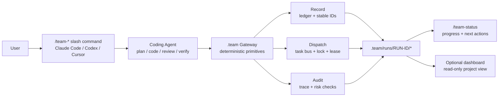
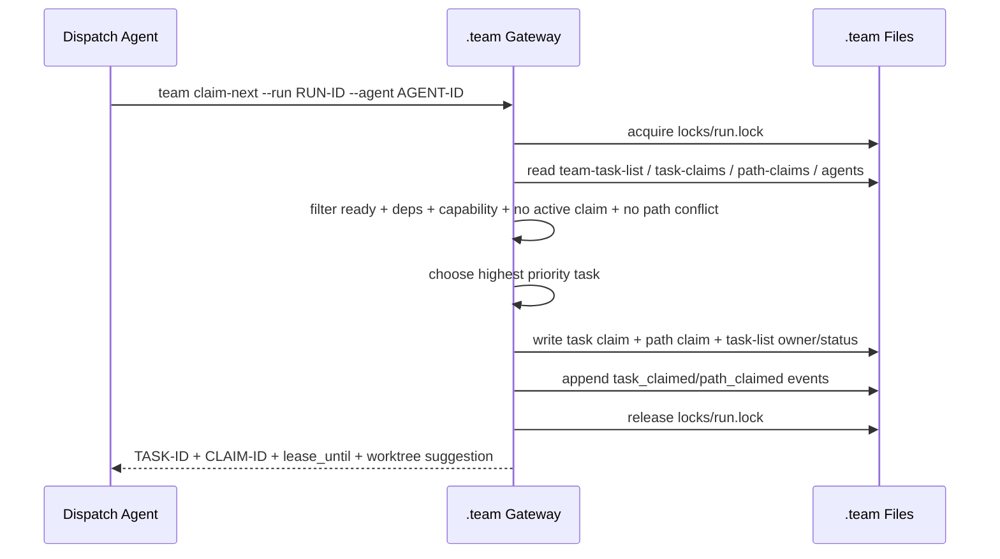

# 08. Core Gateway Capabilities: Record, Dispatch, Audit

> 目标：把 `.team gateway` 自己的产品能力拆清楚。Claude Code、Codex、Cursor 负责智能推理和软件工程判断；`.team gateway` 负责记录事实、分发任务、审计过程，并从事实中派生进度。

---

## 1. 产品契约

`.team gateway` 的核心不是“再造一个 coding agent”，而是给现有 coding agent 提供一组确定性工程协作原语：

```text
Record   -> 把 run、task、claim、evidence、review、verification 写成可追溯事实
Dispatch -> 把 team-task-list 变成可并发认领的任务队列
Audit    -> 检查事实链是否可信，发现冲突、遗漏、越界和伪完成
```

换句话说：

- `/team-plan` 里由 Claude Code / Codex / Cursor 拆任务，gateway 只负责导入、分配 ID、发布任务队列。
- `/team-dispatch RUN-ID` 里由当前 coding agent 执行任务，gateway 只负责注册、原子认领、路径占用、心跳、证据提交。
- `/team-review` 里由 reviewer agent 审查代码和证据，gateway 只负责记录 reviewer、结论、状态转换和审计约束。

---

## 2. 能力地图



Dashboard 只是展示层。它可以展示谁在做、进度如何、改了哪些文件、哪些 task 卡住了，但它不应该成为任务分发的权威入口。权威入口仍然是 slash command 调用 gateway primitive。

---

## 3. Capability A: Record

Record 是 `.team` 的账本能力。它回答：

```text
这次 run 是什么？
任务是谁拆出来的？
每个 TASK-ID 的目标、范围、验收标准是什么？
谁在什么时候领取了任务？
做了哪些改动、跑了哪些检查、谁 review 过？
```

### 3.1 记录对象

| 事实 | 主要文件 | 写入时机 |
|---|---|---|
| Run 元数据 | `run.json` | `team run import/create` |
| 计划说明 | `plan.md` | `/team-plan` 的 agent 输出后导入 |
| 任务队列索引 | `team-task-list.json` | 导入任务、发布、claim、status 变化 |
| 任务详情 | `tasks/TASK-ID/task.json`, `task.md` | 导入任务时 |
| Agent 会话 | `agents/AGENT-ID.json` | `/team-dispatch` 注册时 |
| Task claim | `claims/task-claims.json` | `claim-next` 成功时 |
| Path claim | `claims/path-claims.json` | `claim-next` 成功时 |
| Review claim | `claims/review-claims.json` | `team review claim` 或 `claim-next --role reviewer` 命中时（[14](14-evidence-review-verification-contract.md) §3.1） |
| Path approval | `claims/path-approvals.json` | `team approve-paths` 批准/拒绝时（[14](14-evidence-review-verification-contract.md) §5） |
| Worktree | `worktrees.json` | agent 创建/进入 worktree 时 |
| Evidence | `evidence/TASK-ID/evidence.json` + `evidence.md`（含 `outputs/`、`history/`） | `/team-submit` 时（目录化布局见 [14](14-evidence-review-verification-contract.md) §1） |
| Review | `reviews/TASK-ID/REVIEW-TASK-ID-NN.json` + `.md`（多轮各自成记录，永不覆盖） | `/team-review` 时 |
| Verification | `verification/VERIFY-*.json` + `.md`（`verification.md` 降级为派生索引） | `/team-verify` 时 |
| Integration | `integration.md`, `report.md` | `/team-integrate` 时 |
| ID 计数器 | `counters.json`（run 级；project 级 `.team/counters.json` 管 RUN-ID） | 锁内分配 ID 时递增（[17](17-cli-mcp-contract-and-error-model.md) §6） |
| 备份 | `.team/backup/<ts>/`（project 级） | `team migrate` / `team repair` 执行前自动备份（[21](21-schema-versioning-and-migration.md) §5） |
| Event stream | `events.jsonl` | 每次状态变化都追加 |

### 3.2 Record primitives

| Primitive | 输入 | 输出 | 说明 |
|---|---|---|---|
| `team run import` | planning agent 生成的 run/task payload | `RUN-ID` | 分配/校验 `RUN-ID`、`TASK-ID`，写入 run 和 task list |
| `team task publish` | `RUN-ID`, task filters | ready task count | 把确认后的任务从 `draft` 发布为 `ready` |
| `team agent register` | `RUN-ID`, tool, capabilities | `AGENT-ID` | 注册当前 Claude/Codex/Cursor 会话 |
| `team event append` | event payload | event id | 追加审计事件，通常由其他 primitive 内部调用 |
| `team evidence store` | `RUN-ID`, `TASK-ID`, evidence | evidence path | 存储实现证据并推进状态 |
| `team worktree register/adopt` | worktree 路径、branch | worktree entry | 登记/接管 worktree 事实到 `worktrees.json` |
| `team export` | `RUN-ID`、目标目录 | 导出目录路径 | 把 run 的 plan/evidence/reviews/report 导出为可入库留档（D4 配套） |

Record 相关命令的完整清单与读/写、锁标注以 [17](17-cli-mcp-contract-and-error-model.md) §1 命令总表为准。

### 3.3 Record 不变量

1. `RUN-ID` 是跨工具协作入口，必须稳定。
2. `TASK-ID` 是执行、查询、review、evidence 的基本单位，不能只存在聊天上下文里。
3. 所有状态变化必须追加 `events.jsonl`。
4. `team-task-list.json` 是索引，不替代 `tasks/TASK-ID/task.json`。
5. `progress.json` 是派生视图，不是权威事实源。
6. Agent 不应该直接改 `claims/*`、`progress.json` 或别人的 evidence/review 记录。

---

## 4. Capability B: Dispatch

Dispatch 是 `.team` 的任务总线能力。它回答：

```text
RUN-0001 现在有哪些任务可以做？
当前 agent 能领哪个 TASK-ID？
这个 task 有没有被别人领？
它要改的路径会不会和别人冲突？
如果 agent 掉线，这个 task 什么时候能被回收？
```

这里的分发不是中心强派，而是：

```text
published task queue + pull-based claim-next + short lock + lease/heartbeat
```

### 4.1 `claim-next` 主流程



`run.lock` 只保护这段短事务。真正的任务执行不持有文件锁，而是靠 lease 和 heartbeat 表示活跃状态。

### 4.2 可领取条件

一个 task 能被 `claim-next` 领取，需要同时满足：

| 条件 | 说明 |
|---|---|
| `status == ready` | 只有发布后的任务可领取 |
| `depends_on` 已满足 | 前置任务 `done`，或 policy 允许并行探索 |
| role/capability 匹配 | 例如 implementation / review / verification |
| 没有有效 task claim | 防止两个 agent 做同一个 task |
| 没有 path claim 冲突 | 防止两个 agent 同时改同一范围 |
| 未被 block | blocker 未解除前不可领取 |
| run 未暂停 | 用户可暂停整个 run |

### 4.3 选择策略

MVP 可以采用简单排序：

```text
claimable tasks
  -> priority desc
  -> dependency depth asc
  -> weight desc
  -> created_at asc
```

后续可以加更智能的策略，比如按 agent capability、历史成功率、文件热区、任务粒度自动推荐。但这些策略仍然只是选择可领取任务，不应该变成 gateway 自己拆任务或写代码。

### 4.4 锁、租约和心跳

| 概念 | 作用 | MVP 规则 |
|---|---|---|
| `run.lock` | 保护状态写入短事务 | 只在 claim/status/path update 时持有 |
| Task lease | 表示 task 被某 agent 暂时占用 | 默认 30 分钟，可 heartbeat 延长 |
| Heartbeat | 表示 agent 仍在工作 | 更新 `agents/AGENT-ID.json` 和 claim lease |
| Stale claim | lease 过期或 agent 长时间无心跳 | `/team-status` 标为风险，需 reclaim |
| Reclaim | 回收 stale task | MVP 可要求用户确认，避免覆盖未提交改动 |

### 4.5 Path claim

Path claim 是工程冲突控制的关键。它不是简单的“文件锁”，而是 task 对修改范围的声明。

```json
{
  "claim_id": "CLAIM-path-0007",
  "run_id": "RUN-0001",
  "task_id": "TASK-0003",
  "agent_id": "AGENT-codex-001",
  "paths": {
    "allow": ["src/auth/**", "tests/auth/**"],
    "avoid": ["package-lock.json"],
    "requires_approval": ["src/users/**"]
  },
  "lease_until": "2026-07-09T14:40:00+08:00"
}
```

冲突策略建议分三档：

| 策略 | 行为 | 适合场景 |
|---|---|---|
| `block` | 有重叠就不允许领取 | MVP 默认，最安全 |
| `warn` | 允许领取但记录 risk | 文档、测试、低风险探索 |
| `override` | 用户或 integrator 显式允许 | 紧急修复或集成阶段 |

### 4.6 Dispatch 失败也要有结构化原因

`claim-next` 失败不是一句“没有任务”。它应该返回可行动原因：

```json
{
  "ok": false,
  "reason": "path_conflict",
  "run_id": "RUN-0001",
  "blocked_by": {
    "task_id": "TASK-0002",
    "agent_id": "AGENT-claude-001",
    "paths": ["src/auth/**"]
  },
  "next_actions": [
    "try another role",
    "wait for TASK-0002 submit",
    "ask user to override path claim"
  ]
}
```

这会直接改善用户旅途：用户知道为什么当前 Codex 没有开始干活，而不是误以为工具坏了。

本节的结构化失败返回已全局化为 [17](17-cli-mcp-contract-and-error-model.md) §2 的统一 envelope（`ok`/`code`/`data`/`next_actions`，本例的 `reason` 字段在 envelope 中统一为 `code`），适用于全部命令；且 `message`/`next_actions` 一律英文（D16），人读中文文案由 adapter/dashboard 层本地化。

---

## 5. Capability C: Audit

Audit 是 `.team` 的可信过程检查能力。它回答：

```text
这个 run 的过程可信吗？
有没有两个 agent 做了同一个 task？
有没有 agent 改了未声明路径？
有没有 evidence 缺失、review 缺失、自己 approve 自己？
progress 是不是和事实一致？
```

### 5.1 Audit 输入

Audit 不依赖聊天上下文，而是读取 `.team` 事实源：

- `run.json`
- `team-task-list.json`
- `tasks/*/task.json`
- `agents/*.json`
- `claims/task-claims.json`
- `claims/path-claims.json`
- `claims/review-claims.json`
- `claims/path-approvals.json`
- `worktrees.json`
- `counters.json`
- `evidence/*/evidence.json`（及 `outputs/`）
- `reviews/*/REVIEW-*.json`
- `verification/VERIFY-*.json`
- `integration.md`
- `events.jsonl`

### 5.2 Audit primitives

| Primitive | 目标 |
|---|---|
| `team audit run RUN-ID` | 检查整个 run 的一致性和风险 |
| `team audit task RUN-ID TASK-ID` | 检查单 task 的 claim/evidence/review/verification |
| `team audit claims RUN-ID` | 检查重复 claim、过期 lease、stale agent |
| `team audit paths RUN-ID` | 检查 path overlap 和 out-of-scope changes |
| `team audit evidence RUN-ID` | 检查 evidence 是否覆盖 acceptance 和 checks |
| `team audit progress RUN-ID` | 检查 progress 是否能从事实重建 |

### 5.3 Audit 检查项

> 下表是示例子集；完整规则目录（AUD-001…AUD-040，含字段级触发条件、修复建议与依赖事件）以 [18](18-audit-rule-catalog-and-trust-model.md) §4 为准。

| 检查 | 发现的问题 | 严重度建议 |
|---|---|---|
| Duplicate active task claim | 同一 task 被多个 agent 有效领取 | error |
| Active path conflict | 多个 task 同时声明重叠修改范围 | error/warn |
| Stale lease | agent 心跳过期但 task 仍 working | warn |
| Missing evidence | task submitted/approved 但无 evidence | error |
| Self approval | owner agent approve 自己的 task | error |
| Missing verification | task/run integrated 前未验证 | error |
| Out-of-scope change | changed files 超出 `paths.allow` | warn/error |
| Progress mismatch | `progress.json` 与事实重算不一致 | warn |
| Dangling dependency | task 依赖不存在或形成环 | error |
| Event gap | 状态变化没有对应 event | error（[15](15-run-task-state-machine-and-lifecycle.md) 通用原则 1：无事件的转换 = audit error） |

### 5.4 Audit 输出

Audit 输出要同时服务 slash command 和 dashboard，所以建议有结构化 JSON 和 Markdown 两种形式。

```json
{
  "run_id": "RUN-0001",
  "status": "warn",
  "summary": {
    "errors": 1,
    "warnings": 2
  },
  "findings": [
    {
      "severity": "error",
      "kind": "missing_evidence",
      "task_id": "TASK-0003",
      "message": "TASK-0003 is submitted but evidence/TASK-0003/evidence.json is missing",
      "next_action": "ask owner agent to run /team-submit RUN-0001 TASK-0003"
    }
  ]
}
```

---

## 6. Progress 是派生产品视图

Project progress 不是 agent 手写一句“完成 80%”。它应该从事实派生：

```text
run progress =
  weighted task status
  + active/stale agent health
  + review/verification gate state
  + blocker/risk count
```

### 6.1 `/team-status RUN-ID` 应展示

| 区块 | 内容 |
|---|---|
| Run summary | title、status、base branch、created_by |
| **Needs user** | 待你处理收件箱（[13](13-design-audit-and-next-breakdown.md) 附录 C M32）：待批准路径请求、open blocker、D5 停等确认、manual reclaim 确认、等 review 的 submitted 任务——每项含等待时长与可复制命令 |
| Task progress | total、ready、working、submitted、reviewing、done、blocked（stale 是 Claims 的派生风险标注，不是任务状态，[15](15-run-task-state-machine-and-lifecycle.md) §3.1） |
| Agent activity | active agents、current task、last heartbeat |
| Claims | active task claims、path claims、lease_until |
| Evidence | submitted tasks、missing evidence |
| Review | waiting review、approved、changes requested |
| Verification | checks passed/failed/not run |
| Risks | stale lease、path conflict、self approval、out-of-scope |
| Next actions | 可以继续执行的命令 |

### 6.2 Dashboard 的定位

Dashboard 如果做，应该读取同一套数据并做可视化：

```text
左侧：RUN 列表 / TASK 列表
中间：进度、泳道、agent activity
右侧：当前 task 的 evidence / diff / review / events
```

但 dashboard 不负责“派活”。派活仍然通过 `/team-dispatch RUN-ID -> claim-next` 完成。Dashboard 最多提供复制命令、查看详情、触发只读刷新。页面规格、read-model 聚合、只读边界与刷新模型的完整信息架构以 [23](23-dashboard-information-architecture.md) 为准。

---

## 7. MVP 命令面

先把 gateway primitive 做小而硬：

| 命令 | 必须支持 | 归属能力 |
|---|---|---|
| `team run import` | 导入 agent 生成的 plan/task payload，返回 `RUN-ID` | Record |
| `team run show` | 展示 run 元数据和 task summary | Record |
| `team task list` | 列出 run 内任务和状态 | Record/Progress |
| `team task show` | 展示单个 `TASK-ID` 的全部事实 | Record/Audit |
| `team agent register` | 注册当前工具会话 | Record/Dispatch |
| `team claim-next` | 原子领取下一个可做任务 | Dispatch |
| `team heartbeat` | 刷新 agent 和 claim lease | Dispatch |
| `team submit` | 存 evidence，推进到 `submitted` | Record/Audit |
| `team review` | 写 review 记录和状态转换 | Audit |
| `team verify` | 写 verification 记录 | Audit |
| `team progress` | 从事实重算 `progress.json` | Progress |
| `team audit` | 输出 run/task 审计报告 | Audit |
| `team task publish` | 把确认后的任务从 `draft` 发布为 `ready`，首次发布激活 run | Record |
| `team release` | 主动归还任务回 `ready`，保留 previous_attempts | Dispatch |
| `team reclaim` | 回收 stale claim（manual 策略需用户确认） | Dispatch |
| `team unblock` | blocker 解除后任务恢复 `working` | Dispatch |
| `team approve-paths` | 批准/拒绝 `requires_approval` 路径 | Dispatch |
| `team worktree register/adopt` | 登记/接管 worktree 事实 | Record |
| `team run pause/resume/cancel` | run 生命周期控制（暂停/恢复/取消） | Dispatch |
| `team run archive` | run 归档为只读终态 | Record |
| `team export` | 导出 run 留档报告到可入库目录 | Record |
| `team watch` | 只读巡检器：周期触发 sweep 并刷新可见性（D14） | Progress |
| `team repair` | 对照事件账本对状态文件前滚/回滚（M30） | 运维 |

命令总表（含读/写、锁、MVP 标注与 envelope 合同）以 [17](17-cli-mcp-contract-and-error-model.md) §1 为准。上层 slash command 只是在不同 coding agent 中把这些 primitive 串成固定过程。

---

## 8. MVP 验收标准

这一层可以用非常具体的场景验收：

| 场景 | 预期 |
|---|---|
| Claude Code 执行 `/team-plan` | gateway 生成 `RUN-ID`、`team-task-list.json`、稳定 `TASK-ID` |
| Codex 和 Claude 同时 `/team-dispatch RUN-ID` | 两个 agent 不能拿到同一个 active task claim |
| 两个 task 的 `paths.allow` 重叠 | `claim-next` 默认阻断第二个领取，并返回 conflict 原因 |
| agent 执行中断且无 heartbeat | `/team-status` 标记 stale risk，不静默当作完成 |
| task submitted 但缺 `evidence/TASK-ID/evidence.json` | `team audit task` 报 error |
| owner agent 尝试 approve 自己的 task | `team review` 阻断或 `team audit` 报 error |
| progress 文件被手改 | `team progress` 可从事实重建，`team audit progress` 可发现 mismatch |
| 用户只知道 `RUN-ID` | 能通过 status/list/task/audit 找到所有 task、owner、证据和风险 |

如果这些场景成立，说明产品骨架已经成立：多 agent 可以并行，但过程不是散落在聊天记录里，而是落在 `.team` 的事实链里。

---

## 9. 继续细拆的问题

下一步应该继续拆这些更细的工程契约：

1. `team run import` 的 payload schema：coding agent 到 gateway 的输入合同。
2. `claim-next` 的锁实现和原子写入策略：文件锁、临时文件、rename、崩溃恢复。
3. path conflict 算法：glob overlap、文件级精度、允许误报还是允许漏报。
4. evidence schema：changed files、checks、acceptance、risks、deviations 的最小格式。
5. audit rule catalog：每条审计规则的输入、输出、严重度、修复建议。
6. stale/reclaim 策略：何时自动回收，何时必须用户确认。
7. slash command/skill 的最小可运行模板：Claude Code、Codex、Cursor 各自怎么固定流程。
