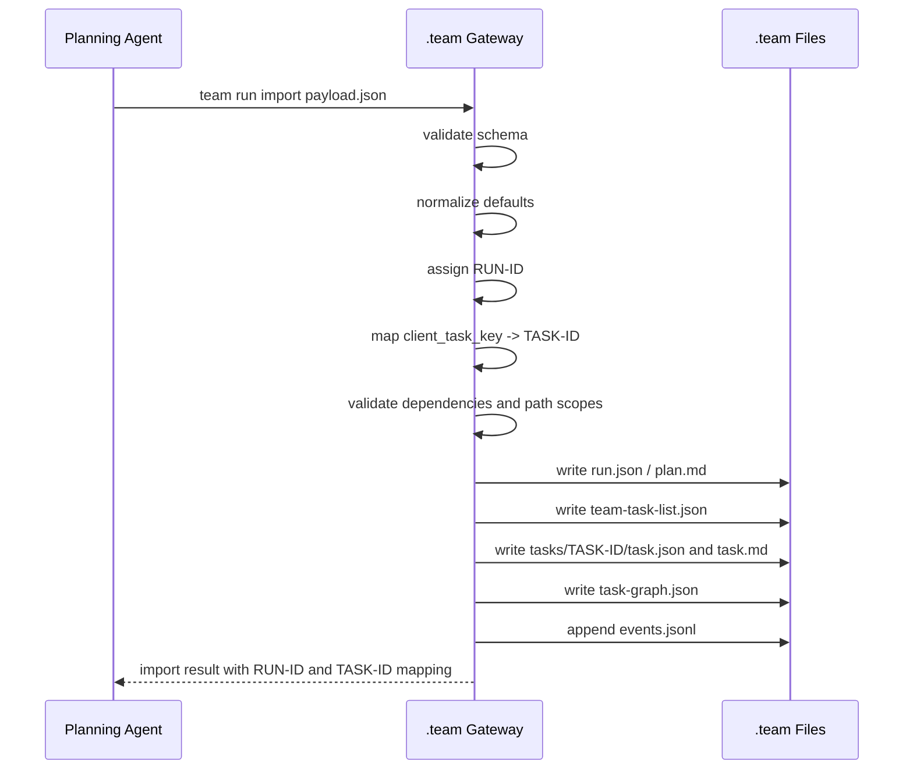

# 09. `team run import` Payload Schema

> 目标：定义 `/team-plan` 这类 planning slash command 和 `.team gateway` 之间的输入合同。任务由 Claude Code、Codex、Cursor 拆解；gateway 只负责校验、分配 ID、记录、发布。

---

## 1. 为什么先拆 payload

整个产品链路里，最容易混乱的一步是：

```text
/team-plan "目标"
  -> coding agent 读项目、拆任务
  -> gateway 生成 RUN-ID 和 TASK-ID
```

这里必须明确：**planning agent 输出的是 plan/task payload，不是直接写 `.team/` 的最终状态。**  
`.team gateway` 接收 payload 后，才分配稳定 ID，写入 `run.json`、`team-task-list.json`、`tasks/*` 和 `events.jsonl`。

这样可以避免三个问题：

1. 不同工具生成的任务格式不一致。
2. agent 自己编 `TASK-ID` 导致冲突。
3. 任务队列散落在聊天记录里，后续 Codex/Cursor 无法领取。

---

## 2. 边界

### Planning agent 负责

- 读项目上下文。
- 理解用户目标。
- 按软件工程流程拆任务。
- 识别依赖、风险、修改范围、验收标准。
- 生成符合 schema 的 payload。

### `.team gateway` 负责

- 校验 payload。
- 分配或校验 `RUN-ID`。
- 分配稳定 `TASK-ID`。
- 生成 `team-task-list.json`。
- 写 `tasks/TASK-ID/task.json` 和 `task.md`。
- 写 `task-graph.json`。
- 写 `events.jsonl`。
- 返回 import result。

### Gateway 不负责

- 不读项目来重新拆任务。
- 不判断代码应该怎么写。
- 不 claim task。
- 不创建 worktree。
- 不写 evidence/review/verification。

---

## 3. Payload 顶层结构

```json
{
  "schema_version": "team.plan_payload.v1",
  "source": {},
  "run": {},
  "plan": {},
  "tasks": [],
  "task_graph": [],
  "publication": {}
}
```

| 字段 | 必填 | 说明 |
|---|---|---|
| `schema_version` | yes | 当前固定为 `team.plan_payload.v1` |
| `source` | yes | 哪个工具、哪个命令、哪个 agent 生成了 payload |
| `run` | yes | run 级目标、模式、策略 |
| `plan` | yes | 给人和 agent 读的总体计划 |
| `tasks` | yes | planning agent 拆出的任务数组 |
| `task_graph` | no | 任务依赖边，gateway 也可从 `tasks.depends_on` 派生 |
| `publication` | no | 导入后是否直接发布为 `ready` |

---

## 4. 完整示例

Planning agent 可以先生成临时 `client_task_key`。Gateway import 成功后再映射到稳定 `TASK-ID`。

```json
{
  "schema_version": "team.plan_payload.v1",
  "source": {
    "tool": "claude-code",
    "command": "/team-plan",
    "agent_id": "AGENT-claude-planner-local",
    "prompt": "实现 auth phase 1",
    "created_at": "2026-07-09T15:00:00+08:00"
  },
  "run": {
    "title": "Implement auth phase 1",
    "mode": "feature",
    "goal": "Add the first usable auth slice without changing unrelated modules.",
    "base_branch": "main",
    // worktree_root 省略：payload 提交时 RUN-ID 尚未分配，不应包含 RUN-ID 派生路径；该字段由 gateway 按 project config 生成（13 号 E4）
    "policy": {
      "claim_ttl_minutes": 30,
      "max_parallel_tasks": 4,
      "path_conflict_policy": "block",
      "require_review": true,
      "require_verification": true
    }
  },
  "plan": {
    "summary": "Build auth domain model, persistence, API tests, then integration verification.",
    "assumptions": [
      "Existing user persistence can be reused.",
      "Phase 1 does not add OAuth or password reset."
    ],
    "non_goals": [
      "Do not refactor all user modules.",
      "Do not change deployment configuration."
    ],
    "risks": [
      "Auth changes may touch shared user code."
    ]
  },
  "tasks": [
    {
      "client_task_key": "auth-domain",
      "title": "Add auth domain model",
      "type": "implementation",
      "objective": "Create domain types for auth users and sessions.",
      "context": [
        "Keep the model independent from API handlers."
      ],
      "acceptance": [
        "AuthUser and Session domain types exist.",
        "Focused tests cover construction and validation.",
        "No unrelated formatting churn."
      ],
      "depends_on": [],
      "priority": 90,
      "weight": 2,
      "suggested_role": "implementer",
      "paths": {
        "allow": ["src/auth/**", "tests/auth/**"],
        "avoid": ["package-lock.json"],
        "requires_approval": ["src/users/**"]
      },
      "required_checks": ["npm test -- auth"],
      "review": {
        "required": true,
        "focus": ["domain boundaries", "test coverage", "no unrelated changes"]
      }
    },
    {
      "client_task_key": "auth-api-tests",
      "title": "Add auth API tests",
      "type": "implementation",
      "objective": "Add API-level tests for login/session behavior.",
      "context": [
        "Use the domain model from auth-domain."
      ],
      "acceptance": [
        "API tests cover successful login.",
        "API tests cover invalid credentials.",
        "Tests fail before implementation and pass after."
      ],
      "depends_on": ["auth-domain"],
      "priority": 80,
      "weight": 2,
      "suggested_role": "implementer",
      "paths": {
        "allow": ["tests/api/auth/**", "src/api/auth/**"],
        "avoid": ["src/users/**"]
      },
      "required_checks": ["npm test -- auth-api"],
      "review": {
        "required": true,
        "focus": ["behavior coverage", "error paths"]
      }
    }
  ],
  "task_graph": [
    {
      "from": "auth-domain",
      "to": "auth-api-tests",
      "kind": "blocks"
    }
  ],
  "publication": {
    "initial_status": "draft",
    "requires_user_confirm": true
  }
}
```

---

## 5. 字段细则

### 5.1 `source`

| 字段 | 必填 | 说明 |
|---|---|---|
| `tool` | yes | `claude-code` / `codex` / `cursor` / `unknown` |
| `command` | yes | 通常是 `/team-plan` |
| `agent_id` | no | planner 侧已有 agent id 时填写；gateway 可重新注册 |
| `prompt` | yes | 用户原始目标 |
| `created_at` | no | ISO timestamp，缺省由 gateway 写入 |

### 5.2 `run`

| 字段 | 必填 | 说明 |
|---|---|---|
| `title` | yes | run 短标题 |
| `mode` | yes | `feature` / `bugfix` / `review` / `integration` / `spike` / `docs` |
| `goal` | yes | run 的可读目标 |
| `base_branch` | no | 缺省使用 project config |
| `worktree_root` | no | 可由 gateway 按 project config 生成 |
| `policy` | no | review、verification、claim ttl、path policy 等 |
| `policy.reclaim_policy` | no | 缺省 `{"auto_after_ttl_multiple": 3}`：claim 过期超过 3×TTL 由下一次 sweep 自动回收；设 `"manual"` 则只标 risk（[15](15-run-task-state-machine-and-lifecycle.md) §5.2） |
| `policy.path_release_on_submit` | no | 缺省 `hold`：submit 后 path claim 保持 block 级直到 integrated，保证返工环无缝；`downgrade` 为显式 opt-in（[15](15-run-task-state-machine-and-lifecycle.md) §4.2） |
| `policy.max_active_claims_per_agent` | no | 缺省 `1`：同一 agent 的并发 active claim 上限（[13](13-design-audit-and-next-breakdown.md) 附录 C M36） |
| `policy.cross_run_path_policy` | no | 缺省 `warn`：与其他 active run 的 paths 交集只警告（D7）；设 `block` 则 publish 与 claim-next 硬阻断（`cross_run_conflict`，D18） |

`policy` 只能给默认值，不允许绕过 gateway 不变量。例如 payload 不能设置 `allow_self_approval: true`。

**import 防重（D17）**：gateway 对 payload 规范化后计算内容哈希，存入 `run.json.source.payload_hash`；再次 import 相同哈希的 payload → 警告"identical payload already imported as RUN-xxxx"并默认拒绝，`--force` 可显式创建重复 run。防的是同一份计划被误跑两次造成的交叉运行。

### 5.3 `plan`

| 字段 | 必填 | 说明 |
|---|---|---|
| `summary` | yes | 总体方案 |
| `assumptions` | no | 计划依赖的假设 |
| `non_goals` | no | 明确不做什么 |
| `risks` | no | 已知风险 |
| `notes` | no | 其他上下文 |

`plan` 主要写入 `plan.md`，也会被 `/team-status` 和 dashboard 摘要展示。

### 5.4 `tasks[]`

| 字段 | 必填 | 说明 |
|---|---|---|
| `client_task_key` | yes | payload 内临时 key，gateway 用它映射稳定 `TASK-ID` |
| `title` | yes | task 短标题 |
| `type` | yes | `implementation` / `investigation` / `review` / `verification` / `integration` / `docs` |
| `objective` | yes | 任务目标 |
| `context` | no | agent 执行所需上下文 |
| `acceptance` | yes | 验收标准，至少一条 |
| `depends_on` | no | 依赖的 `client_task_key` |
| `priority` | no | 缺省 50，范围 0-100 |
| `weight` | no | progress 权重，缺省 1 |
| `suggested_role` | no | 推荐 agent role |
| `paths` | no | 推荐修改范围 |
| `required_checks` | no | task 级检查命令 |
| `review` | no | review 是否需要、关注点 |

`client_task_key` 的存在很重要：planning agent 可以用自然稳定的 key 表达依赖，gateway 再统一生成 `TASK-0001`。

### 5.5 `paths`

| 字段 | 说明 |
|---|---|
| `allow` | task 推荐修改范围，通常是 glob |
| `avoid` | 不建议修改的路径 |
| `requires_approval` | 修改前需要用户或 integrator 确认的路径 |

MVP 中 `paths.allow` 可以为空，但会降低 path conflict 的效果。`/team-status` 应把无 path scope 的 task 标成风险或提示。

### 5.6 `publication`

| 字段 | 缺省 | 说明 |
|---|---|---|
| `initial_status` | `draft` | `draft` 或 `ready` |
| `requires_user_confirm` | `true` | 是否要求用户确认后再发布 |

推荐默认导入为 `draft`，用户确认后再 `team task publish`。如果是小型 run，可以允许 `/team-plan --publish` 直接发布为 `ready`。

---

## 6. Gateway import 流程



---

## 7. Import result

Gateway 返回值必须让用户和其他工具能继续执行。

```json
{
  "ok": true,
  "run_id": "RUN-0001",
  "status": "draft",
  "task_count": 2,
  "task_id_map": [
    {
      "client_task_key": "auth-domain",
      "task_id": "TASK-0001",
      "title": "Add auth domain model"
    },
    {
      "client_task_key": "auth-api-tests",
      "task_id": "TASK-0002",
      "title": "Add auth API tests"
    }
  ],
  "next_actions": [
    "Review .team/runs/RUN-0001/plan.md",
    "Publish tasks with team task publish RUN-0001",
    "Start an agent with /team-dispatch RUN-0001"
  ]
}
```

如果导入时选择直接发布：

```json
{
  "ok": true,
  "run_id": "RUN-0001",
  "status": "ready",
  "task_count": 2,
  "next_actions": [
    "/team-dispatch RUN-0001"
  ]
}
```

---

## 8. 校验规则

### 8.1 必须报错

| 错误 | 原因 |
|---|---|
| `schema_version` 不支持 | gateway 不知道如何解释 payload |
| `tasks` 为空 | 没有可记录的任务队列 |
| `client_task_key` 重复 | 依赖映射会冲突 |
| `depends_on` 指向不存在的 key | 任务图不完整 |
| task 缺少 `title` / `objective` / `acceptance` | 无法作为工程任务执行 |
| `priority` 超出范围 | 排序不可预期 |
| `weight <= 0` | progress 无法计算 |
| path 是 repo 外绝对路径 | 可能越界修改 |
| payload 试图写 `owner_agent_id` / `claim_id` | planner 不能伪造运行态 |

### 8.2 应该警告

| 警告 | 原因 |
|---|---|
| task 没有 `paths.allow` | path conflict 难以阻断 |
| task 没有 `required_checks` | verification 不明确 |
| task acceptance 过于泛化 | review 难以判断完成 |
| 单 task 权重过大且路径过宽 | 可能需要继续拆分 |
| dependency graph 太串行 | 并行收益低 |
| 太多 task 同时触碰同一模块 | 需要人工确认 path policy |
| `prompt` / `context` 文本命中 secret 模式 | 凭据可能被写入 plan.md / task.md；import 阶段 warn-only、不改写用户原文，提示改写后重导（[24](24-security-permissions-and-data-hygiene.md) §4.1） |

---

## 9. 不允许出现在 import payload 里的字段

这些字段只能由 gateway primitive 或后续流程产生：

| 字段 | 原因 |
|---|---|
| `run_id` | 由 gateway 分配，除非 import 支持显式恢复模式 |
| `task_id` | 由 gateway 分配 |
| `owner_agent_id` | 由 `claim-next` 写入 |
| `claim_id` | 由 `claim-next` 写入 |
| `status` 超出 `draft/ready` | planning 阶段不能伪造执行进度 |
| `progress` | 由事实派生 |
| `evidence` | 执行完成后由 `/team-submit` 写 |
| `review_result` | review 阶段写 |
| `verification_result` | verify 阶段写 |
| `integration_result` | integrate 阶段写 |

这条边界非常重要：payload 是“计划”，不是“完成记录”。

---

## 10. 软件工程拆任务质量要求

Gateway 不负责拆任务，但可以校验 payload 是否像一个可执行的软件工程计划。

每个 implementation task 最好满足：

1. 有明确目标，不是“优化项目”这种泛任务。
2. 有验收标准，reviewer 能判断是否完成。
3. 有推荐路径范围，便于 path claim 防冲突。
4. 有必要的 checks，便于 verification。
5. 有依赖关系，便于并行调度。
6. 粒度适合一个 agent 在一个 worktree 中完成。

一个健康的 run 通常包含：

```text
investigation / design clarification
implementation tasks
test tasks
review tasks or review gates
verification / integration task
```

但 review/verification 不一定必须作为普通 task，也可以作为状态机 gate。MVP 建议先用 gate，后续再把大型 review/integration 拆成 task。

---

## 11. 对 slash command 的要求

`/team-plan` 的固定流程应该是：

```text
1. 读用户目标。
2. 读项目上下文。
3. 生成 plan/task payload。
4. 调用 team run import。
5. 展示 RUN-ID、task summary、warnings、next actions。
6. 不直接开始实现。
```

返回给用户的内容应该像：

```text
Created RUN-0001: Implement auth phase 1
Status: draft

Tasks:
- TASK-0001 Add auth domain model
- TASK-0002 Add auth API tests

Warnings:
- TASK-0002 has broad path scope: src/api/auth/**

Next:
team task publish RUN-0001
/team-dispatch RUN-0001
```

这样用户可以在 Claude Code 里完成计划，然后去 Codex 执行 `/team-dispatch RUN-0001`。

---

## 12. 继续细拆的问题

以下问题已全部裁决关闭：

1. `team run import` 是否允许恢复已有 `RUN-ID`，还是只允许新建。**已关闭：只允许新建**——import 不支持恢复已有 `RUN-ID`；跨版本恢复由 [21](21-schema-versioning-and-migration.md) 的 `team migrate` 覆盖。
2. `publication.initial_status=ready` 是否需要用户确认。**已关闭：** `initial_status=ready` 必须由 `/team-plan --publish` 显式开启且 `requires_user_confirm=false`；默认仍是 `draft` + `/team-publish` 用户确认（[15](15-run-task-state-machine-and-lifecycle.md) §6）。
3. `client_task_key` 是否保存在最终 task metadata 中，便于追溯原始计划。**已关闭：是**，保留进 task metadata，便于追溯原始计划。
4. path glob 使用哪套语义。**已关闭：minimatch**（D3，[13](13-design-audit-and-next-breakdown.md) §2.1）。
5. task 是否允许没有 path scope。**已关闭：允许**，`/team-status` 与 audit 以警告提示风险（§5.5 既有条款维持）。
6. review/verification 是 task，还是 gate。**已关闭：gate + 轻量 review claim**（[13](13-design-audit-and-next-breakdown.md) §5.4 + D15）；review 工作项可经 `claim-next --role reviewer` 合成虚拟工作项自主领取（[15](15-run-task-state-machine-and-lifecycle.md) §7、[14](14-evidence-review-verification-contract.md) §3.1）。
