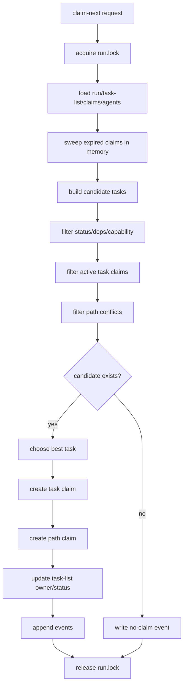
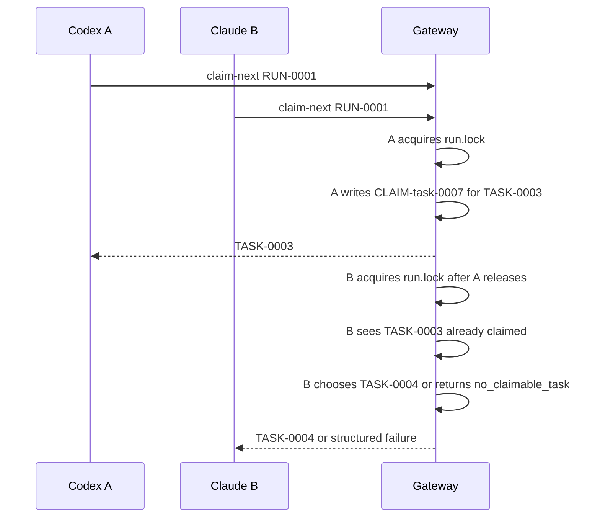

# 10. `claim-next` Lock and Conflict Rules

> 目标：把任务认领、锁、租约、心跳、路径冲突和回收规则拆清楚。`claim-next` 是 `.team gateway` 最核心的并发原语。

---

## 1. 核心判断

`claim-next` 不是“让 gateway 智能派活”，而是一个受锁保护的短事务：

```text
从 RUN-ID 的 ready task queue 中
为当前 AGENT-ID 找到一个可领取 TASK-ID
同时写入 task claim、path claim、task-list owner/status、events
```

它解决的是工程协作问题：

- 同一个 task 不能被两个 agent 同时做。
- 高风险路径不能被多个 task 同时改。
- agent 掉线后，任务不能永久卡死。
- 所有领取、失败、回收都必须能审计。

---

## 2. 输入和输出

### 2.1 输入

```text
team claim-next --run RUN-0001 --agent AGENT-codex-001
```

可选参数：

| 参数 | 说明 |
|---|---|
| `--role implementer` | 当前 agent 想领取的角色 |
| `--capability code_edit,test_run` | 当前 agent 能力 |
| `--task TASK-0003` | 尝试领取指定 task |
| `--dry-run` | 只解释会领取什么，不写状态 |
| `--json` | 返回结构化 JSON |

### 2.2 成功输出

```json
{
  "ok": true,
  "run_id": "RUN-0001",
  "task_id": "TASK-0003",
  "claim_id": "CLAIM-task-0007",
  "path_claim_ids": ["CLAIM-path-0011"],
  "agent_id": "AGENT-codex-001",
  "lease_until": "2026-07-09T16:30:00+08:00",
  "worktree": {
    "suggested_branch": "team/RUN-0001/TASK-0003-auth-api-tests",
    "suggested_path": "../.team-worktrees/RUN-0001/TASK-0003"
  }
}
```

### 2.3 失败输出

失败必须结构化，不能只返回“没有任务”。

```json
{
  "ok": false,
  "reason": "path_conflict",
  "run_id": "RUN-0001",
  "candidate_task_id": "TASK-0003",
  "blocked_by": [
    {
      "task_id": "TASK-0002",
      "agent_id": "AGENT-claude-001",
      "claim_id": "CLAIM-path-0009",
      "paths": ["src/auth/**"]
    }
  ],
  "next_actions": [
    "wait for TASK-0002 to submit",
    "run /team-status RUN-0001",
    "ask user to override path conflict"
  ]
}
```

---

## 3. Claim 数据模型

### 3.1 `claims/task-claims.json`

```json
{
  "schema_version": "team.task_claims.v1",
  "run_id": "RUN-0001",
  "claims": [
    {
      "claim_id": "CLAIM-task-0007",
      "task_id": "TASK-0003",
      "agent_id": "AGENT-codex-001",
      "status": "active",
      "acquired_at": "2026-07-09T16:00:00+08:00",
      "lease_until": "2026-07-09T16:30:00+08:00",
      "last_heartbeat_at": "2026-07-09T16:10:00+08:00",
      "released_at": null,
      "release_reason": null
    }
  ]
}
```

### 3.2 `claims/path-claims.json`

```json
{
  "schema_version": "team.path_claims.v1",
  "run_id": "RUN-0001",
  "claims": [
    {
      "claim_id": "CLAIM-path-0011",
      "task_id": "TASK-0003",
      "agent_id": "AGENT-codex-001",
      "status": "active",
      "paths": {
        "allow": ["src/auth/**", "tests/auth/**"],
        "avoid": ["package-lock.json"],
        "requires_approval": ["src/users/**"]
      },
      "policy": "block",
      "acquired_at": "2026-07-09T16:00:00+08:00",
      "lease_until": "2026-07-09T16:30:00+08:00"
    }
  ]
}
```

### 3.3 Claim 状态

与 [15](15-run-task-state-machine-and-lifecycle.md) §4.1 对齐：

```text
active -> submitted -> released          （正常闭环，released 发生在 integrated）
active -> released                       （owner 主动 release）
active -> reclaimed                      （stale 回收）
active/submitted -> cancelled            （task/run 取消）
派生标注: expired = now > lease_until    （不持久化，读取时计算）
```

| 状态 | 含义 |
|---|---|
| `active` | claim 有效，task/path 被占用 |
| `submitted` | task submit 时转入：owner 已提交 evidence，等待 review/verify/integrate |
| `released` | 正常释放（integrated，或 owner 主动 release） |
| `reclaimed` | stale claim 已被回收，task 可重新领取 |
| `cancelled` | task/run 取消时级联转入 |
| `expired`（派生） | `now > lease_until` 的读取时标注，不是持久化状态 |

---

## 4. 短事务流程



`run.lock` 只保护 `B -> P`。执行任务、跑测试、写代码都不持有这个锁。

---

## 5. 锁规则

| 规则 | 说明 |
|---|---|
| 锁粒度 | MVP 使用 run 级锁：`.team/runs/RUN-ID/locks/run.lock` |
| 实现选型 | mkdir 锁目录（跨平台原子）+ 目录内 `meta.json`（pid、agent_id、command、acquired_at，[17](17-cli-mcp-contract-and-error-model.md) §4） |
| 锁范围 | 只保护 claim、release、heartbeat lease update、status update |
| 锁时长 | 应该是毫秒到秒级，不覆盖代码执行 |
| 锁超时 | 获取锁超时返回 `lock_timeout` |
| stale lock | `meta.json.acquired_at` 超过 `lock_stale_ms`（默认 30s）后允许抢占：**先原子接管**（旧锁目录 rename 留证 + mkdir 新锁），新锁事务的**第一条事件**写 `lock_takeover`——事件追加本身需要持锁，顺序不可颠倒（[17](17-cli-mcp-contract-and-error-model.md) §4） |
| 写入方式 | temp file + atomic rename，避免半写入（[17](17-cli-mcp-contract-and-error-model.md) §5.1） |

锁和 lease 是两件事：

- lock 保护文件写入一致性。
- lease 表示 agent 对 task/path 的临时占用。

---

## 6. 可领取条件

一个 task 必须通过这些检查：

| 阶段 | 检查 | 失败原因 |
|---|---|---|
| Run | run 存在且未暂停 | `run_not_found` / `run_paused` |
| Agent | agent 已注册且 active | `agent_not_registered` |
| Status | task 是 `ready` | `no_ready_task` |
| Dependency | `depends_on` 全部满足 | `deps_blocked` |
| Capability | role/capability 匹配 | `capability_mismatch` |
| Task claim | 无有效 active claim | `task_already_claimed` |
| Path claim | 无有效冲突 path claim | `path_conflict` |
| Policy | 未超过并行上限 | `parallel_limit_reached` |
| Agent 上限 | 未超 `max_active_claims_per_agent`（默认 1） | `agent_claim_limit` |
| Role | `--role reviewer/verifier` 时不查 ready 队列，改从 submitted/approved 队列合成虚拟 review/verify 工作项（D15，[15](15-run-task-state-machine-and-lifecycle.md) §7） | 无候选时 `no_claimable_task` |

依赖满足的 MVP 规则：

```text
depends_on task status in [done]
```

后续可以按 run policy 放宽为：

```text
approved / verified / integrated / done
```

放宽档的策略字段（FEAT-010 实现期定名回填）：`policy.deps_satisfied_when: string[]`，默认 `["done"]`；BDD-008 的"链上任务先后 verified"旅程即以 `["approved","verified","integrated","done"]` 档达成。

---

## 7. Candidate 选择策略

MVP 排序：

```text
priority desc
dependency depth asc
weight desc
created_at asc
task_id asc
```

解释：

- 先做高优先级。
- 优先解开依赖图上游任务。
- 权重大代表对 progress 影响大。
- 最后用创建时间和 task id 保证稳定结果。

不要在 MVP 引入复杂的“智能派活”。真正的智能仍然在 coding agent 和用户决策中。

---

## 8. Path conflict 规则

### 8.1 路径标准化

所有路径进入 claim 前必须标准化：

```text
repo-relative
POSIX separator
no ..
no absolute path outside repo
normalized glob
```

示例：

```text
src/auth/**
tests/auth/**
package-lock.json
```

glob 匹配与重叠判断采用 minimatch 语义（D3）。

### 8.2 冲突判断

MVP 采用保守策略：

| 情况 | 判断 |
|---|---|
| 完全相同 glob | conflict |
| 一个路径是另一个路径祖先目录 | conflict |
| 两个 glob 明显可能匹配同一文件 | conflict |
| 无法确定是否重叠 | 按 policy：`block` 则 conflict，`warn` 则 risk |
| 只命中 `avoid` | 不作为 claim 冲突，但 submit 时提示风险 |
| 命中 `requires_approval` | claim 阶段需要用户或 integrator 允许 |

### 8.3 policy 行为

| Policy | Claim 阶段 | Audit 阶段 |
|---|---|---|
| `block` | 阻断领取 | 记录 blocked reason |
| `warn` | 允许领取 | 记录 path_conflict warning |
| `override` | 需要显式批准：复用 `path_approval_granted` 事件，`payload.kind=conflict_override`（[14](14-evidence-review-verification-contract.md) §5） | 审计显示谁批准了 override |

---

## 9. Heartbeat 和 lease

Heartbeat 是长任务的生命信号：

```text
team heartbeat --run RUN-0001 --task TASK-0003 --agent AGENT-codex-001
```

它应该更新：

- `agents/AGENT-ID.json.last_heartbeat_at`
- `claims/task-claims.json.lease_until`
- `claims/path-claims.json.lease_until`
- `events.jsonl` 中的 heartbeat event，可采样写入，避免太吵

捎带续租：owner 对本 task 的任何写 primitive（`message post`、`block`、`unblock`、`submit`）自动把 lease 续至 `now + claim_ttl`，显式 heartbeat 不再是唯一续租途径（[15](15-run-task-state-machine-and-lifecycle.md) §8）。

MVP 建议：

| 项 | 默认 |
|---|---|
| claim ttl | 30 分钟 |
| heartbeat 建议间隔 | 5 分钟 |
| stale 判定 | 当前时间超过 `lease_until` |
| heartbeat 写 event | 每 10-15 分钟采样一次即可 |

---

## 10. Stale 和 reclaim（摘要）

本节只保留摘要，全文以 [15](15-run-task-state-machine-and-lifecycle.md) §5 为准。要点：

- stale 是读取时按 `now > lease_until` 派生的标注，不持久化；`blocked` 任务豁免 stale 判定。
- **默认自动回收**：过期超过 `auto_reclaim_after_ttl_multiple`（默认 3×TTL）后，下一次 sweep（任一写 primitive / claim-next / `team watch`）在同一锁事务内回收；policy 设为 `"manual"` 时只标 risk，等 `team reclaim --run RUN-0001 --task TASK-0003` 人工确认后回收。
- 回收动作：旧 task/path claim → `reclaimed`，task → `ready`（有未解 blocker 则 → `blocked`），append `task_reclaimed` 事件。
- **回收不清零**：进展快照写入 `previous_attempts`（gateway 只做机械收集：`git status` 与最近 commit 列表），新领取者 hydrate 可见，由新 agent 决定续做或重做。
- worktree 保留不删，entry 转 `abandoned`；续做经 `team worktree adopt` 转移 ownership（[16](16-git-worktree-and-team-root.md) §3.5）。
- stale agent 恢复后必须重新读取 task 状态，不能继续假装自己仍持有 claim。

---

## 11. 典型竞态场景

### 11.1 两个 agent 同时领取



结果：不会出现两个 active claim 指向同一个 `TASK-ID`。

### 11.2 path conflict

```text
TASK-0002 active path claim: src/auth/**
TASK-0003 wants paths.allow: src/auth/session/**
```

默认 `block` 策略下，`TASK-0003` 不能领取，除非：

- `TASK-0002` submit/release；
- lease stale 后 reclaim；
- 用户显式 override。

---

## 12. Event 记录

`claim-next` 至少写这些事件：

```jsonl
{"event":"claim_requested","run_id":"RUN-0001","agent_id":"AGENT-codex-001"}
{"event":"task_claimed","run_id":"RUN-0001","task_id":"TASK-0003","agent_id":"AGENT-codex-001","claim_id":"CLAIM-task-0007"}
{"event":"path_claimed","run_id":"RUN-0001","task_id":"TASK-0003","agent_id":"AGENT-codex-001","claim_id":"CLAIM-path-0011"}
```

失败也可以写事件，但要避免噪音。建议只记录重要失败：

- `path_conflict`
- `lock_timeout`
- `deps_blocked`
- `parallel_limit_reached`
- `no_claimable_task` 可选择不写或采样写

---

## 13. 不变量

1. 同一 `TASK-ID` 同时最多一个 active task claim。
2. 同一 path scope 在 `block` policy 下同时最多一个 active path claim。
3. 只有 gateway primitive 能写 task/path claim。
4. 实现 agent 不能手动把自己的 task 标成 `done`。
5. lease 过期不等于自动完成，也不等于自动删除 worktree。
6. `claim-next` 成功后必须能从 `events.jsonl` 追溯。
7. `claim-next` 失败必须返回可行动原因。

---

## 14. MVP 验收场景

| 场景 | 预期 |
|---|---|
| 两个 agent 同时 claim | 不会拿到同一个 `TASK-ID` |
| task 有未完成依赖 | 返回 `deps_blocked` 或跳过该 task |
| path overlap 且 policy=block | 返回 `path_conflict` |
| agent heartbeat | lease 延长，status 显示 active |
| lease 过期 | status 显示 stale risk |
| reclaim stale task | 旧 claim 标记 reclaimed，task 可重新 ready |
| claim 写入中崩溃 | 下次 audit/progress 能发现不一致 |
| `--dry-run` | 输出候选和失败原因，不写 `.team` 状态 |

---

## 15. 继续细拆的问题（已全部关闭）

1. 文件锁具体用 `flock`、lockfile，还是跨平台库。——已关闭：mkdir 锁目录 + `meta.json`（[17](17-cli-mcp-contract-and-error-model.md) §4）。
2. atomic write 是否要求 fsync directory，MVP 是否简化。——已关闭：temp + rename + 文件 fsync，MVP 不做目录 fsync（已知取舍，[17](17-cli-mcp-contract-and-error-model.md) §5）。
3. stale lock 和 stale lease 的阈值是否分开配置。——已关闭：分开配置，`lock_stale_ms` 默认 30s，与 lease TTL 独立（[17](17-cli-mcp-contract-and-error-model.md) §4）。
4. path glob overlap 用保守算法还是引入专门库。——已关闭：保守算法 + minimatch 语义（D3）。
5. override path conflict 是否必须用户确认，agent 能否请求但不能批准。——已关闭：agent 可请求、不可自批，批准归 user/integrator（[14](14-evidence-review-verification-contract.md) §5）。
6. reclaim 后旧 worktree 如何处理：保留、归档、还是提示人工检查。——已关闭：保留并转 `abandoned`，续做经 adopt 转移 ownership（[16](16-git-worktree-and-team-root.md) §3.5）。
