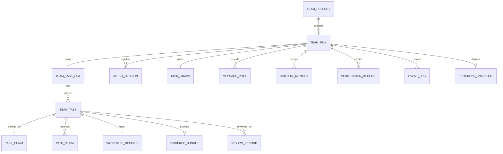
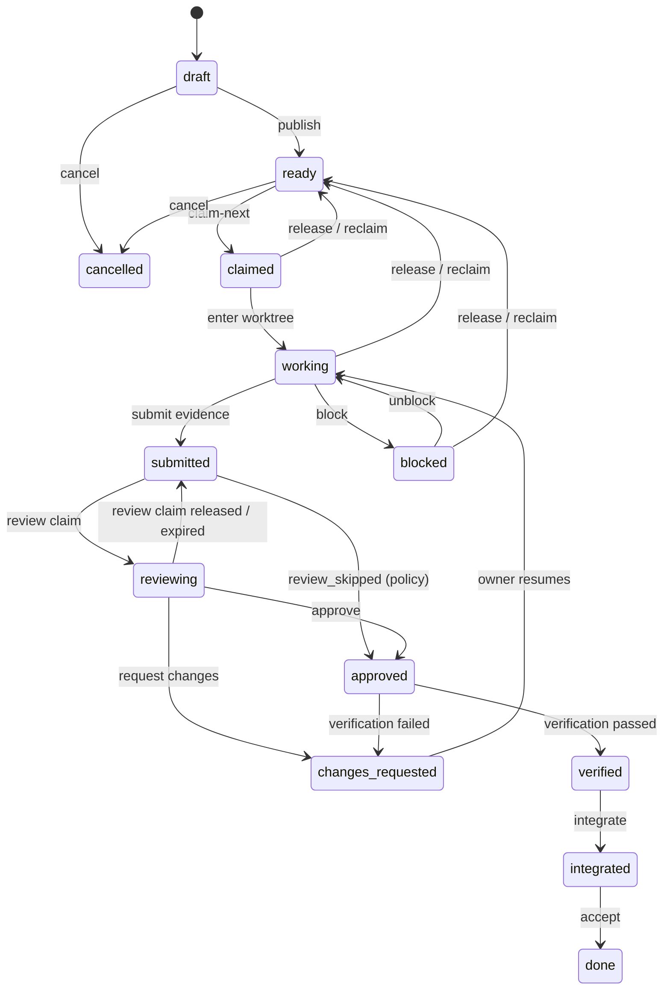
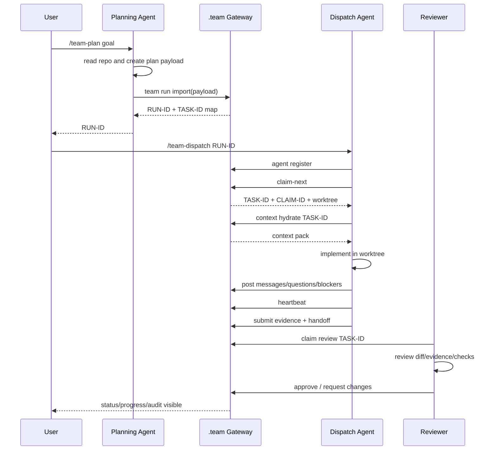
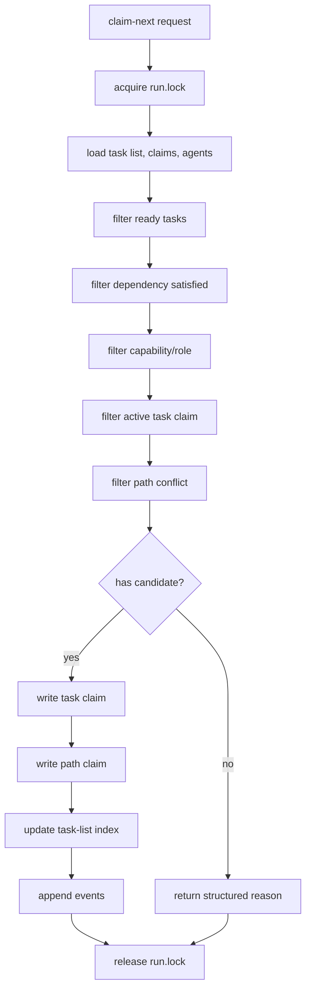
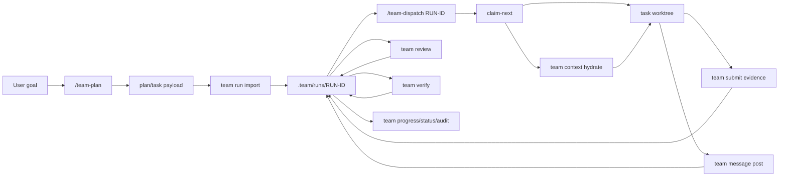
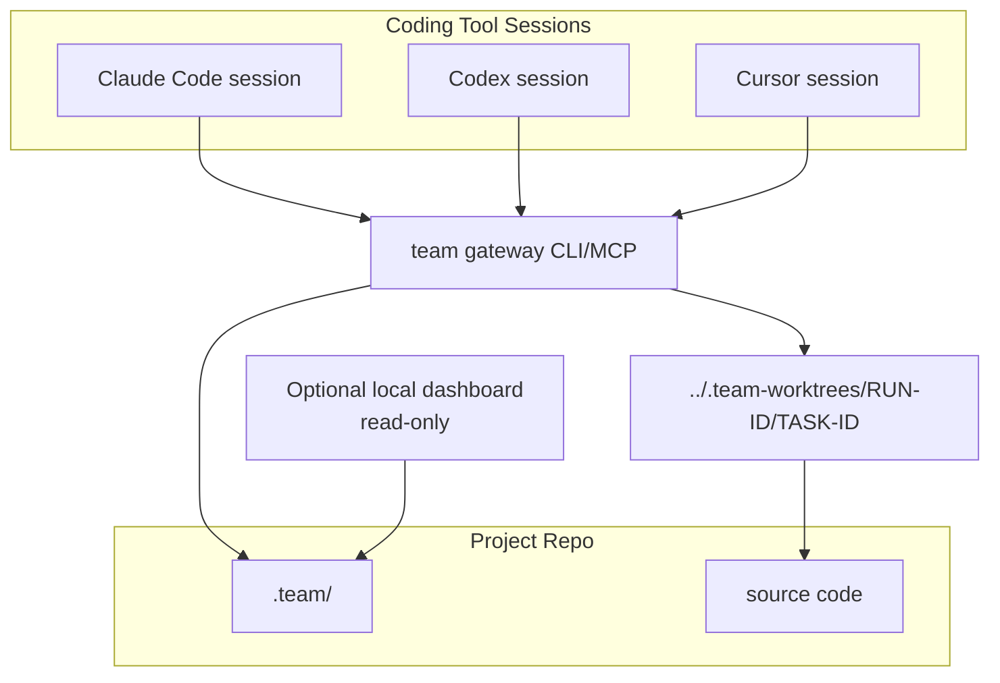

# 11. 4+1 Architecture View

> **修订注（2026-07-15，整改 R3 回写）**：①实况为**八包**——`mcp-server` 仍为 contract-only；`read-model` 职责由 **watch** 包承担（status/progress/task 查询面），文中九包图按此解读。②run 锁物理路径为 `runs/<RUN>/run.lock`（`locks/` 子目录仅 watch.lock）。③事务骨架已归一至 `core/tx.ts::withRunTx`（版本闸门+锁+接管留证一处实现），写序契约收敛为「**events 最后 = 提交点**」+推荐序（详情→索引→claims→派生）。④状态词汇与 EVENT_STATUS 单源于 `core/state-machine.ts`。⑤依赖矩阵由 `packages/core/test/architecture.test.ts` 机器对账。轻量模式见 [26](26-lightweight-mode.md)。


> 目标：从 4+1 视图重新组织 Team Run Protocol 的架构。前面的文档按用户旅途和能力拆；这一篇按软件工程架构视角拆，回答“这个系统由什么组成、怎么运行、怎么开发、跑在哪里、用哪些场景验证自洽”。

---

## 1. 为什么需要 4+1 视图

当前已经明确：

- Claude Code / Codex / Cursor 负责理解项目、拆任务、写代码、review。
- `.team gateway` 负责记录、分发、锁、证据、审计、进度。
- `.team/` 是 repo-local 的事实源。

4+1 视图可以把这些判断压成一张架构网：

| 视图 | 在本项目里回答什么 |
|---|---|
| Logical View | `.team` 里有哪些核心对象、关系和不变量 |
| Process View | `/team-plan`、`claim-next`、submit、review、verify 怎么跑，哪里有并发和状态机 |
| Development View | 代码模块应该怎么分，CLI/MCP/Skill/Dashboard 的边界在哪里 |
| Physical View | 系统实际跑在哪些进程、目录、worktree、工具会话中 |
| +1 Scenarios | 用核心用户旅途验证四个视图是否自洽 |

---

## 2. +1 Scenarios：先用场景校准架构

这里建议把 +1 场景放在前面，因为这个产品最容易从“做一个调度系统”跑偏。场景能反向约束架构边界。

### S1. Plan and Import

```text
User 在 Claude Code 输入 /team-plan "目标"
Claude Code 读项目并拆任务
Claude Code 生成 plan/task payload
.team gateway import payload
gateway 返回 RUN-ID 和 TASK-ID mapping
```

架构验证点：

- Gateway 不拆任务。
- Payload 是输入合同，不是最终状态。
- Gateway 分配稳定 `RUN-ID` / `TASK-ID`。
- 所有任务进入 `team-task-list.json`，不留在聊天上下文里。

### S2. Dispatch, Claim, and Hydrate

```text
User 在 Codex 输入 /team-dispatch RUN-ID
Codex 注册 agent
Codex 调用 claim-next
Gateway 在 run.lock 下原子写 task claim 和 path claim
Codex 拿到 TASK-ID 后 hydrate task context
Codex 读取上游 handoff、open questions、decisions 后创建 worktree 并执行
```

架构验证点：

- 同一个 task 不能被两个 agent 同时领取。
- Path conflict 由 gateway 检查。
- 锁只保护短事务。
- 长任务靠 lease 和 heartbeat。
- 下游 agent 不依赖聊天历史，而是读取 Context Plane。

### S3. Submit Evidence

```text
Agent 完成 TASK-ID
Agent 收集 changed files、checks、acceptance result、风险、handoff
Agent 调用 team submit
Gateway 校验并落盘 evidence/TASK-ID/（evidence.json + evidence.md + outputs/）与 context/tasks/TASK-ID.md，推进 task 到 submitted
```

架构验证点：

- “完成”必须有 evidence。
- Evidence 归属 `TASK-ID`，不是 run 级模糊记录。
- Handoff 归属 `TASK-ID`，供下游 task hydrate。
- Gateway 记录事实，不评价代码质量。

### S4. Review and Verify

```text
Reviewer agent 领取 review
Reviewer 审查 diff/evidence/checks
Gateway 记录 approve / request changes
Verifier 跑 focused/full checks
Gateway 记录 verification result
```

架构验证点：

- Owner 不能 approve 自己的 task。
- Review 和 verification 是 gate，不是口头确认。
- 状态机不能从 working 直接跳到 done。

### S5. Status and Audit

```text
User 输入 /team-status RUN-ID
Gateway 从事实重算 progress
Gateway 输出 active agents、tasks、claims、risks、next actions
Audit 检查重复 claim、path conflict、missing evidence、self approval
Audit 检查 DAG cycle、missing context、unresolved blocker
```

架构验证点：

- Progress 是派生视图。
- Dashboard 只能读事实源。
- Audit 不依赖聊天记录。
- Message pool 和 memory 不能替代 evidence/event，但能帮助 agent 快速恢复上下文。

---

## 3. Logical View：领域模型和不变量

Logical View 关心“系统里有哪些概念，以及它们之间的关系”。

### 3.1 领域关系



### 3.2 核心对象

| 对象 | 架构职责 |
|---|---|
| TeamProject | 项目级默认配置、策略、`.team` 根 |
| TeamRun | 一次协作运行，绑定目标、状态、base branch |
| TeamTaskList | run 内任务队列索引，支持 status/progress/claim 查询 |
| TeamTask | 可执行、可 review、可验证的工作单元 |
| AgentSession | 一个 Claude/Codex/Cursor 工具会话 |
| TaskGraph | task DAG，描述依赖、上下文传播、review/verify/integration 边 |
| MessagePool | agent 间问题、回答、blocker、handoff、decision |
| ContextMemory | 从消息、evidence、reviews、events 压缩出的 run/task working memory |
| TaskClaim | agent 对 task 的 lease |
| PathClaim | task 对路径范围的占用 |
| WorktreeRecord | task 的 branch/worktree 事实 |
| EvidenceBundle | task 完成后的证据 |
| ReviewRecord | review 过程和结论 |
| VerificationRecord | checks/gates 的执行结果 |
| EventLog | append-only 审计事件 |
| ProgressSnapshot | 从事实派生的进度快照 |

### 3.3 领域不变量

| ID | 不变量 |
|---|---|
| INV-001 | `RUN-ID` 必须稳定，是跨工具协作入口 |
| INV-002 | `TASK-ID` 必须稳定，是 claim/evidence/review/status 的基本单位 |
| INV-003 | 同一 `TASK-ID` 同时最多一个 active task claim |
| INV-004 | `block` policy 下，同一 path scope 同时最多一个 active path claim |
| INV-005 | 所有状态变化必须追加 `events.jsonl` |
| INV-006 | `progress.json` 可删除重建，不能作为权威事实源 |
| INV-007 | 实现者不能直接把自己的 task 标记为 `done` |
| INV-008 | Owner agent 不能 approve 自己的 task |
| INV-009 | `claim-next` 成功必须写 task claim、path claim、task-list owner/status、event |
| INV-010 | `submitted` task 必须有 evidence |
| INV-011 | `events.jsonl` 不能承担 message pool 职责 |
| INV-012 | memory 必须带 source refs，不能成为无来源事实 |
| INV-013 | task DAG 不能有 cycle |
| INV-014 | 下游 task hydrate 时必须读 required context refs |

### 3.4 状态生命周期

与 [15](15-run-task-state-machine-and-lifecycle.md) §3.2 一致（v2：stale 派生化，不再是持久状态）：



（`claimed/working/blocked/submitted` 亦可被 `team task cancel` 取消，图中省略以保持可读；权限见 [15](15-run-task-state-machine-and-lifecycle.md) §3.3。）

---

## 4. Process View：运行、状态、并发

Process View 关心“系统怎么跑”。

### 4.1 主流程时序



### 4.2 并发模型

```text
并发单位：AgentSession
资源单位：TaskClaim + PathClaim
同步点：run.lock
长任务活性：lease + heartbeat
冲突控制：path claim policy
可观测性：events.jsonl + message pool + progress rebuild + audit
```

关键判断：

- 多个 agent 可以同时加入一个 `RUN-ID`。
- 只有 gateway primitive 能改 claim。
- `run.lock` 是短事务锁，不覆盖 coding。
- 如果 agent 掉线，lease 过期后进入 stale/reclaim 流程。

### 4.3 `claim-next` 控制流



### 4.4 数据流



### 4.5 失败路径

| 失败 | Process 处理 |
|---|---|
| payload invalid | `team run import` 拒绝，返回 schema errors |
| no claimable task | `claim-next` 返回结构化 reason |
| lock timeout | 返回 `lock_timeout`，不写半状态 |
| path conflict | 默认阻断，或记录 override event |
| heartbeat missing | task 标为 stale risk，等待 reclaim |
| missing evidence | audit 报 error，不能进入 verified/done |
| self approval | review 阻断或 audit error |
| DAG cycle | import/graph validate 阻断 |
| missing required context | hydrate/audit 报 error |
| unresolved blocker | status/audit 标为 risk |
| blocked 无人解 | `team unblock` 恢复 working，或 release/reclaim 回 ready（[15](15-run-task-state-machine-and-lifecycle.md) §3.3） |
| 写事务中崩溃 | events 追加为提交点：事件不在则残留视为未提交，`team repair` 对账回滚/前滚（[17](17-cli-mcp-contract-and-error-model.md) §5.3） |
| rev 不符 | 返回 `rev_conflict`；疑似绕过 CLI 直改由 audit 检出（[17](17-cli-mcp-contract-and-error-model.md) §5.2） |
| review claim 过期 | `reviewing` 回退 `submitted`，review claim 经 sweep 回收（[15](15-run-task-state-machine-and-lifecycle.md) §3.3） |

---

## 5. Development View：模块和代码组织

Development View 关心“代码怎么分模块，哪些模块不能互相越界”。

### 5.1 推荐模块边界

以 [20](20-c4-l2-l3-component-contracts.md) §3 的 TS monorepo 九包结构为准：

```text
packages/
  core/          # 纯领域 + 生命周期原语（可用 storage，不做进程/UI 假设）
    ids | schemas | state-machine | path-glob(minimatch) | events
    graph | progress | envelope | lifecycle
  storage/       # 路径、锁、原子读写、模板、脱敏——无业务规则
    team-dir | lock-manager | atomic-write(jsonl 并入) | templates | redaction
  dispatch/      # 认领域：筛选、租约、回收、路径冲突
    claim-engine(lease/reclaim/sweep 并入) | path-conflict
  context/       # Context Plane
    message-pool | memory-store | context-hydrator | graph-validator
  audit/         # 规则引擎与报告
    audit-engine(rules + report)
  cli/           # 前端一：命令注册表 → primitive → envelope 打印
  mcp-server/    # 前端二：tool 注册表 → 同一批 primitive（形态 C）
  watch/         # 前端三：巡检循环（sweep + progress + 增量打印）
  read-model/    # P2：dashboard 只读聚合
adapters/        # 19 号交付物：.claude/commands + codex skills 模板
                 # 不在运行时依赖图内——只生成调用 gateway 的文本
```

### 5.2 模块职责

| 模块（包） | 职责 |
|---|---|
| `cli` | 前端一：命令注册表 → primitive → envelope 打印与 exit code 映射 |
| `mcp-server` | 前端二：tool 注册表 → 同一批 primitive（形态 C，与 CLI 同核，独立前端包） |
| `watch` | 前端三：巡检循环（周期 sweep + progress 重算 + 增量打印），不派活不 claim |
| `core/schemas` | payload/evidence/review/verification 机械校验，不做语义判断 |
| `core/state-machine` | run/task/claim 三层状态转换规则、权限矩阵、一致性矩阵 |
| `core/graph` | task DAG 对象、边类型、拓扑序、不变量 |
| `core/path-glob` | minimatch 语义封装（D3） |
| `core/envelope` | TeamEnvelope 构造、reason code 枚举、exit code 映射 |
| `core/lifecycle` | record 侧原语编排（import/publish/submit/review/verify/worktree/export/report） |
| `core/progress` | 从事实重建 `progress.json` |
| `dispatch/claim-engine` | `claim-next` 筛选与原子认领；lease 续租、过期 sweep、reclaim 并入 |
| `dispatch/path-conflict` | glob/path overlap 判断（纯函数，数据由调用方注入） |
| `storage/team-dir` | team root 解析（git common-dir）与 `.team/` 布局 |
| `storage/lock-manager` | mkdir 锁目录、退避、stale takeover——文件系统原语，零业务规则（自 dispatch 迁入） |
| `storage/atomic-write` | temp file + rename、`rev` 乐观锁、jsonl 锁内 append |
| `storage/redaction` | 机械脱敏管道（outputs 落盘前、export 前二次扫描） |
| `audit/audit-engine` | 规则求值与报告；P0 子集内嵌进写 primitive 直接阻断 |
| `context/message-pool` | 写入和查询 typed collaboration messages |
| `context/memory-store` | 机械 rollup + source refs 校验 + 存储 agent 生成的 memory 内容（无语义压缩，gateway 无 LLM） |
| `context/context-hydrator` | 为 task 组装 must-read context pack，写 `context_hydrated` 事件 |
| `context/graph-validator` | 校验 DAG cycle、dangling edge、missing context refs |
| `read-model` | P2：dashboard 只读聚合，不写权威状态 |
| `adapters/` | 19 号模板产物（.claude/commands + codex skills），零运行时依赖 |

### 5.3 依赖规则

依赖图以 [20](20-c4-l2-l3-component-contracts.md) §5 为准（含违例清单 V1–V10，CI 依赖白名单强制）。文字版约束：

- `dashboard` 不能调用会写状态的 dispatch primitive。
- `read-model` 禁写：不得 import dispatch、core/lifecycle、lock-manager 或 atomic-write 写 API——永远拿不到写原语与锁（[20](20-c4-l2-l3-component-contracts.md) §5 V1）。
- `adapters` 不能直接写 `.team` 文件，只能调用 gateway service。
- `adapters` 零运行时依赖：不在运行时依赖图内，只生成调用 gateway 的文本（[20](20-c4-l2-l3-component-contracts.md) §3）。
- `storage` 不包含业务规则，只做路径、锁、读写、原子性。
- `core` 不知道 Claude/Codex/Cursor 的具体 UI。
- `dispatch` 可以读 task schema，但不能读项目代码来重新拆任务。

---

## 6. Physical View：运行和部署拓扑

Physical View 关心“系统实际跑在哪里”。

### 6.1 MVP 本地拓扑



### 6.2 本地文件布局

```text
repo/
  .team/
    project.json
    runs/
      RUN-0001/
        run.json
        team-task-list.json
        tasks/
        claims/
        agents/
        evidence/
        context/
          messages.jsonl
          run-memory.md
          tasks/
        reviews/
        events.jsonl
        progress.json
        locks/
  tools/
    team-gateway/
  .claude/
    commands/
  .codex/
    skills/
../.team-worktrees/
  RUN-0001/
    TASK-0001/
    TASK-0002/
```

### 6.3 未来远端拓扑

MVP 是 repo-local。未来如果要跨机器，可以加 remote sync，但不应改变核心协议：

```text
local gateway -> local .team
optional sync -> remote coordination service
remote service -> sync back to .team-compatible state
```

关键原则：

- `.team` schema 仍然是协议基线。
- Remote service 只是同步和协作增强，不替代 `RUN-ID/TASK-ID/claim/evidence/audit` 模型。
- 本地离线时仍能查看已有 run、task、evidence 和 audit。

---

## 7. 视图间追踪

| Scenario | Logical 对象 | Process 机制 | Development 模块 | Physical 资源 |
|---|---|---|---|---|
| S1 Plan and Import | TeamRun, TeamTaskList, TeamTask, EventLog | `team run import` | `schemas`, `storage`, `events` | `.team/runs/RUN-ID` |
| S2 Dispatch and Claim | AgentSession, TaskClaim, PathClaim, ContextMemory | `claim-next`, `context hydrate`, `run.lock`, lease | `claim-engine`, `context-hydrator`, `lock-manager`, `path-conflict` | `.team/claims`, `locks/run.lock`, `context/*` |
| S3 Submit Evidence | EvidenceBundle, MessagePool, ContextMemory, TeamTask, EventLog | submit evidence, handoff, state transition | `submit`, `message-pool`, `memory-store`, `state-machine`, `events` | `evidence/TASK-ID/evidence.json`+`.md`+`outputs/`, `context/tasks/TASK-ID.md` |
| S4 Review and Verify | ReviewRecord, VerificationRecord | review gate, verify gate | `review`, `verify`, `audit/rules` | `reviews/TASK-ID/REVIEW-*.json`, `verification/VERIFY-*.json`（`verification.md` 为派生索引） |
| S5 Status and Audit | ProgressSnapshot, EventLog, TaskGraph, MessagePool | progress rebuild, audit scan, graph validate | `progress`, `audit/report`, `graph-validator` | `progress.json`, `events.jsonl`, `task-graph.json`, `context/messages.jsonl` |

---

## 8. Architecture Gates

| Gate | 当前判断 | 证据 |
|---|---|---|
| G3-2 4+1 视图存在 | PASS | 本文档覆盖 Logical / Process / Development / Physical / Scenarios |
| G3-3 逻辑模型和不变量 | PASS | 领域 ER、不变量、状态生命周期、Context Plane 对象 |
| G3-4 过程视图含状态/并发 | PASS | 主流程、`claim-next`、并发模型、失败路径 |
| G3-5 开发视图含模块依赖 | PASS | 推荐模块边界、context/dispatch/audit 依赖规则 |
| G3-6 物理视图 | PASS for MVP | 本地 repo、`.team/`、worktree、工具会话拓扑 |
| G3-7 API/命令契约 | PASS | 命令总表、全局 envelope、reason code、exit code、锁与原子写合同已定（[17](17-cli-mcp-contract-and-error-model.md)） |
| G3-9 状态机无明显悬空 | PASS | run/task/claim 三层状态机闭环：blocked 出口、返工环、reclaim、cancel 均已定（[15](15-run-task-state-machine-and-lifecycle.md)） |
| G3-17 可观测性 | PARTIAL | events 目录与 schema、audit 规则目录（[18](18-audit-rule-catalog-and-trust-model.md)）、`team watch`（[17](17-cli-mcp-contract-and-error-model.md) §7）已定；metrics 仍为 P2 |

---

## 9. 这份视图反推的下一步

4+1 视图曾暴露出三个未闭合的架构点，现已全部闭合：

1. **Evidence / Review / Verification contracts**——已闭合：[14](14-evidence-review-verification-contract.md)（evidence.json 双格式、review claim 与多轮 record、verification 目录化）。  
   当前主流程清楚，但“提交证据、审查、验证”的 schema 还需要像 `claim-next` 一样细。

2. **Audit rule catalog**——已闭合：[18](18-audit-rule-catalog-and-trust-model.md)（事件目录 + event schema + 规则全表 + 信任模型）。  
   已有 audit 能力地图，但每条规则的输入、触发条件、严重度、修复建议需要落成表。

3. **C4 L2/L3 或模块 contracts**——已闭合：[20](20-c4-l2-l3-component-contracts.md)（container 边界、九包结构、component 接口签名与依赖白名单）。  
   如果准备进入实现，需要把 gateway CLI/MCP/storage/dispatch/audit 的 component contract 再压一层。
