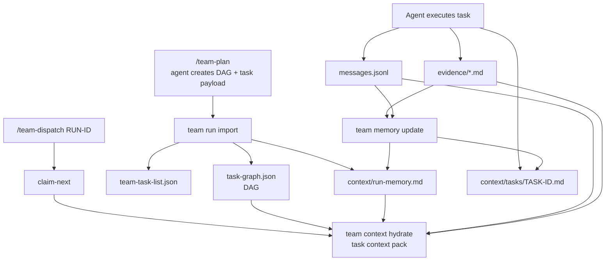

# 12. Context Plane: Task DAG, Message Pool, and Working Memory

> 目标：补上多 agent 协作中最容易缺失的一层：上下文如何在 DAG 任务之间流动，agent 之间如何传递消息，任务执行过程中的 memory 如何沉淀、压缩和被后续 agent 读取。

---

## 1. 核心判断

你说的点是对的：只靠 `team-task-list.json`、`task-graph.json`、`events.jsonl` 不够。

它们分别解决：

| 对象 | 解决什么 | 不解决什么 |
|---|---|---|
| `team-task-list.json` | 当前有哪些 task、状态如何、谁在做 | task 之间上下文如何流动 |
| `task-graph.json` | task 的依赖关系 | 执行过程中产生的新知识如何传给下游 |
| `events.jsonl` | 审计事实，谁在什么时候做了什么状态变化 | agent 工作记忆、问题、回答、handoff、设计发现 |
| `evidence/*.md` | task 完成后的证据 | task 进行中的协作消息和中间发现 |

所以需要一个独立的 **Context Plane**：

```text
Task DAG        -> 描述任务依赖、上下游产物、上下文传播关系
Message Pool    -> 记录 agent 间协作消息、问题、回答、blocker、handoff
Working Memory  -> 从消息/evidence/events 中压缩出的 run/task 当前上下文
```

这层仍然属于 `.team gateway` 的记录和编排能力。Gateway 不理解代码该怎么写，但它必须让上下文可写、可查、可追溯、可压缩、可传递。

---

## 2. Context Plane 在产品里的位置



关键点：

- `/team-dispatch` 领取任务后，不应该立刻写代码，而是先 hydrate context。
- 下游 task 不只读取上游 evidence，也要读取上游 handoff、decisions、open questions。
- Message pool 是“协作消息”，events 是“审计事件”，两者不能混成一个文件。

---

## 3. 三层上下文模型

### 3.1 Task DAG

Task DAG 表达 task 之间的关系。它不只是 `depends_on`，还包括“谁产出谁需要的上下文”。

```text
TASK-0001 --blocks--> TASK-0003
TASK-0001 --produces_context_for--> TASK-0004
TASK-0005 --reviews--> TASK-0002
TASK-0006 --verifies--> RUN-0001
TASK-0007 --conflicts_with--> TASK-0003
```

### 3.2 Message Pool

Message pool 是 run 内协作消息池。它回答：

```text
哪个 agent 对哪个 task 提了问题？
上游 task 给下游 task 留了什么 handoff？
reviewer 提了什么修改建议？
某个 blocker 有没有被解答？
某个架构决定是谁在什么时候记录的？
```

它不是原始聊天记录，也不是自由聊天频道。它是 task-scoped、typed、可索引的协作消息。

### 3.3 Working Memory

Working memory 是可压缩上下文。它回答：

```text
如果一个新 Codex 会话加入 RUN-0001，它最少要读什么才能继续？
如果一个 agent 领取 TASK-0004，它需要哪些上游事实、决策、风险、接口变化？
```

它应该是 derived / curated，而不是权威事实。权威来源仍然是 task、messages、evidence、reviews、events。

---

## 4. 推荐 `.team/` 结构补充

```text
.team/
  runs/
    RUN-0001/
      task-graph.json
      context/
        run-memory.md
        run-decisions.jsonl
        open-questions.jsonl
        messages.jsonl
        context-index.json
        tasks/
          TASK-0001.md
          TASK-0003.md
        snapshots/
          CTX-0001.md
          CTX-0002.md
```

文件职责：

| 文件 | 职责 |
|---|---|
| `task-graph.json` | task DAG，包含依赖边和 context flow 边 |
| `context/messages.jsonl` | typed collaboration messages；**唯一协作事实权威**（[13](13-design-audit-and-next-breakdown.md) M23 裁决） |
| `context/run-memory.md` | run 级压缩上下文 |
| `context/tasks/TASK-ID.md` | task 级 working memory / handoff |
| `context/run-decisions.jsonl` | 运行过程中形成的架构/流程决定；**derived**（从 messages 的 `decision` 消息重建，可删重算） |
| `context/open-questions.jsonl` | 未解决问题和 owner；**derived**（从 messages 的 `question`/`blocker` 状态重建，可删重算） |
| `context/context-index.json` | context ref 索引，便于 hydrate；**derived**（可删重算） |
| `context/snapshots/CTX-ID.md` | 某次压缩生成的上下文快照 |

---

## 5. Task DAG Schema

`task-graph.json` 应该从简单 `depends_on` 升级为显式 DAG。

```json
{
  "schema_version": "team.task_graph.v1",
  "run_id": "RUN-0001",
  "nodes": [
    {
      "task_id": "TASK-0001",
      "title": "Add auth domain model",
      "type": "implementation"
    },
    {
      "task_id": "TASK-0003",
      "title": "Add auth API tests",
      "type": "implementation"
    }
  ],
  "edges": [
    {
      "edge_id": "EDGE-0001",
      "from": "TASK-0001",
      "to": "TASK-0003",
      "kind": "blocks",
      "required": true,
      "context_refs": ["context/tasks/TASK-0001.md", "evidence/TASK-0001/evidence.md"]
    },
    {
      "edge_id": "EDGE-0002",
      "from": "TASK-0001",
      "to": "TASK-0004",
      "kind": "produces_context_for",
      "required": false,
      "context_refs": ["context/messages.jsonl#MSG-0007"]
    }
  ]
}
```

> 按 [13](13-design-audit-and-next-breakdown.md) §5.5 裁决：nodes 与 edges 均不携带 `status` 字段——task 状态以 `tasks/*/task.json` 为权威，graph 读取时 join 派生；edge 的满足与否（satisfied/available）同样在读取时计算。

### Edge kind

| kind | 含义 | 对 claim 的影响 |
|---|---|---|
| `blocks` | 硬依赖，上游未完成前不能 claim | block |
| `soft_depends_on` | 软依赖，可并行但需要 warning | warn |
| `produces_context_for` | 上游产出上下文给下游 | hydrate 时必须读 |
| `reviews` | review task 指向被 review task | review 流程使用 |
| `verifies` | verification task 指向 task/run | verify 流程使用 |
| `integrates` | integration task 汇总多个 task | integrate 流程使用 |
| `conflicts_with` | 由 path conflict 或 planner 标注 | claim 时按 policy 处理 |
| `supersedes` | 新 task 替代旧 task | status/audit 使用 |

DAG 不能有 cycle。`team run import` 和 `team task add` 必须校验。

---

## 6. Message Pool Schema

`context/messages.jsonl` 是 append-only，但它不是审计 event。它记录协作语义。

```jsonl
{"message_id":"MSG-0001","run_id":"RUN-0001","task_id":"TASK-0003","from_agent_id":"AGENT-codex-001","to":"task:TASK-0001","type":"question","visibility":"run","body":"TASK-0003 needs the exact session expiry rule from TASK-0001.","created_at":"2026-07-09T16:20:00+08:00","status":"open","refs":["tasks/TASK-0003/task.json"]}
{"message_id":"MSG-0002","run_id":"RUN-0001","task_id":"TASK-0001","from_agent_id":"AGENT-claude-002","to":"task:TASK-0003","type":"answer","in_reply_to":"MSG-0001","visibility":"run","body":"Session expiry is 7 days sliding. See evidence/TASK-0001/evidence.md#session-policy.","created_at":"2026-07-09T16:30:00+08:00","status":"resolved","refs":["evidence/TASK-0001/evidence.md"]}
```

每行可带可选的行级 `v` 字段标注 schema 版本，缺省视为 1（[21](21-schema-versioning-and-migration.md) §3.4）。

### Message types

| type | 用途 |
|---|---|
| `question` | task 执行中提出问题 |
| `answer` | 回答问题 |
| `blocker` | 声明阻塞原因 |
| `handoff` | 上游 task 给下游 task 的交接说明 |
| `context_update` | 执行中产生的新上下文 |
| `decision` | 运行中形成的设计/流程决定 |
| `risk` | 风险提示 |
| `finding` | review / audit / investigation 发现 |
| `request_changes` | review 修改请求；由 review 的 must_fix findings 镜像产生，`message_ref` 回链 REVIEW 记录（[14](14-evidence-review-verification-contract.md) §3.2） |
| `note` | 普通备注，MVP 可少用 |

### Message routing

| `to` 示例 | 含义 |
|---|---|
| `run` | run 级消息，所有 agent hydrate 都可见 |
| `task:TASK-0003` | 发给某个 task 的后续 owner |
| `agent:AGENT-codex-001` | 发给某个 agent，会话级提示 |
| `role:reviewer` | 发给 reviewer 角色 |
| `edge:EDGE-0002` | 绑定到 DAG 边的上下文 |

---

## 7. Working Memory

Working memory 是“给 agent 读的压缩上下文”，不是权威事实。

### 7.1 `context/run-memory.md`

```markdown
# RUN-0001 Memory

## Goal
Implement auth phase 1.

## Current Architecture Decisions
- Session expiry is 7 days sliding. Source: MSG-0002, evidence/TASK-0001/evidence.md.
- Auth phase 1 does not include OAuth. Source: plan.md.

## Active Risks
- `src/users/**` requires approval before changes. Source: TASK-0001 paths.

## Open Questions
- Q-0003: Should login errors reveal locked status? Owner: reviewer.

## Recently Completed
- TASK-0001 completed auth domain model.

## Next Context
- TASK-0003 should read evidence/TASK-0001/evidence.md and context/tasks/TASK-0001.md.
```

### 7.2 `context/tasks/TASK-ID.md`

```markdown
# TASK-0001 Context Memory

## Handoff Summary
Auth domain model added. Session policy is 7-day sliding expiry.

## Files / Interfaces Created
- `src/auth/session.ts`
- `src/auth/user.ts`

## Decisions
- Do not modify `src/users/**` without approval.

## Downstream Notes
- TASK-0003 should test invalid credentials and expired session.

## Source Refs
- evidence/TASK-0001/evidence.md
- MSG-0002
```

### 7.3 Memory 更新规则

| 操作 | 更新 |
|---|---|
| `team run import` | 初始化 `run-memory.md` |
| `team message post` | 追加 message，必要时更新 open questions |
| `team submit` | 要求 owner 写 handoff/context summary；evidence 须含 `context_ack[]` 声明已读 refs（[14](14-evidence-review-verification-contract.md) §2.1） |
| `team review` | 将重要 findings/request changes 写入 message pool |
| `team memory update` | 存储 **agent 生成**的压缩内容并校验 source refs（无效 ref 拒绝，INV-012）；gateway 自身只做机械 rollup（列表/索引拼接），不做语义压缩（[13](13-design-audit-and-next-breakdown.md) §5.1 裁决） |
| `team context hydrate` | 读取 memory + refs，生成 agent 上下文包 |

Memory 可以被重建；每次压缩应该保留 source refs，避免“AI 总结污染事实源”。

---

## 8. Context Hydration

`/team-dispatch` 成功 claim 后，下一步应该是：

```text
team context hydrate --run RUN-0001 --task TASK-0003
```

返回一个 context pack：

```json
{
  "run_id": "RUN-0001",
  "task_id": "TASK-0003",
  "must_read": [
    "tasks/TASK-0003/task.md",
    "context/run-memory.md",
    "context/tasks/TASK-0001.md",
    "evidence/TASK-0001/evidence.md"
  ],
  "messages": [
    {
      "message_id": "MSG-0002",
      "type": "answer",
      "body": "Session expiry is 7 days sliding."
    }
  ],
  "open_questions": [],
  "risks": [
    "Avoid src/users/** unless approved."
  ]
}
```

hydrate 成功即写 `context_hydrated` 事件（payload 含本次 `must_read` 清单）；下游 `team submit` 时，evidence 的 `context_ack[]` 与该事件的 must_read 对账，缺失项记 warning——这是 M22 的可执行版本，对应 audit 规则 AUD-028（[18](18-audit-rule-catalog-and-trust-model.md) §4.D）。

Agent-side `/team-dispatch` 的固定流程要改成：

```text
1. claim-next
2. context hydrate
3. read must_read context
4. create / enter worktree
5. implement
6. post messages/questions/blockers while working
7. submit evidence + handoff memory
8. stop and report（D5 默认单任务即停；--loop 显式开启连续领取）
```

---

## 9. Context 和其他事实源的边界

| 层 | 权威性 | 是否 append-only | 用途 |
|---|---|---|---|
| `events.jsonl` | 权威 | yes | 审计状态变化 |
| `team-task-list.json` | 权威索引 | no | 查询、claim、progress |
| `task-graph.json` | 权威 DAG | mostly | 依赖和上下文传播 |
| `messages.jsonl` | 协作事实（**唯一权威**，M23） | yes | agent 间消息、问题、handoff |
| `open-questions.jsonl` / `run-decisions.jsonl` / `context-index.json` | 派生索引（可删重算） | no | 从 messages 重建的查询视图 |
| `run-memory.md` | 派生/压缩 | no | 快速恢复上下文 |
| `tasks/TASK-ID.md` | 权威任务描述 | mostly | 任务目标和验收 |
| `evidence/TASK-ID/evidence.json`（+ `evidence.md`、`outputs/`） | 权威结果证据 | revision 归档（[14](14-evidence-review-verification-contract.md) §1） | 完成证明 |

不要把所有东西都写进 `events.jsonl`。否则 audit event 会变成聊天日志，查询和审计都会变脏。

---

## 10. Gateway primitives

Context Plane 需要新增这些 primitives：

| Primitive | 作用 |
|---|---|
| `team graph show RUN-ID` | 展示 task DAG |
| `team graph validate RUN-ID` | 检查 cycle、dangling node、missing context refs |
| `team message post` | 写入 typed message |
| `team message list` | 按 run/task/agent/type 查询消息 |
| `team question list` | 查询 open questions |
| `team context hydrate` | 为某 task 生成上下文包 |
| `team memory update` | 存储 agent 生成的压缩 memory 并校验 source refs（无效 ref 拒绝）；gateway 只做机械 rollup，不做语义压缩 |
| `team memory show` | 展示 run/task memory |

对应 slash command（canonical 总表见 [04](04-command-workflows.md) §1.1）：

```text
/team-context <RUN-ID> [<TASK-ID>]    # P1，memory show + hydrate 只读预览
/team-graph <RUN-ID>                  # P1，graph show / validate
```

注：`/team-message` 不作为独立 slash——消息由 agent 在执行中经 `team message post` 代发（用户口头告知即可），查看则并入 `/team-task` 的消息面板与 `/team-status` 的 open questions 区块。

---

## 11. Audit 规则补充

Context Plane 也需要审计：

| 规则 | 问题 | 规则编号（[18](18-audit-rule-catalog-and-trust-model.md) §4.D 为准） |
|---|---|---|
| DAG has cycle | task 无法稳定调度 | AUD-021 |
| dangling edge | `from`/`to` 指向不存在 task | AUD-022 |
| missing required context | 下游 task claim 前缺少 required context ref | AUD-023 |
| unresolved blocker | task submitted 但 blocker 仍 open | AUD-024 |
| stale open question | open question 超过 TTL 未处理 | AUD-025 |
| memory without source refs | memory 内容无法追溯，可能是幻觉 | AUD-026 |
| message points to missing ref | 消息引用的 evidence/task 不存在 | AUD-027 |
| downstream ignored handoff | task 依赖上游 context 但缺 `context_hydrated` 事件 / `context_ack` 对账不齐 | AUD-028 |

---

## 12. MVP 验收场景

| 场景 | 预期 |
|---|---|
| `/team-plan` 生成 DAG | gateway 写 `task-graph.json`，校验无 cycle |
| TASK-0001 完成后 submit | owner 必须写 handoff，生成 `context/tasks/TASK-0001.md` |
| TASK-0003 claim 成功 | `/team-dispatch` 自动 hydrate 上游 context |
| agent 提出 blocker | `team message post --type blocker` 后 status 显示 blocked/risk |
| blocker 被回答 | `answer` 关联 `in_reply_to`，open question 转 resolved |
| memory 被更新 | `run-memory.md` 包含 source refs |
| dashboard 展示 task DAG | 能看到 task 依赖、context flow、open questions（MVP 只渲染 blocks / produces_context_for / soft_depends_on 三种边，[23](23-dashboard-information-architecture.md) §5） |

---

## 13. 对现有文档的影响

这层会反向修改几个已有判断：

1. `TeamRun` 下不只包括 task/evidence/review，还要包括 `TaskGraph`、`MessagePool`、`ContextMemory`。
2. `/team-dispatch` 不是 claim 后直接开工，而是 claim -> hydrate context -> work。
3. `task-graph.json` 不只是 `depends_on` 的派生文件，而是显式 DAG。
4. dashboard 的重要展示对象不只是“谁在做”，还包括 DAG、message pool、open questions、context handoff。
5. Audit 不只检查 claims/evidence，也要检查 context 是否可追溯。
6. 本文档已按 [13](13-design-audit-and-next-breakdown.md)/[15](15-run-task-state-machine-and-lifecycle.md)/[17](17-cli-mcp-contract-and-error-model.md)/[18](18-audit-rule-catalog-and-trust-model.md)/[21](21-schema-versioning-and-migration.md) 裁决回写：graph 状态派生化（13 §5.5）与 memory 边界修正（13 §5.1）已生效。
