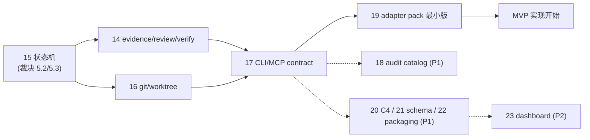

# 13. Design Audit and Next Breakdown

> 日期：2026-07-09
> 状态：v0.1 审计报告
> 审计范围：README + 01–12 全部设计文档
> 性质：这是一份"设计文档的 review record"。它不新增协议能力，只回答三件事：现有设计哪里强、哪里断、下一批文档怎么拆。

---

## 1. Executive Summary

**总体判断：产品骨架成立，可以进入合同细化阶段。** 12 份文档最难得的是边界纪律——"gateway 不做智能"这条线在每份文档里都被重复且没有实质性破功；[09](09-team-run-import-payload-schema.md) 的 payload 合同和 [10](10-claim-next-lock-and-conflict-rules.md) 的 claim-next 规则已经接近可实现质量。

但有 **4 个系统性风险**，其中前 3 个会直接导致 MVP 不闭环：

1. **Git/worktree 与 `.team/` 的关系此前完全未定义（最大 P0）。** agent 在 worktree 中工作时，worktree 里也有一份 branch 版本的 `.team/`；事实源解析到哪个 checkout、`.team` 变更会不会被带进 task branch 造成 merge 冲突，此前没有任何文档回答。本次审计已与产品负责人确认决策 D4（MVP 全部 gitignore + 主 checkout 解析），需要专门文档落地。
2. **状态机不闭环。** run 级状态机整体缺失（`run.json` 里出现了 `planned`，claim-next 检查 `run_paused`，但 run 状态从未被枚举）；task 状态机中 `blocked` 没有出口转换；`stale` 在 [03](03-team-task-list-and-task-schema.md) 是状态、在 [10](10-claim-next-lock-and-conflict-rules.md) 是派生风险，两者矛盾；`changes_requested → working` 返工环的 path claim 语义缺失。
3. **Evidence / Review / Verification 只有目录名和散落要求，没有合同。** 直接后果是 audit 规则悬空：`team audit evidence` 要检查"evidence 覆盖 acceptance"，但 evidence 是自由 markdown，机器无法检查。reclaim 被 [05](05-mvp-feature-slices.md) 放到 Phase 2，但没有 reclaim 的 MVP 在 agent 崩溃后任务永久死锁。
4. **`team memory update` 有越界成"智能 gateway"的苗头。** [11](11-4-plus-1-architecture-view.md) 和 [12](12-context-plane-task-dag-message-pool-memory.md) 都描述 gateway 模块"从 messages/evidence **压缩** memory"——语义压缩是 LLM 行为，gateway 没有也不应该有 LLM。必须重新定义为"agent 生成压缩内容，gateway 只校验 source refs 并存储"。

**下一步：** 建议新增 9 份文档（见第 6 节），其中 4 份 P0（14 evidence/review/verification 合同、15 状态机与生命周期、16 git/worktree 集成、17 CLI/MCP 合同与错误模型），外加一轮对现有文档的修订 pass（见 6.3）。

---

## 2. Current Product Understanding

审计基于以下产品理解（与 README 和产品负责人本轮确认一致）：

- **它不是 coding agent，也不是中心调度 AI。** Claude Code / Codex / Cursor 负责读项目、拆任务、写代码、review、verify；`.team gateway` 只负责记录、分发、锁、防冲突、任务 DAG、上下文传递、证据、审计、进度。
- **`.team/` 是 repo-local 事实源**，run/task/claim/evidence/review/event 全部落在项目内文件里，不落在聊天记录里。
- **两层命令模型：** slash command / skill 固定 agent 的流程（何时调用什么、何时停止），gateway primitive 固定状态变更（原子、可审计）。`/team-plan` 由 coding agent 拆任务，gateway 只 import payload 并分配 RUN-ID / TASK-ID；`/team-dispatch` 由 agent 自主领取，gateway 用 `claim-next` 保证原子性。
- **Dashboard 只是 read-only viewer**，不是任务分发权威入口。
- **events 是审计账本，messages 是协作上下文**，两者分离（INV-011）。

### 2.1 产品决策记录（2026-07-09，产品负责人确认）

本次审计过程中确认了 4 项此前悬而未决的产品决策，后续文档以此为准：

| ID | 决策 | 内容 | 影响 |
|---|---|---|---|
| **D1** | 落地形态走 **A → B → C 演进** | 先做形态 A 最小本地版（repo 内 `.claude/commands` + `tools/team-gateway` CLI）验证链路；跑通后升级形态 B 插件包分发；最后形态 C MCP-first 强一致 | [07](07-skill-plugin-execution-form.md) 从"三选一"改为"路线图"；新增 22 号 packaging 文档 |
| **D2** | MVP 工具矩阵 = **Claude Code + Codex** | 保住核心跨工具故事（Claude plan → Codex dispatch）；Cursor 移入 Phase 2 | 19 号 adapter 文档只需覆盖两家；Cursor 从 MVP 验收中移除 |
| **D3** | gateway 实现栈 = **TypeScript / Node** | npm/npx 分发；MCP SDK 成熟；path glob 用 minimatch 语义 | 17/20 号文档按 Node 写锁实现与包结构；解决 [09](09-team-run-import-payload-schema.md) 待决问题 4 |
| **D4** | `.team/` MVP **全部 gitignore** | `.team/` 是本地协作状态目录；gateway 一律通过 git common dir 解析到主 checkout 的 `.team/`；留档需求用 `team export` 导出报告后再入库 | 16 号文档落地；[02](02-domain-model-and-team-storage.md) §4 "制品可进 git"的表述需按 MVP 口径修订 |
| **D5** | dispatch **默认单任务即停** | agent 完成一个 task 后停下汇报，等用户确认是否继续；`--loop` 参数显式开启连续领取（解 Q1） | [15](15-run-task-state-machine-and-lifecycle.md) §7；19 号模板 dispatch 末步 |
| **D6** | review gate **必须存在，默认开启** | `require_review` 默认 `true`，可经 run policy 配置关闭；关闭时状态走 `review_skipped(actor=policy)` 留痕且 audit 记 warning；**self-approval 禁令不受此开关影响**（解 Q2） | [15](15-run-task-state-machine-and-lifecycle.md) §9；14 号；18 号补 audit 规则 |
| **D7** | **允许多个 active run** | 执行期各 run worktree 隔离，但跨 run 无路径冲突硬检查、最终都合回同一 base branch；发布第二个 active run 时 gateway 警告并在 status 列为 risk（解 Q3） | 16/17；[10](10-claim-next-lock-and-conflict-rules.md) 补注记 |
| **D8** | required_checks **强制附原始输出** | 任务声明的 required_checks 必须附截断后的 raw output + exit code；其余命令可选（解 Q4） | 14 号 evidence schema |
| **D9** | stale **惰性探测 + 超时自动回收** | 无守护进程：stale 在每次 primitive/status 调用时按 `now > lease_until` 派生；过期超过 `auto_reclaim_after_ttl_multiple`（默认 3×TTL）由下一次 claim-next sweep 自动回收；回收**保留 worktree 与 previous_attempts 进展标注**，任务回 `ready`，新领取者决定续做或重做；可配 manual-only（解 Q5） | [15](15-run-task-state-machine-and-lifecycle.md) §5；10 号 §10 重写 |
| **D10** | **三类 run 模式都进 MVP** | feature/debug/review 共用协议与状态机，差异只在 planning prompt 模板与默认 policy 表（解 Q6） | [15](15-run-task-state-machine-and-lifecycle.md) §10；19 号需三套 plan 模板 |
| **D11** | MVP gateway **不执行 checks** | 命令由 agent 执行，gateway 只接收结构化结果并记录；防伪造 runner Phase 3 再评估（解 Q7） | 14 号 checks 执行边界 |
| **D12**（终裁） | **CLI 定名 `sigmarun`**（2026-07-10 产品负责人确认） | npm 包名与 bin 均为 `sigmarun`（[22](22-packaging-installation-and-evolution.md) §6 实测 E404 可用，注册即防御 `sigma-run` 连字符变体）；可选别名 `sigma` 默认关闭（PyPI sigma-cli 撞名）；workspace scope `@sigmarun/*` 注册时确认；**协议目录维持 `.team/`**；设计文档沿用 `team <cmd>` 简记，一律等价于 `sigmarun <cmd>`（避免全集机械改写，实现仓库用真名）（解 Q8，终） | 22 §6；[17](17-cli-mcp-contract-and-error-model.md) §1 记号约定；20 号 scope 占位随实现更新 |
| **D13**（闭环） | Codex 触发方式**先实测再定稿** | 两轮实测完成（跨 codex-cli 0.142.5 / 0.144.0-alpha.4，桌面版期间并入 ChatGPT.app）：T1 斜杠 **3/3**、T2 中文 **3/3** 触发；T3 闲聊误报 **0/3**；T4 显式调用 **2/2**；11 个有效 run `.team/` 零直改（RULE 2 全守）——全判据通过，**触发词 + 显式调用双路径定稿，PROVISIONAL 解除**（解 Q9，终） | [19](19-agent-adapter-pack-claude-codex.md) §8.1–8.2；testkit-codex-trigger/ |
| **D15** | **review/verify 工作项进 claim-next**（M31 裁决，2026-07-10 产品负责人委托 Claude 决策） | gate 模型不变：`claim-next --role reviewer/verifier` 从 submitted/approved 队列**合成虚拟工作项**（不进 task-list，命中即落 review claim），envelope 与普通认领同构（`data.kind: "review_work"`）；无此类 agent 时回退人触发 `/team-review` | [15](15-run-task-state-machine-and-lifecycle.md) §7；[14](14-evidence-review-verification-contract.md) §3.1；10 修订 |
| **D16** | **envelope 一律英文**（M41 裁决，同上委托） | `message` / `next_actions` / reason code 是 agent 解析面，固定英文保 adapter 分支稳定；中文人读文案由 adapter / dashboard 层本地化 | [17](17-cli-mcp-contract-and-error-model.md) §2；19 号模板 |
| **D17** | **窗口可寻址 + 定向领取 + import 防重**（2026-07-10 使用语义细化，产品负责人委托） | ① `team agent register --label "<窗口名>"` 按 label 幂等：同 run 内同名 active 注册返回同一 AGENT-ID——堵住"同窗口重复 dispatch 造多身份绕过 per-agent 上限（M36）"的洞；② slash 层暴露定向领取：`/team-dispatch <RUN> --as <窗口名> --task <TASK>`（CLI `claim-next --task` 既有能力），失败沿用结构化原因；③ 预留式指派（提前锁任务给某 agent）MVP 不做，保持 pull 模型，P2 备选 `team task reserve`；④ `run import` 计算 payload 内容哈希存 `run.json.source.payload_hash`，重复 import 同一 payload → 警告并指向既有 RUN（`--force` 可越过） | [15](15-run-task-state-machine-and-lifecycle.md) §7；[17](17-cli-mcp-contract-and-error-model.md) §1/§3；[09](09-team-run-import-payload-schema.md)；[04](04-command-workflows.md) §1.1；19 模板 |
| **D18** | **跨 run 路径冲突升级为可配置**（同上委托，D7 增补不推翻） | run policy `cross_run_path_policy: "warn"`（默认，维持 D7）\| `"block"`——设 block 时，`task publish` 与 `claim-next` 对其他 active run 的 paths 交集执行硬阻断（reason `cross_run_conflict`），需 `--force` 或改 paths 才能越过；单 run 内冲突控制不变 | [16](16-git-worktree-and-team-root.md) §5；[09](09-team-run-import-payload-schema.md) §5.2；17 §3 |
| **D19** | **项目级记忆（L4）加入协议**（2026-07-10 产品负责人提出，经 Claude Code 记忆体系查证后设计） | 四层记忆补最后一层：git-tracked 的 `docs/team/MEMORY.md`（`.team/` 之外，D4 不动）承载跨 run 决策；**agent 撰写、用户把关（Needs user）、gateway 机械晋升**（`team memory promote`：refs 校验 + 出处戳 + redaction 阻断 + MEM-ID）；读路径双轨（hydrate must_read 恒含 + AGENTS.md/CLAUDE.md `@import` 指向）；借 Claude Code 纪律（索引+按需、<200 行、更新胜于追加、supersedes 链）；**读路径 MVP 生效、写原语 P1 首位（Slice 10）** | [25](25-project-memory-and-knowledge-promotion.md) 全文 |
| **D20** | **deps_satisfied_when 默认档改为含 verified**（2026-07-11 产品负责人裁决，发包前功能测试轮 F4） | 原默认 `["done"]` 与 15 §3.3（done 仅在 report 验收产生）组合后，run 内依赖任务永不可领（真机取证：上游 verified/integrated 均拒领，report 后下游永久搁浅 ready）；改默认 `["verified","integrated","done"]`——上游过独立验证即解锁下游，配合 16 §3.6 上游支合并模式；要更严格由 planner 显式收紧 | [10](10-claim-next-lock-and-conflict-rules.md) §6；16 §3.6 |
| **D14**（复议后 v2） | **被动 CLI 是唯一权威写入者 + `team watch` 巡检器纳入 MVP**；永不做 OS 级 daemon | 初版仅凭"Claude Code agent teams 同为无 daemon 纯文件协调"即落决策，产品负责人复议指出"明知先例有病症不能照抄"，修正为四点：① 权威状态变更保持短锁 CLI 原语——先例病症（忘标完成/状态滞后）的根因是**完成标记自愿无门禁 + 无租约回收**，daemon 无法得知"活干完了"这个只在 agent 上下文里的事实，evidence 门禁 + lease 回收才治得了本病，本设计已具备；② **`team watch` 提前进 MVP**：用户手动启动的常驻**只读**巡检器，每 N 秒触发一次 sweep 并刷新可见性，仍走同一套原语，不是第二事实源；③ 配套三条加固：先例失败模式清单（附录 B，逐条配验收用例）、关键状态文件 `rev` 乐观锁（17 号）、adapter 端 submit 固化 + Stop hook 兜底（19 号）；④ 真 OS 级开机自启 daemon 维持不做，形态 C 的 MCP server 常驻性按 D1 演进自然获得（解 Q5 追问，经复议） | [15](15-run-task-state-machine-and-lifecycle.md) §5.1；17 号（watch 规格 + rev）；本文附录 B |

---

## 3. What Is Strong Already

这些是已经站住、下一批文档不需要推翻只需要引用的部分：

| 强项 | 位置 | 说明 |
|---|---|---|
| **边界纪律贯彻始终** | 全部文档 | 每份文档都有"gateway 不做什么"清单，且相互一致：不读项目、不拆任务、不写代码、不评价代码质量。这是本产品最容易跑偏的地方，目前没有跑偏 |
| **两层命令模型** | [04](04-command-workflows.md) §1、[07](07-skill-plugin-execution-form.md) | "Skill 固定流程，gateway 固定状态"一句话把并发安全的收口点说清楚了 |
| **payload 输入合同** | [09](09-team-run-import-payload-schema.md) | `client_task_key → TASK-ID` 映射解决了 agent 自编 ID 的冲突问题；§9"不允许出现在 payload 里的字段"表（planner 不能伪造运行态）是全套文档里最好的一张边界表；错误/警告分级可直接实现 |
| **claim-next 规格** | [10](10-claim-next-lock-and-conflict-rules.md) | 结构化失败原因（不只说"没任务"）、`--dry-run`、锁与 lease 分离、竞态时序图、不变量清单、验收场景——这是最接近可实现的一份文档，可作为其他合同文档的模板 |
| **events / messages 分离** | [02](02-domain-model-and-team-storage.md) §8、[12](12-context-plane-task-dag-message-pool-memory.md) §9、INV-011 | 审计账本不被聊天污染，这条在多份文档中一致 |
| **progress 是派生视图** | [02](02-domain-model-and-team-storage.md) §10、INV-006 | 可删可重算、audit 可发现 mismatch，杜绝了"agent 手写 80%"的伪进度 |
| **场景先行的 4+1** | [11](11-4-plus-1-architecture-view.md) §2 | 把 +1 场景放在最前面反向约束架构，并有 Scenario→Logical→Process→Development→Physical 的追踪表 |
| **MVP 切片带验收标准** | [05](05-mvp-feature-slices.md)、[08](08-core-gateway-capabilities.md) §8 | 每个 slice 有可判定的验收；08 §8 的场景验收表（并发 claim、path 重叠、self-approve、progress 手改）质量很高 |
| **Dashboard 边界干净** | [08](08-core-gateway-capabilities.md) §2/§6.2、[11](11-4-plus-1-architecture-view.md) §5.3 | "dashboard 不派活、read-model 不能调用写原语"被一致执行，未发现破功 |

---

## 4. Missing / Weak Areas

按主题分组；每条标注建议优先级和归属文档（编号见第 6 节）。

### 4.1 状态机与生命周期（P0，归属 15 号文档）

| # | 缺口 | 证据 | 后果 |
|---|---|---|---|
| M1 | **Run 状态机缺失** | [02](02-domain-model-and-team-storage.md) §5 `run.json` 出现 `"status": "planned"`；[10](10-claim-next-lock-and-conflict-rules.md) §6 有 `run_paused` 失败原因；但 run 的状态集合、转换、谁有权转换从未定义 | pause/resume/cancel/archive 无法实现；`/team-integrate` 后 run 算什么状态不可知 |
| M2 | **`blocked` 无出口** | [03](03-team-task-list-and-task-schema.md) §7 和 [11](11-4-plus-1-architecture-view.md) §3.4 的状态机中 `working -> blocked` 后没有任何出边；[04](04-command-workflows.md) 有 `team block` 原语但没有 `team unblock` | 一旦 block 任务永久卡死；blocker 被 message `answer` 解决后如何联动状态未定义 |
| M3 | **返工环的 path claim 语义缺失** | [04](04-command-workflows.md) §5 submit 时"释放或降级 path claim，取决于 policy"——"降级"未定义；`changes_requested -> working` 后 owner 是否要重新 claim path、此时路径被别人占了怎么办，无答案 | review 返工是高频路径，MVP 必然踩到 |
| M4 | **claim 恢复 / agent 身份续期缺失** | [10](10-claim-next-lock-and-conflict-rules.md) §10.2 只说 stale agent 恢复后"必须重新读取状态，不能假装持有 claim"，但没有 `resume`/重挂原语；AGENT-ID 由每次 `/team-dispatch` 生成（[03](03-team-task-list-and-task-schema.md) §2），会话重启后拿到新 ID，旧 claim 变孤儿 | agent 中断重连是常态而非异常；无 resume 则每次重启都要走 reclaim |
| M5 | **heartbeat 现实性未处理** | [10](10-claim-next-lock-and-conflict-rules.md) §9 建议 5 分钟心跳，但 coding agent 深度实现时不会定时调 CLI（没有后台定时器） | 大量假 stale。缓解：所有 primitive 调用（message post、submit 等）自动捎带续租；TTL 按"一次专注实现的时长"设置；adapter 模板中写明在自然停顿点 heartbeat |

### 4.2 Evidence / Review / Verification（P0，归属 14 号文档）

| # | 缺口 | 证据 | 后果 |
|---|---|---|---|
| M6 | **evidence 无结构化格式** | [04](04-command-workflows.md) §5 列了 evidence 必须包含的 7 项，但载体只有 `evidence/TASK-ID.md` 自由 markdown | `team audit evidence` 要检查"覆盖 acceptance 和 checks"（[08](08-core-gateway-capabilities.md) §5.3），对自由文本无法机械检查。需要 `evidence.json`（结构化：changed_files、checks[{cmd,exit_code,output_ref}]、acceptance[{item,status}]）+ `evidence.md`（人读）双格式 |
| M7 | **verification 记录粒度冲突** | 存储是 run 级单文件 `verification.md`（[02](02-domain-model-and-team-storage.md) §3）；ID 是 `VERIFY-RUN-0001-01`；但 task 状态机有每 task 的 `approved -> verified` 转换 | 单文件既装不下多轮 verification 也对不齐 per-task 状态。建议改 `verification/VERIFY-*.json|md` 目录，record 可指向 task 或 run |
| M8 | **review 多轮与 review claim 无模型** | ID `REVIEW-TASK-0003-01` 隐含多轮，但存储是单文件 `reviews/TASK-0001.review.md`；[03](03-team-task-list-and-task-schema.md) §8 和 [04](04-command-workflows.md) §8 的流程里有"review claim"，但 [10](10-claim-next-lock-and-conflict-rules.md) 的 claim 数据模型只有 task claim 和 path claim | reviewing 状态可以并发抢占（两个 reviewer 同时 review）；changes_requested 后第二轮 review 覆盖第一轮记录 |
| M9 | **checks 执行边界未写死** | [04](04-command-workflows.md) §9 说 `/team-verify` "运行 checks"——应明确：**命令由 agent（或未来 runner）执行，gateway 只接收结构化结果并记录**；MVP gateway 不执行项目代码（避免沙箱/安全问题） | 边界不写死，实现时容易顺手让 gateway shell out 跑测试，破坏"gateway 无副作用于项目代码"的定位 |
| M10 | **`requires_approval` 路径的批准流缺失** | [09](09-team-run-import-payload-schema.md) §5.5 和 [10](10-claim-next-lock-and-conflict-rules.md) §8.2 都说命中 `requires_approval` 需要"用户或 integrator 允许"，但没有批准原语、批准记录、对应事件 | 该字段目前是无法兑现的承诺 |

### 4.3 Git / Worktree 集成（P0，归属 16 号文档；D4 已定方向）

| # | 缺口 | 证据 | 后果 |
|---|---|---|---|
| M11 | **team root 解析规则缺失** | agent 在 `../.team-worktrees/RUN-0001/TASK-0003` 内运行 `team submit` 时，CLI 必须解析到**主 checkout** 的 `.team/`（例如经 `git rev-parse --git-common-dir`），而不是 worktree 内那份 branch 版本的 `.team/`。没有任何文档提到这一点 | 不定死这条，每个 worktree 会各写各的 `.team/`，事实源当场分裂——这是能让整个 MVP 失败的单点 |
| M12 | **worktree 生命周期不完整** | worktree 创建者未决（[05](05-mvp-feature-slices.md) 待决 4）；`worktrees.json` 无 schema；`WT-TASK-0003` ID 定义后（[01](01-product-boundary-and-user-journey.md) §6）从未出现在任何 schema 里；integration 后 worktree 清理/归档无策略（[10](10-claim-next-lock-and-conflict-rules.md) 待决 6） | 长期使用后 worktree 垃圾堆积；reclaim 时旧 worktree 的未提交改动处置无据 |
| M13 | **integration/merge 生命周期只有一段话** | [04](04-command-workflows.md) §10 五步描述；integration branch 策略、按依赖排序合并的算法、冲突时回到谁处理、merge 后 task branch 删除策略全部缺失 | Slice 9 无法验收 |
| M14 | **跨 run 的 path conflict 无检查** | path-claims.json 是 per-run 的；两个 active run 同时 claim `src/auth/**` 不会被发现 | MVP 可先规定"建议单 active run"+ status 警告；长期需要 project 级 path 索引 |
| M15 | **`team export` 缺失** | D4 决定 `.team/` 不入库后，"留档"需求（复盘、PR 附证据）需要一个导出原语：把 run 的 plan/evidence/reviews/report 导出成可入库目录 | 没有它，D4 会被用户体验倒逼回"直接把 .team 提交进 git" |

### 4.4 CLI / MCP 合同（P0，归属 17 号文档）

| # | 缺口 | 证据 | 后果 |
|---|---|---|---|
| M16 | **全局错误模型缺失** | 结构化失败只在 claim-next 处定义（[10](10-claim-next-lock-and-conflict-rules.md) §2.3）；其余命令的输出 envelope、reason code 枚举、exit code、`--json` 是否全命令支持，均未定义 | Skill/slash command 靠解析 CLI 输出驱动流程；无统一 envelope 则每个 adapter 各写各的解析逻辑 |
| M17 | **锁实现未选型** | [10](10-claim-next-lock-and-conflict-rules.md) 待决 1：flock / lockfile / mkdir。D3 定了 Node 栈后应选定跨平台方案（如 `proper-lockfile` 或 mkdir 原子性），并定义 stale lock 检测与崩溃恢复 | claim-next 的全部保证建立在这上面 |
| M18 | **命令面有洞** | 缺 `team run list`（用户只有 repo 时如何发现 RUN-ID）、`team run pause/resume`、`team unblock`、`/team-publish`（journey 阶段 2"用户确认发布"没有对应用户命令，[07](07-skill-plugin-execution-form.md) §8 的命令清单里没有）、`team export`（M15）、`team reclaim`（[10](10-claim-next-lock-and-conflict-rules.md) §10.2 定义了但不在 [08](08-core-gateway-capabilities.md) §7 MVP 命令面里） | 用户旅途在"确认发布"和"出事恢复"两个环节没有把手 |
| M19 | **ID 分配的锁范围** | `run.lock` 在 `runs/RUN-ID/locks/` 下——run 创建**之前**它还不存在；两个 `/team-plan` 并发 import 可能都拿到 RUN-0002。MSG-ID 等 run 内 append 也未说明是否走锁 | 需要 project 级锁（如 `.team/locks/project.lock`）保护 run 创建与全局 ID 分配 |
| M20 | **messages.jsonl 并发 append 纪律未定义** | 多 agent 经 `team message post` 并发追加；是否在锁内、是否依赖 O_APPEND 原子性（Windows 语义不同） | Node 栈下应统一为"所有写经 gateway、短锁内 append"，写进 17 号存储纪律章节 |

### 4.5 Context Plane（P0 修正 + P1 补充，归属 12 修订 + 14/18）

| # | 缺口 | 证据 | 后果 |
|---|---|---|---|
| M21 | **memory update 越界**（详见 5.1） | [11](11-4-plus-1-architecture-view.md) §5.2 `memory-builder`"压缩"、[12](12-context-plane-task-dag-message-pool-memory.md) §10 `team memory update`"压缩 messages/evidence/reviews" | 唯一一处实质性边界破功风险 |
| M22 | **INV-014 不可执行** | "下游 task hydrate 时必须读 required context refs"——gateway 无法验证 agent 真的读了；[12](12-context-plane-task-dag-message-pool-memory.md) §11 的 audit 规则"downstream ignored handoff"依赖"hydrate/read 记录"，但事件表里没有 hydrate 事件 | 改为可执行版本：hydrate 写 `context_hydrated` 事件；submit 的 evidence 中要求声明已读 refs（`context_ack`）；audit 检查事件与声明，而不是检查"是否真的读了" |
| M23 | **open-questions / run-decisions 与 messages 冗余** | [02](02-domain-model-and-team-storage.md) §3 同时有 `messages.jsonl`（含 `decision`/`question` 类型）、`open-questions.jsonl`、`run-decisions.jsonl` 三份，权威归属未定义 | 同一事实两处写必然漂移。建议：messages.jsonl 是唯一协作事实源，open-questions/run-decisions 降级为派生索引（与 progress.json 同类，可重建） |
| M24 | **context pack 体积策略缺失** | 长 run 后 hydrate 的 must_read + messages 会膨胀 | P2：pack 分级（must_read 上限 N 条、其余给 refs）；MVP 可仅在文档中注明风险 |

### 4.6 Audit 与信任模型（P1，归属 18 号文档；P0 子集内嵌）

| # | 缺口 | 证据 | 后果 |
|---|---|---|---|
| M25 | **规则目录未成表** | [08](08-core-gateway-capabilities.md) §5.3 有 10 条检查项概览、[12](12-context-plane-task-dag-message-pool-memory.md) §11 又加 8 条，但"每条规则查什么文件、触发条件、severity、修复建议、依赖哪些事件"未落表 | README 后续拆解顺序第 2 条，本审计确认仍缺 |
| M26 | **event schema 与目录不闭合** | [04](04-command-workflows.md) §11 的事件清单缺：`task_reclaimed`（[10](10-claim-next-lock-and-conflict-rules.md) §10.2 用到）、`task_published`（[03](03-team-task-list-and-task-schema.md) §8 用到，04 清单里有 `task_published`——但缺 `task_unblocked`）、`run_paused/resumed`、`context_hydrated`（M22 需要）、`path_override_approved`（[10](10-claim-next-lock-and-conflict-rules.md) §8.3 需要）、`task_cancelled`；且每类事件的必填字段（actor、event_id、seq）无 schema | audit 规则引用不存在的事件 = 规则无法实现 |
| M27 | **信任模型未声明** | `.team/` 是普通文件，任何 agent 技术上可绕过 gateway 直接改 claims（[07](07-skill-plugin-execution-form.md) §10 只说"Skill 明确禁止；gateway 可做 audit 检查"）；evidence 是 agent 自报，命令输出可以是幻觉 | 应显式声明：**MVP 信任模型 = 合作式 agent + 事后审计（audit-not-prevent），不是拜占庭防御**。这决定了哪些"防伪造"需求（哈希链、gateway 亲自跑 checks）属于后期而非 MVP |

### 4.7 Schema 版本与配置（P1，归属 21 号文档）

| # | 缺口 | 证据 |
|---|---|---|
| M28 | 每个文件都带 `schema_version` 但无兼容政策：未知版本读到怎么办、gateway 升级后旧 run 怎么办、`team migrate` 是否存在。MVP 最低规则应是"未知 major 版本 → 拒绝并提示升级路径" | 全部 schema 文件 |
| M29 | `config.toml` 与 `project.json` 并存（[02](02-domain-model-and-team-storage.md) §3 目录树），前者从未被任何文档提及职责 | 建议 MVP 只留 `project.json`，删除 `config.toml` |

### 4.8 编辑性问题（trivial，随修订 pass 处理）

| # | 问题 | 位置 |
|---|---|---|
| E1 | 同一文档出现两个 `## 10` 章节（"Progress 是派生视图"和"Storage Rules"） | [02](02-domain-model-and-team-storage.md) |
| E2 | "三类 Team Run"表：表头 5 列、分隔行 4 列，markdown 渲染损坏 | [01](01-product-boundary-and-user-journey.md) §4 |
| E3 | Slice 编号漂移：[05](05-mvp-feature-slices.md) 有 9 个 slice（Slice 4 = Context Plane），[06](06-user-journey-visual-breakdown.md) §7 的主链路图还是旧的 8 slice 编号；06 §2 泳道图也没有 hydrate 步骤（[12](12-context-plane-task-dag-message-pool-memory.md) §13 明确要求 dispatch = claim → hydrate → work） | 05 / 06 |
| E4 | payload 示例中 `"worktree_root": "../.team-worktrees/RUN-0001"`——payload 提交时 RUN-ID 尚未分配，payload 不应包含 RUN-ID 派生路径（该字段应留空由 gateway 生成） | [09](09-team-run-import-payload-schema.md) §4 |
| E5 | dispatch command 示例 `allowed-tools: ["Bash", "Read", "Edit"]` 缺 `Write`，无法写新文件 | [07](07-skill-plugin-execution-form.md) §3 |
| E6 | 命令参数约定不一致：[01](01-product-boundary-and-user-journey.md) §5 用单参 `/team-task TASK-0003`，[03](03-team-task-list-and-task-schema.md) §10 / [07](07-skill-plugin-execution-form.md) §8 用双参 `/team-task RUN-ID TASK-ID`。由于 TASK-ID 是 run-scoped 自增（每个 run 都有 TASK-0001），**单参形式是歧义的**，必须统一为双参（或让 TASK-ID 全局唯一） | 01 / 03 / 07 |

---

## 5. Contradictions or Boundary Risks

按严重度排序。前 3 条是真正的设计矛盾，必须在下一批文档中裁决；后面是需要防守的边界风险。

### 5.1 `team memory update`：唯一一处边界破功风险（P0 裁决）

[12](12-context-plane-task-dag-message-pool-memory.md) 开头说"Gateway 不理解代码该怎么写"，但 §10 定义 `team memory update`"**压缩** messages/evidence/reviews 到 run/task memory"，[11](11-4-plus-1-architecture-view.md) §5.2 的 `context/memory-builder` 模块职责同样是"压缩"。语义压缩/总结是智能行为——gateway 没有 LLM，做不了；如果为了做这个给 gateway 塞一个 LLM 调用，产品定位就滑向了用户明令禁止的"中心调度 AI"。

**裁决建议：** memory 内容一律由 agent 生成，gateway 只做两件事：
1. **机械 rollup**：按模板拼接/索引（最近完成的 task 列表、open questions 列表、refs 目录）——确定性操作，允许。
2. **存储 agent 提交的压缩内容并校验 source refs**：`team memory update --content <agent 写的 memory> --refs ...`，refs 指向不存在的文件则拒绝（对应 INV-012）。

对应改动：12 号 §7.3/§10 重写 memory update 语义；11 号 §5.2 `memory-builder` 改名/改职责为 `memory-store`（校验 + 模板 rollup）；adapter 模板中把"压缩 memory"定义为 submit 流程中 agent 的职责。

### 5.2 `stale`：状态还是派生风险？（P0 裁决）

[03](03-team-task-list-and-task-schema.md) §7 把 `stale` 列为任务状态（`claimed/working -> stale`），[11](11-4-plus-1-architecture-view.md) §3.4 状态图同样；但 [10](10-claim-next-lock-and-conflict-rules.md) §10.1 说 stale 是 status/progress 在读取时发现 `now > lease_until` 后标注的**风险**。关键事实：**gateway 是被动 CLI，没有后台守护进程**——没有任何主体会在 lease 过期的瞬间去改写状态文件。

**裁决建议：** stale 是**读取时派生**的标注（progress/status/audit 计算），不是持久化状态；持久化状态只在 `reclaim` 时改变（claim → `reclaimed`，task → `ready`/`blocked`）。从 03/11 的状态机中移除 `stale` 节点，改为在 claim 状态表加"expired（派生）"注记。这同时回答了"谁来写 stale"的实现问题。

### 5.3 reclaim 的 MVP 归属矛盾（P0 裁决）

[05](05-mvp-feature-slices.md) §11 把 "stale task reclaim" 放进 Phase 2；但 [10](10-claim-next-lock-and-conflict-rules.md) §10.2 按 MVP 语气详细设计了 `team reclaim`（用户确认 + 7 步流程）。**没有 reclaim 的 MVP 不闭环**：agent 崩溃（必然发生）后该 task 的 claim 永不释放，run 死锁。

**裁决建议：** 手动 reclaim（需用户确认）进 MVP，挂到 Slice 3（claim-next + lock）或 Slice 7（status 发现 stale → 提示 reclaim 命令）；自动回收策略留 Phase 2。修订 05。

### 5.4 review claim 出现在流程里但不在数据模型里（P0，并入 14/15）

[03](03-team-task-list-and-task-schema.md) §8 `submitted -> reviewing` 要求记录 "review claim"，[04](04-command-workflows.md) §8 第 1 步是 "claim review"；但 [10](10-claim-next-lock-and-conflict-rules.md) 的 claim 模型只有 task claim 与 path claim。两个 reviewer 并发 review 无互斥，多轮 review 无记录结构（见 M8）。14 号文档需给出 review claim（或 review 作为特殊 task type 复用 task claim——[09](09-team-run-import-payload-schema.md) 待决 6 的"gate vs task"之争在此必须裁决：**建议 MVP 用 gate + 轻量 review claim，Phase 2 再支持 review-as-task**）。

### 5.5 task 状态的三处冗余写（P1 裁决，防漂移）

task 状态同时存在于 `team-task-list.json`（索引）、`tasks/*/task.json`（详情）、以及 [12](12-context-plane-task-dag-message-pool-memory.md) §5 的 `task-graph.json` nodes（`"status": "done"`）。前两者有"索引 vs 详情"的说法但**没有单写者规则**（primitive 更新时是否两处原子更新？谁先谁后？崩溃在中间怎么办）。graph nodes 带 status 是 12 号新引入的第三处冗余。

**裁决建议：** `tasks/*/task.json` 为权威，task-list 为索引（primitive 在同一锁事务内双写，audit 校验一致性），**task-graph.json 的 nodes 移除 status 字段**（读取时 join），edges 的 `status: satisfied` 同样改为派生。写进 17 号的"权威/派生字段矩阵"。

### 5.6 audit 规则引用不存在的事件（P1，并入 18）

见 M26。规则目录成表时必须先补全事件目录，否则 catalog 一落地就发现一半规则查不到输入。

### 5.7 边界灰区：允许与不允许的"校验智能"

[09](09-team-run-import-payload-schema.md) §8.2 的警告项里有"task acceptance 过于泛化"——这是文本语义判断的边缘。建议在 14/17 中显式声明灰区规则：**gateway 允许机械启发式**（长度、是否为空、枚举匹配、glob 语法、路径存在性），**不允许语义判断**（"这个验收标准好不好"）。语义质量判断属于 planning agent 的自检或 review agent 的职责。

### 5.8 其他确认无破功的边界

- Dashboard read-only：多处一致，无违反。
- gateway 不读项目：`import` 校验"path 是否越出 repo"用的是文件系统事实而非项目理解，可接受。
- `/team-plan` 不 claim、不开工：多处一致。

---

## 6. Recommended Next Documents

### 6.1 新文档清单

编号顺延本文档（13）。用户提议的 7 个方向全部保留，另增 2 个独立判断出的缺口（15 状态机、19 adapter pack——15 是审计发现的最大结构性缺口之一；19 是 README 拆解顺序第 4 条，用户清单漏掉了它，而没有 adapter 模板产品无法被使用）。

| # | 文件名 | 优先级 | 目标 | 主要章节 |
|---|---|---|---|---|
| 14 | `14-evidence-review-verification-contract.md` | **P0** | 把"完成的证明"从自由文本变成合同，解决 M6–M10 | ① evidence.json + evidence.md 双格式 schema（changed_files / checks 结构化结果 / acceptance checklist / risks / context_ack refs）② raw output 附带策略（截断规则）③ review record schema + 多轮版本化 + review claim 模型（gate vs task 裁决）④ verification/ 目录与 per-task/per-run record schema ⑤ checks 执行边界（agent 跑、gateway 存）⑥ `requires_approval` 批准流与事件 ⑦ templates/ 四个模板的最终内容 ⑧ acceptance→evidence→review→verify 的追踪链与验收场景 |
| 15 | `15-run-task-state-machine-and-lifecycle.md` | **P0** | 状态机闭环，解决 M1–M5、5.2、5.3 | ① run 状态机（planned→active→paused→integrating→reported→archived/cancelled）② task 状态机修订版（blocked 出口、stale 派生化、rework 环 path 语义）③ claim 状态机与 task 状态机的对齐表 ④ **转换权限矩阵**（谁 × 从哪到哪 × 必写记录与事件）⑤ publish 流程与 `/team-publish` ⑥ reclaim / resume / cancel 流程（含 agent 身份续期）⑦ heartbeat 捎带策略与 TTL 建议值修订 |
| 16 | `16-git-worktree-and-team-root.md` | **P0** | 落地 D4，解决 M11–M15 | ① `.gitignore` 模板与 D4 声明 ② team root 解析算法（git common dir，worktree 内运行的行为契约）③ worktree 创建/进入/命名/`worktrees.json` schema ④ integration branch 策略、依赖序合并、冲突处理归属 ⑤ run 结束后 worktree 清理/归档 ⑥ `team export`（留档导出格式与目标目录）⑦ 跨 run path conflict 的 MVP 策略（单 active run 建议 + 警告）⑧ 故障场景：worktree 内误改 `.team/`、branch 带入 `.team` 变更的检测 |
| 17 | `17-cli-mcp-contract-and-error-model.md` | **P0** | 全命令统一合同，解决 M16–M20、5.5 | ① 命令总表（含新增：run list/pause/resume、unblock、reclaim、export、publish）② 全局 JSON envelope（ok/reason/data/next_actions）+ reason code 枚举 + exit code 规范 ③ `--json`/`--dry-run` 全命令约定 ④ Node 锁实现选型（proper-lockfile/mkdir）、atomic write（temp+rename）、崩溃恢复、stale lock 检测 ⑤ project 级锁与 ID 分配规则 ⑥ 权威/派生字段矩阵（单写者规则）⑦ MCP tool 映射表（为形态 C 预留，D1）⑧ schema_version 握手最低规则 ⑨ gateway 自身测试策略（并发 claim 压测、崩溃注入） |
| 18 | `18-audit-rule-catalog-and-trust-model.md` | **P1**（含 P0 子集） | 规则成表 + 信任模型声明，解决 M25–M27 | ① 事件目录补全 + event schema（actor/event_id/seq/必填字段）② 规则表：rule_id / 输入文件 / 触发条件 / severity / 报告字段 / 修复建议 / 依赖事件 ③ **P0 内嵌子集标注**：duplicate claim、missing evidence、self approval、DAG cycle、path overlap 这五条不等 audit 命令，直接在 primitive 里阻断 ④ 信任模型章：合作式假设、audit-not-prevent、evidence 自报边界、Phase 3 防伪造选项（哈希链/runner）⑤ audit 输出 JSON+MD 双格式 |
| 19 | `19-agent-adapter-pack-claude-codex.md` | **P0/P1**（最小模板 P0，完整包 P1） | 落地 D2，产品可被真实使用 | ① Claude Code `.claude/commands/*.md` 全套可运行模板（plan/dispatch/publish/status/task/submit/review/verify）② Codex skills 全套 SKILL.md ③ AGENTS.md / CLAUDE.md 协议段落（进 repo 的那一段）④ dispatch loop 行为（完成后是否继续 claim）⑤ heartbeat 捎带写法 ⑥ 模板与 CLI envelope 的解析约定（依赖 17）⑦ Cursor 附录占位（Phase 2, D2） |
| 20 | `20-c4-l2-l3-component-contracts.md` | **P1** | README 拆解顺序第 3 条；11 号是 4+1 不是 C4 | ① C4 L1 System Context / L2 Container（CLI、MCP server、dashboard read-model、.team 存储、coding agents）② L3 Component（对齐 11 §5.1 的模块图，按 D3 改为 TS 包结构）③ 每个 component 的接口签名（claim-engine、lock-manager、storage、audit engine、context hydrator）④ 与 4+1 的映射表 |
| 21 | `21-schema-versioning-and-migration.md` | **P1** | 解决 M28–M29 | ① 每类 schema 的 semver 政策 ② 未知版本行为（拒绝 + 提示）③ `team migrate` 设计 ④ gateway 版本 × schema 版本兼容矩阵 ⑤ payload 版本协商 ⑥ config.toml 移除决议 |
| 22 | `22-packaging-installation-and-evolution.md` | **P1** | 落地 D1 的 A→B→C 路线图 | ① 形态 A：repo 内布局、`team init`、`team doctor` ② 形态 B：插件打包（Claude plugin + Codex skills 包）、版本升级、多项目复用 ③ 形态 C：MCP server 化的触发条件与工具面 ④ 各阶段进入/退出判据 ⑤ npm 包名与 CLI 命名（`team` 命名冲突风险，见开放问题 Q8） |
| 23 | `23-dashboard-information-architecture.md` | **P2** | README 拆解顺序第 5 条，保持最后 | ① 只读 IA：RUN 列表 / DAG 视图 / message pool / open questions / evidence-diff 面板 ② read-model 数据来源映射 ③ 明确无写路径与"复制命令"边界 ④ 刷新模型（轮询 .team/） |
| 24 | `24-security-permissions-and-data-hygiene.md` | **P0/P1**（redaction 管道 P0，其余 P1） | 产品负责人 2026-07-09 追加：安全/权限/越权写/secret redaction/日志脱敏此前无独立覆盖；D8 决定原始输出落盘后 redaction 成为 P0 | ① MVP 信任模型（合作式 + audit-not-prevent，M27 闭合，18 号信任小节指向此文）② 权限边界矩阵与"记录只追加"原则 ③ 越权写 `.team` 的检测信号（rev/seq/一致性/事件失配）④ secret redaction 管道（入口盘点、模式表、export 阻断式二次扫描、诚实边界）⑤ 日志与 envelope 脱敏 ⑥ 路径/symlink 逃逸防护 ⑦ 隐私与数据保留 |

### 6.2 建议的编写顺序

理由：15 的状态机裁决是 14/17 的前置（review claim、reclaim、publish 都依赖状态机定稿）；16 独立可并行；17 汇总前三者的命令面后，19 才能写出能跑的模板。

### 6.3 现有文档修订 pass（随 14–17 一次性执行）

| 文档 | 修订项 |
|---|---|
| README | 见第 8 节 |
| 01 | E2 表格修复；E6 命令统一双参；§5 增加 `/team-publish`；边界节引用 D4 |
| 02 | E1 重复章节号；M29 移除 config.toml；§4 按 D4 改写（MVP 全 ignore + export 留档）；补 worktrees.json schema 引用；stale 派生化注记 |
| 03 | 状态机按 15 号修订（blocked 出口、stale 移除）；E6 参数约定；`verification.md` 改目录引用 |
| 04 | M18 命令补全；M26 事件表补全；§5 "降级"语义按 15 号定义；§9 checks 执行边界按 M9 写死 |
| 05 | 5.3 reclaim 移入 MVP；E3 与 06 编号对齐；待决问题 1/2/4/6 按 D3/D4 与 15/16 号裁决关闭 |
| 06 | E3 主链路图更新；泳道图补 hydrate 步骤 |
| 07 | D1 落地：三形态改为演进路线图；E5 allowed-tools；§8 命令清单补 publish；heartbeat 捎带指引；§9"CLI 包成 MCP"更正为"同 core 双前端"（20 号裁决） |
| 08 | §5.1 audit 输入清单按 14 号目录化布局更新；§5.3 event-gap severity 收紧为 error（15 号通用原则）且检查项表让位于 18 号 AUD 编号；§6.1 状态计数移除 stale（15 §3.1 派生化）；§4.6/§7 指向 17 号全局 envelope 与命令总表 |
| 09 | E4 示例修复；待决 4 按 D3 定 minimatch；待决 6 按 5.4 裁决（gate + review claim）；client_task_key 保留进 metadata（建议 yes，便于追溯） |
| 10 | 待决 1 按 D3 选型；review claim 指向 14；M19 project 锁；M14 跨 run 冲突注记；待决 6 定"保留 + 人工检查" |
| 11 | 5.1 memory-builder 改职责；G3-7/G3-9 在 14/15 完成后复评；补 C4 指针 |
| 12 | 5.1 memory update 语义重写；5.5 graph nodes 去 status；M22 hydrate 事件 + context_ack；M23 open-questions/decisions 派生化 |

---

## 7. P0 / P1 / P2 Priority Breakdown

**P0 判据：不做则 MVP 主链路（plan → dispatch → claim → hydrate → work → submit → review → status）跑不通或跑通了不可信。**

### P0（必须，MVP 闭环阻塞）

| 项 | 来源 | 归属 |
|---|---|---|
| team root 解析规则 + `.gitignore` 策略成文（D4） | M11 | 16 |
| 状态机闭环：run 状态机、blocked 出口、stale 派生化裁决、返工环 path 语义 | M1–M3、5.2 | 15 |
| reclaim（手动 + 用户确认）纳入 MVP | 5.3 | 15 + 05 修订 |
| evidence 双格式合同（json+md）；review claim + 多轮 record；verification 目录化 | M6–M8、5.4 | 14 |
| checks 执行边界写死（agent 跑、gateway 存） | M9 | 14 |
| `team memory update` 边界修正（agent 生成、gateway 校验存储） | 5.1 | 12 修订 |
| 全局 CLI envelope + reason code + 锁选型（Node）+ 原子写纪律 | M16–M17、M20 | 17 |
| 命令面补洞：`/team-publish`、`team run list`、`team unblock`、`team reclaim`、`team export` 规格 | M18 | 15/16/17 |
| project 级锁与 RUN-ID 分配 | M19 | 17 |
| primitive 内嵌审计子集（duplicate claim / missing evidence / self approval / DAG cycle / path overlap 直接阻断） | M25 | 14/17（规则全表在 18） |
| Claude Code + Codex 最小可运行 adapter 模板 | D2 | 19 最小版 |
| 命令参数歧义修复（TASK-ID run-scoped → 全部双参） | E6 | 修订 pass |
| `team watch` 常驻巡检器（只读 + 定期触发 sweep）纳入 MVP | D14 复议 | 17（命令规格）、05 修订 |
| 关键状态文件 `rev` 乐观锁 + 附录 B 失败模式验收用例 | D14 复议、附录 B | 17 |

### P1（MVP 后立刻，产品可信度与可维护性）

| 项 | 来源 | 归属 |
|---|---|---|
| audit rule catalog 全表 + event schema 补全 | M25–M26 | 18 |
| 信任模型声明（合作式 + audit-not-prevent） | M27 | 18 |
| agent 身份续期 / claim resume | M4 | 15 |
| heartbeat 捎带续租 + TTL 修订 | M5 | 15/19 |
| `requires_approval` 批准流 | M10 | 14 |
| 跨 run path conflict（单 active run 策略 + 警告） | M14 | 16 |
| schema versioning / migration 政策 | M28 | 21 |
| open-questions / run-decisions 派生化 | M23 | 12 修订 |
| task 状态单写者矩阵 + graph node 去 status | 5.5 | 17 + 12 修订 |
| C4 L2/L3 component contracts（TS 包结构） | — | 20 |
| packaging A→B→C 路线图 + `team init/doctor` | D1 | 22 |
| gateway 并发/崩溃测试策略 | — | 17 §9 |
| 完整 adapter pack（含 publish/verify 命令、错误处理分支） | D2 | 19 完整版 |

### P2（增强，明确不阻塞 MVP）

| 项 | 来源 |
|---|---|
| Dashboard 信息架构（23 号） | scope 既定 Phase 2 |
| context snapshots（CTX-ID）与压缩链、context pack 体积分级 | M24、12 §4 |
| message 高级路由（`role:` / `edge:` / `visibility`）与 `conflicts_with` / `supersedes` 边 | 12 §5–6（MVP 只需 `blocks` / `produces_context_for` / `soft_depends_on`，其余边裁剪进 P2） |
| capability 智能匹配、历史成功率派活 | 08 §4.3 已自我约束为后续 |
| evidence 防伪造（哈希链、gateway/runner 亲自跑 checks） | M27 |
| semantic memory search、cross-run knowledge promotion、metrics/observability（G3-17） | 05 §11、11 §8 |
| 多机同步、merge train、GitHub 同步 | 05 Phase 3 既定 |

---

## 8. Suggested README Updates

1. **文档索引**：追加第 13 行（本文档）；可同时列出 14–23 的占位行并标注状态（planned）。
2. **新增"产品决策记录"小节**：收录 D1–D4（形态 A→B→C 演进、Claude Code + Codex 首发、TypeScript/Node、`.team/` MVP 全 gitignore），后续决策继续追加。这是目前唯一没有落文档的口头共识，必须成文。
3. **"关键判断"补两条**：
   - 第 8 条：`.team/` 在 MVP 不进 git；gateway 通过 git common dir 解析事实源到主 checkout；留档走 `team export`。
   - 第 9 条：memory/上下文压缩内容由 coding agent 生成，gateway 只校验 source refs 并存储——gateway 永远没有 LLM。
4. **"Out of Scope for v0.1"补一条**："gateway 执行语义总结/压缩"与"gateway 执行项目代码（checks 由 agent 跑）"。
5. **"后续拆解顺序"整节替换**为第 6.2 节的顺序（15 → 14/16 → 17 → 19 → 18/20/21/22 → 23），原有 5 条已被本报告细化覆盖。
6. **把 [06](06-user-journey-visual-breakdown.md) §7 的 MVP 判断标准提升进 README**（"一个 Claude Code 生成的 RUN-ID，能被 Codex dispatch 领取唯一 TASK-ID、写回 evidence、status 可查可信 progress"），作为全项目北极星验收句。

---

## 9. Open Questions for Product Owner

> **2026-07-09 更新：Q1–Q9 已由产品负责人全部裁决，结论收录为 §2.1 的 D5–D13**（Q1→D5、Q2→D6、Q3→D7、Q4→D8、Q5→D9、Q6→D10、Q7→D11、Q8→D12、Q9→D13）。下表保留原问题与审计建议供追溯。

D1–D4 已决，以下是当时仍开放、且会影响 14–19 号文档写法的问题（按影响排序）：

| # | 问题 | 影响的文档 | 审计建议 |
|---|---|---|---|
| Q1 | **dispatch loop 行为**：agent 完成一个 task 后，默认继续 `claim-next` 连续干下去，还是停下等用户？ | 19（模板核心分支） | 建议默认"完成即停 + 输出下一步命令"，`--loop` 显式开启连续模式；无人值守是 Phase 2 能力 |
| Q2 | **review gate 的 MVP 强度**：`require_review=false` 时允许 `submitted → verified` 直通吗？（[05](05-mvp-feature-slices.md) 待决 7） | 14、15 | 建议 MVP 保留 gate 但 policy 可关；关掉时 audit 记 warning，保证事后可见 |
| Q3 | **单 active run 限制**：MVP 是否强制同一 repo 同时只有一个 active run？ | 16、17 | 建议不强制但默认警告（第二个 run publish 时提示跨 run 路径无冲突检查） |
| Q4 | **evidence 是否强制附 raw command output**（[05](05-mvp-feature-slices.md) 待决 5） | 14 | 建议 required_checks 强制附（截断到 N KB + exit code 必填），其余命令可选 |
| Q5 | **reclaim 自动化阈值**：永远人工确认，还是超过 N×TTL 后允许 agent 自动 reclaim？ | 15 | MVP 永远人工确认；阈值自动化进 P1 并配 policy 开关 |
| Q6 | **三类 run 的 MVP 范围**：feature / debug / review 三模式都做，还是 MVP 只做 feature？ | 09、19 | 建议 MVP 只承诺 feature（协议字段已兼容三模式，debug/review 只差 planning prompt 模板，放 19 的 Phase 2 附录） |
| Q7 | **`team verify` 长期是否允许 gateway/runner 直接执行 required_checks**？（确定性执行不算智能，但引入沙箱与安全问题） | 14、18 | MVP 明确不执行；Phase 3 的"防伪造 runner"再评估 |
| Q8 | **CLI 命名**：`team` 作为命令名太通用（易撞 shell alias / 其他工具），npm 包名也未必可用。要不要改 `teamrun` / `tr8` / 其他？ | 17、22 | 建议在 22 号定名前先查 npm/brew 可用性；文档暂用 `team` 占位并注明待定 |
| Q9 | **Codex 侧触发方式确认**：`/team-dispatch` 在 Codex 中以 skill 触发词还是 prompt 显式调用为准，需要实测一轮再定模板措辞 | 19 | 写 19 号前先在真实 Codex 会话中验证 [07](07-skill-plugin-execution-form.md) §4 的 SKILL.md 触发可靠性 |

---

## 附：审计方法说明

本报告逐份精读 README + 01–12（约 4400 行），交叉核对了：ID 与命令在各文档间的一致性、状态机各版本的出入边、事件清单与 audit 规则的闭合性、存储结构与对象模型的对应、MVP 切片与主链路的覆盖。所有 M/E 编号的发现均给出了原文位置，可直接用于修订 pass。

---

## 附录 B：外部先例失败模式清单（Claude Code agent teams）

> 2026-07-09 查证，来源：code.claude.com/docs/en/agent-teams（Architecture / Limitations 章节）。
> 方法论（D14 复议确立）：引用先例不是"他也这样所以我们没错"，而是**把先例的每个已知病症登记为本设计的需求条目——结构性防线 + 残余风险 + 验收用例**。验收用例由 17 号测试策略章节实现，实现前本清单不得关闭。

先例架构速记：纯文件协调（`~/.claude/teams/` 会话级配置、`~/.claude/tasks/` 持久任务列表）、file locking 认领、无 daemon、**无心跳/租约**、推送式通知。

| # | 先例病症 | 根因推测 | 本设计的结构性防线 | 残余风险与缓解 | 验收用例 |
|---|---|---|---|---|---|
| F1 | teammate 完成工作但**忘记标记任务完成** | 完成标记是自愿动作：无门禁、无回收，忘了就永远挂着 | "完成"= `team submit` 交证据这个动作本身，无 submit 即无完成（INV-007/INV-010）；lease 过期 → sweep 回收，带 previous_attempts 回队列（D9） | agent 忘交 → 任务被回收重做（浪费工时但状态一致）；adapter 固化 submit 为不可跳过末步 + Stop hook 在"会话将停但仍持有 claim"时提醒/释放（19 号） | kill 干到一半的 agent：3×TTL 后任务自动回 `ready` 且带进展快照；watch 运行时 stale 在 N 秒内可见 |
| F2 | **task status can lag**（状态显示滞后） | 推测：缓存视图/通知丢失（官方未公开机制，症状明确根因存疑） | progress/status 永远从文件现算（INV-006），无常驻缓存视图；`team watch` 提供准实时巡检（D14） | `.team` 状态滞后于 worktree 真实进度——本质是 F1 的镜像，同一套防线 | 并发状态变更后立即 `/team-status`，输出必须与文件事实一致 |
| F3 | 并发认领竞态（先例以 file locking 缓解，仍有 lag 报告） | 读-改-写窗口 | run.lock 短事务 + temp file + atomic rename（[10](10-claim-next-lock-and-conflict-rules.md) §5）；**新增：关键状态文件 `rev` 乐观锁字段 + check-and-swap**（17 号） | 绕过 CLI 直接改文件的 agent——按信任模型交给 audit 检出（M27） | N 个并发 claim-next 压测：零双认领、零半写文件、rev 冲突可检出 |
| F4 | 成员**静默挂掉无人发现**（先例无心跳/租约，纯推送） | 挂掉的进程发不出推送 | lease + 捎带心跳 + 惰性 sweep + 自动回收（D9）；blocked 豁免防误杀（[15](15-run-task-state-machine-and-lifecycle.md) §5.1） | 全员静默时段无人触发 sweep——由 MVP 的 `team watch` 补位（D14 复议核心动机） | [15](15-run-task-state-machine-and-lifecycle.md) §12 断线场景；追加"全员断线 + watch 在跑"场景 |
| F5 | 团队配置随会话结束删除，**事后不可复盘** | 协调状态设计为临时态 | `.team/` 全量持久化于 repo，events/evidence/reviews 构成可审计事实链（Record 能力） | 无 | run 结束后 `team audit run` 仍可完整重放事实链 |

---

## 附录 C：第二轮盲区清单（M30–M43，2026-07-10）

> 合同层（14–18/20/21/23/24）闭合后，按新透镜（崩溃恢复、注意力路由、需求变更、经济成本、注入攻击、混合人机、规模包络）复扫全集所得。编号接续 M29。**M30–M32 建议在写 19 号之前裁决**，其余随对应文档增补。

**2026-07-10 裁决（产品负责人委托 Claude 决策）：M30–M43 全部按下表"建议处理"列执行。** 其中 M30 已落地 [17](17-cli-mcp-contract-and-error-model.md) §5.3（写序 + 提交点 + `team repair`）；M31 选方案 (a)，记为 **D15**；M41 记为 **D16**；M32/M36/M39 随 reconciliation pass 写入 08/10/02；M35/M38/M41/M42 落 19 号；M33/M34/M37/M40 为 P1 backlog，实现启动前增补。

| # | 盲区 | 为什么重要 | 建议处理 | 优先级 | 归属 |
|---|---|---|---|---|---|
| M30 | **跨文件事务一致性与修复语义缺失**：run.lock 事务要写 task-list、task.json、claims、events 多个文件，单文件原子（17 §5）但**跨文件无 commit point**；崩溃残留只有"audit 能发现"（10 §14），没有"怎么修" | 崩溃后 run 处于矩阵违例状态，只能人肉改文件——恰是我们批判的"直改 `.team`" | 定 canonical 写入顺序，**events append 为提交点**；新增 `team repair`：对照事件账本对状态文件前滚/回滚（机械、幂等、先备份） | **P0** | 17 增补 §5.3 + 18 配规则 |
| M31 | **review/verify 的自主分发断链**：裁决为 gate + 轻量 claim（13 §5.4）后，`claim-next` 只派 task-list 里的任务——submitted 等 review、approved 等 verify 的工作**没有任何自主领取路径**，全靠人触发 `/team-review` | 双 agent 北极星旅途里，A submit 后 B 的 claim-next 拿不到 review 工作，"多 agent 协作"在 review 环节断成人肉 | `claim-next --role reviewer/verifier` 从 submitted/approved 队列**合成虚拟工作项**（不进 task-list，落 review claim）；或显式声明"MVP review 由人触发"并写进旅途文档——二选一需产品负责人裁决 | **P0**（至少要声明） | 15 §3.3 / 14 §3 增补 |
| M32 | **用户注意力队列缺失**：批准请求（requires_approval）、open blocker、D5 停等确认、manual reclaim 确认、review 等待……散落在 status 的 risks/next_actions 里，**没有统一的"待你处理"收件箱**，也没有任何通知渠道 | D5 定了"干完即停等确认"，但用户不知道 agent 停了——停等模式没有通知面就是空转 | status/watch/dashboard 增加一等公民 `needs_user` 区块（类型 × 等待时长 × 一键复制命令）；watch 可选 hook 外部通知（桌面/webhook，P2） | **P1** | 08/15/17/23 增补 |
| M33 | **中途改需求无路径**：publish 后没有 delta 规划——加任务只有裸的 `team task add`（P1），改范围/拆错任务/砍需求只能 cancel；agent 发现"这个任务拆错了"也没有反馈回路 | 需求变更是软件工程常态，"cancel 重来"会丢掉在途工作 | 设计 `team run amend`：planning agent 产出 delta payload（新增/取消/改依赖，复用 import 校验 + `supersedes` 边）；新增 message type `replan_proposal`（agent 建议、user 批准） | P1 | 新小节挂 09/15 |
| M34 | **成本不可观测**：token / 模型 / 耗时 / 返工轮次全无记录 | 多 agent 并行是烧钱模式，不可见就无法回答"这次 run 花了多少、拆几个任务最划算" | evidence/agents 增可选 `usage` 字段（agent 自报、gateway 机械汇总——不越边界）；status/report 出成本小结 | P1 | 14/08 增补 |
| M35 | **上下文链 prompt injection 未覆盖**：24 号防了 secret 外泄，没防**指令注入**——上游 message/handoff/evidence 里的文本会被下游 agent hydrate 后当作上下文执行 | 多 agent 链式注入是已知攻击面；一个被污染的上游可以指挥所有下游 | 24 补节：hydrate 产物标记为"资料非指令"；19 模板硬化（明示 context 不可覆盖流程规则）；audit 加可疑模式扫描（尽力而为，诚实标注残余风险） | P1 | 24/19 |
| M36 | **同 agent 并发 claim 上限未定**：并行上限只有 run 级 `max_parallel_tasks`，同一 AGENT-ID 连续 claim 多个任务无约束 | 同会话重复 dispatch 会让一个 agent 占多个任务却只能干一个 | policy `max_active_claims_per_agent` 默认 1，claim-next 过滤条件 +1 行 | P1 | 10/15 修订 |
| M37 | **`.team/` 误删不可恢复**：D4 全 gitignore 的隐含代价——没有 git 安全网，一条 `rm -rf .team` 全丢 | 珍贵 run 的事实链是唯一副本 | `team backup`（复用 21 号 migrate 的备份机件）；文档明示风险；watch 周期快照可选（P2） | P1/P2 | 16/22 |
| M38 | **adapter 一致性测试缺位**：17 §10 测 gateway，但 skill/command 模板与 envelope 之间没有回归——模板改一行就可能破流程 | adapter 是产品的脸，漂移最容易发生在这层 | mock-agent conformance suite：脚本化"假 agent"按模板走完十步链路，断言每步调用与解析 | P1 | 19 + 17 §10 |
| M39 | **规模包络未声明**：tasks/run 上限、events.jsonl 增长、status 全量重算成本都没有设计边界 | 超出预期规模时系统静默变慢，用户以为坏了 | 声明 MVP 包络（建议 ≤200 task/run、events ≤10MB，越界 status 出 warning）；events 归档/压实进 P2 | P1（声明） | 02/17 |
| M40 | **人类作为 worker 无路径**：角色表把"人"只当发起者/批准者，人想亲自领 TASK-0007 没有注册与心跳故事 | 混合人机团队是真实场景，也可能是卖点 | `agent register --tool human`；human claim 豁免 heartbeat（类 blocked 冻结 lease） | P2 | 15 增补 |
| M41 | **CLI 输出语言未定**：envelope 的 message/next_actions 是 adapter 的解析面 | 语言不稳定会破 adapter 的分支逻辑 | 裁决：envelope 一律英文（机器面）；人读文案由 adapter 层本地化（中文） | P1（声明） | 17/19 |
| M42 | **repo 自有规则与协议指令的优先级未声明**：CLAUDE.md/AGENTS.md 可能与协议模板冲突（如"禁止建分支" vs worktree 流程） | agent 收到矛盾指令时行为不可预期 | 19 声明优先级：用户显式指令 > repo 规则 > 协议模板；冲突时 agent 必须发 blocker 而不是自行取舍 | P1 | 19 |
| M43 | **边界外事项未显式声明**：多 repo 协作、git submodule/LFS、base 漂移提示、priority 饥饿（aging）、卸载清理（`team deinit`） | 不声明就是隐性承诺 | README Out-of-Scope 补多 repo；16 故障表补 submodule/LFS；base 漂移 staleness 与 aging 记 P2；deinit 归 22 | P2 | README/16/22 |
