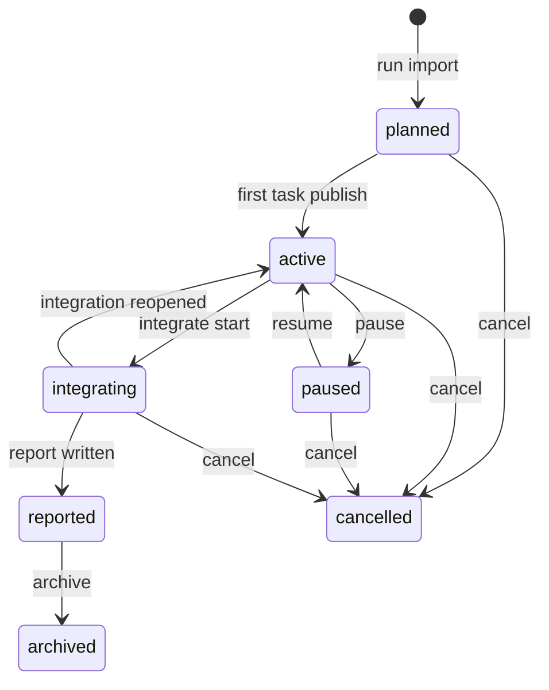
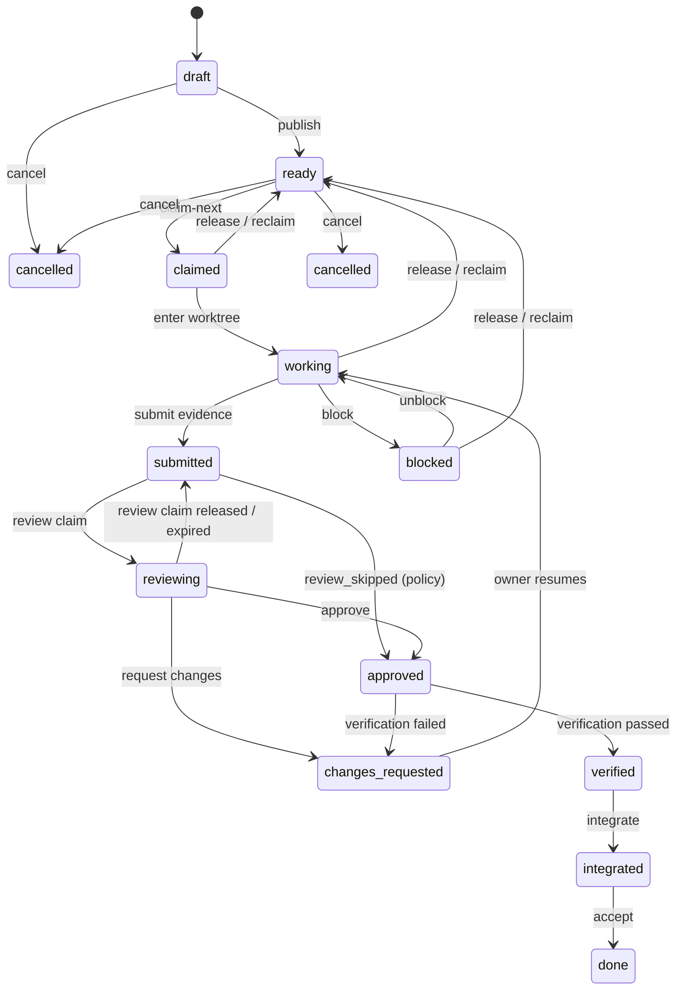

# 15. Run / Task State Machine and Lifecycle

> 日期：2026-07-09
> 状态：v0.1 设计草案
> 依据：[13](13-design-audit-and-next-breakdown.md) 审计发现 M1–M5、裁决 §5.2/§5.3，决策 D5 / D6 / D9 / D10 / D14
> 目标：把 run、task、claim 三层状态机闭环。解决：run 状态机缺失、`blocked` 无出口、`stale` 身份矛盾、返工环 path claim 语义、reclaim/resume、publish/pause/cancel 命令面。本文档定稿后，[03](03-team-task-list-and-task-schema.md) §7–8、[10](10-claim-next-lock-and-conflict-rules.md) §3.3/§9/§10、[11](11-4-plus-1-architecture-view.md) §3.4 以本文为准修订。

---

## 1. 三层状态机总览

```text
Run 状态机    -> 一次协作运行的生命周期（能不能认领、能不能集成、结没结束）
Task 状态机   -> 一个工作单元的工程闭环（拆出来 -> 干 -> 证明 -> 审 -> 验 -> 合入）
Claim 状态机  -> 一次占用的生命周期（谁占着、还活着吗、怎么归还/回收）
```

三层的约束关系：

- Run 状态决定 task 能做什么：`claim-next` 只在 run `active`（及 `integrating` 的受限类型）下工作。
- Task 状态决定 claim 应处于什么状态：两者的合法组合见 §4.3 一致性矩阵，是 audit 的直接输入。
- Claim 的 lease 决定活性：过期是**派生标注**（expired/stale），不是持久化状态（裁决 13 §5.2）。

**通用原则（适用于全部三层）：**

1. 每个转换都有唯一执行者类别 + 必写记录 + 必写事件（无事件的转换 = audit error）。
2. gateway 没有守护进程：所有"超时后发生的事"都在下一次 primitive 调用时惰性发生（D9）。
3. 终态（`done` / `cancelled` / `archived`）只读，只能被 `team export` 引用，不能被复活；要重做就开新 task/run（可用 DAG `supersedes` 边关联，Phase 2）。

---

## 2. Run 状态机

### 2.1 状态定义

| 状态 | 含义 | 进入方式 |
|---|---|---|
| `planned` | payload 已 import，任务多为 `draft`，未开放认领 | `team run import` |
| `active` | 至少一次 publish，任务队列开放认领 | 首次 `team task publish` 隐式激活 |
| `paused` | 用户暂停：不发新 claim；**在途任务可继续 heartbeat / message / submit** | `team run pause` |
| `integrating` | 集成阶段：默认只允许认领 `integration` / `verification` / `review` 类型任务 | `team integrate start`（`/team-integrate` 内部调用） |
| `reported` | `report.md` 已写，run 结果定格 | `team report`（integrate 收尾） |
| `archived` | 归档，只读终态 | `team run archive` |
| `cancelled` | 中止终态：所有 active claim 一并 `cancelled` | `team run cancel`（需用户确认） |

### 2.2 状态图



### 2.3 转换权限与事件

| 转换 | 执行者 | 前置校验 | 事件 |
|---|---|---|---|
| `(new) -> planned` | gateway（import） | payload 校验通过 | `run_created` |
| `planned -> active` | user / planner（经 publish） | 至少 1 个 task 发布为 ready | `run_activated` |
| `active -> paused` | user | — | `run_paused` |
| `paused -> active` | user | — | `run_resumed` |
| `active -> integrating` | integrator / user | 至少 1 个 task 达到 `verified`（policy 可放宽为 `approved`） | `integration_started` |
| `integrating -> active` | integrator / user | 说明 reopen 原因 | `integration_reopened` |
| `integrating -> reported` | integrator / user | `report.md` 存在 | `run_reported` |
| `reported -> archived` | user | — | `run_archived` |
| `planned/active/paused/integrating -> cancelled` | user（需确认） | 提示在途 claim 数量；integrating 下同时中止合并、integration branch 保留待人工处理。**`reported` 不可 cancel**——结果已定格，只能 archive（2026-07-10 裁决，闭合外审 finding 3） | `run_cancelled`（级联 claim `cancelled` 事件） |

### 2.4 Run 状态 × 操作能力矩阵

| 操作 | planned | active | paused | integrating | reported | archived / cancelled |
|---|---|---|---|---|---|---|
| `task publish` | ✓ | ✓ | ✗ | ✗ | ✗ | ✗ |
| `claim-next` | ✗（`run_not_active`） | ✓ | ✗（`run_paused`） | 仅 integration/verification/review 类型 | ✗ | ✗ |
| `heartbeat` / `message post` | ✓ | ✓ | ✓ | ✓ | ✗ | ✗ |
| `submit`（在途任务） | — | ✓ | ✓ | ✓ | ✗ | ✗ |
| `review` / `verify` | — | ✓ | ✓ | ✓ | ✗ | ✗ |
| `reclaim` | — | ✓ | ✓ | ✓ | ✗ | ✗ |
| `status` / `audit` / `export` | ✓ | ✓ | ✓ | ✓ | ✓ | ✓ |

新增 primitives（并入 [17](17-cli-mcp-contract-and-error-model.md) 命令总表）：`team run list`、`team run pause`、`team run resume`、`team run cancel`、`team run archive`。

---

## 3. Task 状态机 v2

### 3.1 相对 v1（[03](03-team-task-list-and-task-schema.md) §7）的变化

| 变化 | 依据 |
|---|---|
| **移除 `stale` 状态** —— stale 是读取时按 `now > lease_until` 派生的风险标注，不持久化 | 13 §5.2 裁决 |
| **`blocked` 增加出口**：`blocked -> working`（unblock）、`blocked -> ready`（release/reclaim） | M2 |
| **新增 `cancelled` 终态** 与 `team task cancel` | M1 关联 |
| **新增主动归还**：`claimed/working -> ready`（`team release`，保留 previous_attempts） | M4 关联 |
| **新增 no-review 直通路径**：`submitted -> approved`（`review_skipped`，仅当 policy 允许） | D6 |
| **新增验证失败回环**：`approved -> changes_requested`（`verification_failed`） | M7 关联 |
| **`changes_requested -> working` 语义定死**：同一 claim 复活续租，path claim 全程未释放 | M3、§4.4 |

### 3.2 状态图



（`claimed/working/blocked/submitted` 亦可被 `team task cancel` 取消，图中省略以保持可读；权限见 §3.3。）

### 3.3 转换权限矩阵

| 转换 | 执行者 | 前置校验 | 必写记录 | 事件 |
|---|---|---|---|---|
| `draft -> ready` | user / planner（`team task publish`） | 依赖的 task 存在；run 非终态 | task-list 状态 | `task_published`（首次触发 `run_activated`） |
| `ready -> claimed` | gateway（`claim-next`） | §[10](10-claim-next-lock-and-conflict-rules.md) 全部可领取条件 | task claim + path claim + task-list owner | `task_claimed` + `path_claimed` |
| `claimed -> working` | owner agent | worktree 已创建/进入 | `worktrees.json` | `worktree_created` + `task_started` |
| `working -> submitted` | owner agent（`team submit`） | evidence 通过 schema 校验（[14](14-evidence-review-verification-contract.md)）；handoff memory 已写 | evidence + `context/tasks/TASK-ID.md`；claim → `submitted` | `evidence_submitted` |
| `submitted -> approved`（直通） | gateway（policy） | `require_review=false` 且 task 级未强制 review | review record（skip 标注） | `review_skipped`（actor=policy） |
| `submitted -> reviewing` | reviewer agent | **reviewer ≠ owner（INV-008，不受 D6 开关影响）** | review claim | `review_claimed` |
| `reviewing -> submitted` | gateway（review claim 主动释放，或 lease 过期经 sweep 回收） | 该轮 review 未产生 decision | review claim → released/reclaimed | `review_released` |
| `reviewing -> approved` | reviewer agent | 同上 | review record | `review_approved` |
| `reviewing -> changes_requested` | reviewer agent | findings 已写入 message pool | review record | `changes_requested` |
| `changes_requested -> working` | owner agent | 同一 agent 或经 reclaim 的新 owner；claim 复活为 `active` 并续租 | claim 更新 | `task_rework_started` |
| `approved -> verified` | verifier / integrator | verification record 含真实命令结果（agent 执行，gateway 记录，D11） | verification record | `verification_passed` |
| `approved -> changes_requested` | verifier / integrator | 失败映射到本 task | verification record | `verification_failed` |
| `verified -> integrated` | integrator | merge 完成（[16](16-git-worktree-and-team-root.md)） | integration record；claim → `released` | `task_integrated` |
| `integrated -> done` | user / integrator | run 接受 | task-list | `task_done` |
| `working -> blocked` | owner agent（`team block`） | 必须关联 blocker message（`--message MSG-ID` 或同时创建） | message pool | `task_blocked` |
| `blocked -> working` | owner agent / user（`team unblock`） | 关联 blocker 已 `resolved`，或显式给出 unblock 理由 | message 状态 | `task_unblocked` |
| `claimed/working/blocked -> ready` | owner 主动（`team release`）或 reclaim（§5） | 写 previous_attempts | claim → `released`/`reclaimed` | `task_released` / `task_reclaimed` |
| `任意非终态 -> cancelled` | user（`team task cancel`，需确认） | 提示在途 claim | claim → `cancelled` | `task_cancelled` |

### 3.4 Progress 权重修订

[03](03-team-task-list-and-task-schema.md) §9 的派生表增加两条：

| 状态 | progress 处理 |
|---|---|
| `cancelled` | **从 run progress 的分母中剔除**（否则 run 永远到不了 100%） |
| `changes_requested` | 0.45（介于 working 与 submitted 之间，体现返工） |

---

## 4. Claim 状态机与 Task 对齐

### 4.1 Task claim 状态

```text
active -> submitted -> released          （正常闭环，released 发生在 integrated）
active -> released                       （owner 主动 release）
active -> reclaimed                      （stale 回收，§5）
active/submitted -> cancelled            （task/run 取消）
派生标注: expired = now > lease_until    （不持久化，读取时计算）
```

### 4.2 Path claim 生命周期（返工环裁决，解 M3）

**MVP 默认 `path_release_on_submit: "hold"`：path claim 在 submit 后不释放、不降级，保持 block 级，直到 task `integrated` / `released` / `reclaimed` / `cancelled`。**

理由：若 submit 时降级为 warn，他人可领取重叠路径；一旦 review 要求返工（`changes_requested -> working`），原 owner 的 block 级占用无法安全恢复。hold 策略下返工环完全无缝：claim 复活、path 占用从未间断。

代价与出口：路径占用时间变长、并行度下降。提供 policy `path_release_on_submit: "downgrade"` 作为显式 opt-in（降级为 warn；返工时若升级失败则 task 转 `blocked` 并报 `path_reclaim_conflict` risk）。[04](04-command-workflows.md) §5 第 7 步"释放或降级"以本节为准。

### 4.3 Task × Claim 一致性矩阵（audit 直接输入）

| Task 状态 | 合法 task claim 状态 | 合法 path claim |
|---|---|---|
| `draft` / `ready` | 无 active claim | 无 |
| `claimed` / `working` / `blocked` | 恰一个 `active` | 恰一组 `active`（block 级） |
| `submitted` / `reviewing` / `approved` | 恰一个 `submitted` | hold 策略下保持 `active` |
| `changes_requested` | `submitted`（未复工）或 `active`（已复工） | 保持 `active` |
| `verified` / `integrated` / `done` | `released` | `released` |
| `cancelled` | `cancelled` 或 `released` | 同左 |

注：review / verification 型任务的 `paths` 可为空（§10 模式表），此时第 2–4 行的 path claim 要求相应豁免为"零组"（[18](18-audit-rule-catalog-and-trust-model.md) AUD-006 已按豁免版实现）。

任何偏离本矩阵的组合都是 audit error（规则编号归 [18](18-audit-rule-catalog-and-trust-model.md)）。

---

## 5. Stale 探测与 Reclaim（D9 落地）

### 5.1 没有守护进程：三个探测点

| 探测点 | 行为 |
|---|---|
| 任一写 primitive 执行前的 sweep（[10](10-claim-next-lock-and-conflict-rules.md) §4 已有该步骤） | 在 run.lock 事务内发现 expired claim；满足自动回收条件的当场回收 |
| `/team-status`、`team progress`、`team audit` | 只读计算，列为 stale risk，给出 reclaim 建议命令 |
| **`team watch` 常驻巡检器（MVP，D14 复议后）** | 用户手动启动的长跑**只读**进程：每 N 秒（默认 30s）重算 status 并触发一次 sweep（仍调用同一套短锁原语）；补齐"无人操作时段"的及时性；dashboard 本地 server / 形态 C 的 MCP server 是它的后续形态 |

**架构决策（D14，复议后 v2）：被动 CLI 是唯一权威写入者；`team watch` 巡检器纳入 MVP；永不做 OS 级 daemon。** 先例参照不是背书而是需求来源：Claude Code agent teams（纯文件协调、无租约）的已知病症"任务忘标完成、状态滞后"，根因在**完成标记自愿无门禁 + 无租约回收**——daemon 无法得知"活干完了"这个只存在于 agent 上下文里的事实，本设计以 evidence 门禁（无 submit 即无完成）+ lease 回收治本。先例全部病症已登记为 [13 附录 B](13-design-audit-and-next-breakdown.md) 失败模式清单，逐条配防线与验收用例。权威状态变更永远走短锁原语 + `rev` 乐观锁（[17](17-cli-mcp-contract-and-error-model.md)），不存在"daemon 内存状态 vs 文件"的事实源分裂。

**`blocked` 任务豁免 stale 判定**：等待人工决策可以远超 TTL，blocked 期间 lease 冻结（不续也不判过期），status 改为显示 blocked 时长。恢复 `working` 时重置 lease。

### 5.2 自动回收与人工回收

Run policy 新增：

```json
"reclaim_policy": {
  "auto_after_ttl_multiple": 3
}
```

- **默认自动**（用户裁决 Q5）：claim 过期超过 `3 × claim_ttl` 后，下一次 claim-next sweep 在同一锁事务内执行回收，事件 actor 标注 `sweep`（附触发该次调用的 agent_id）。
- 设为 `"manual"` 则只标 risk，等 `team reclaim --run RUN-ID --task TASK-ID` 人工确认（[10](10-claim-next-lock-and-conflict-rules.md) §10.2 流程保留）。
- 两种方式共用同一回收动作：旧 claim → `reclaimed`，task → `ready`（有未解 blocker 则 → `blocked`），**worktree 保留不删**（清理归 [16](16-git-worktree-and-team-root.md)），写 previous_attempts。

### 5.3 previous_attempts：回收不清零（"标注当前的进展"）

`task.json` 增量字段：

```json
"previous_attempts": [
  {
    "attempt": 1,
    "agent_id": "AGENT-codex-001",
    "claim_id": "CLAIM-task-0007",
    "worktree_path": "../.team-worktrees/RUN-0001/TASK-0003",
    "branch": "team/RUN-0001/TASK-0003-auth-api-tests",
    "last_heartbeat_at": "2026-07-09T16:10:00+08:00",
    "reclaimed_at": "2026-07-09T17:45:00+08:00",
    "reclaim_reason": "stale_lease_auto",
    "progress_note": "context/tasks/TASK-0003.attempt-1.md"
  }
]
```

回收时 gateway 只做**机械收集**（不总结，守住 13 §5.1 边界）：把 worktree 的 `git status --porcelain` 与最近 commit 列表原样写入 progress_note 文件。

**续做还是重做（"是不是初始化任务"）：** 任务回到 `ready`，但不清零。新领取者 hydrate 时 previous attempt 的 progress_note 进入 must_read；由**新 agent 判断**沿用原 worktree（`worktrees.json` 记录 ownership 转移）还是新开 worktree 重做（原 worktree 留待人工清理）。这个判断是智能行为，归 coding agent，不归 gateway。

---

## 6. Publish 流程与 `/team-publish`

补上用户旅途阶段 2"确认发布"缺失的把手（13 号 M18）：

```text
/team-publish RUN-0001                  # 发布全部 draft 任务
/team-publish RUN-0001 --tasks TASK-0001,TASK-0002
```

固定流程：展示将发布的任务与 warnings（无 paths、无 checks 的任务在此提示）→ 用户确认 → `team task publish` → 首次发布触发 `planned -> active` → 输出 ready 数量与 `Next: /team-dispatch RUN-0001`。

`/team-plan --publish` 保留为小型 run 的捷径（import 后直接发布，跳过确认，[09](09-team-run-import-payload-schema.md) §5.6 语义不变）。

---

## 7. Dispatch Loop（D5 落地）

**默认：单任务即停。** `/team-dispatch RUN-ID` 的固定流程以"submit 完成 → 汇报结果 → 输出下一步命令建议 → 停止"结束，等用户确认是否继续。

**`--loop` 显式开启连续模式：** submit 后自动回到 claim-next，直到 `no_claimable_task` / `run_paused` / 用户中断；每轮结束输出单行简报（TASK-ID、状态、耗时）。loop 模式写入 agent 注册信息（`agents/AGENT-ID.json.mode: "loop"`），便于 status 区分"停了"和"还会自己领"。

**窗口身份与定向领取（D17）：** `team agent register --label "<窗口名>"`（如 `codex-左窗`）**按 label 幂等**——同 run 内存在同名且 active 的注册时返回同一 AGENT-ID 并续用其 claims，而不是新造身份；这是 `max_active_claims_per_agent`（M36）的配套堵漏：没有它，同一窗口重复 dispatch 每次注册新 ID，上限形同虚设。label 由用户起名、写入 `agents/*.json` 并在 status 中展示。定向领取：`/team-dispatch <RUN> --as <窗口名> --task <TASK-ID>` 直通 `claim-next --task`（[10](10-claim-next-lock-and-conflict-rules.md) §2.1 既有），目标任务不可领时返回结构化原因（`task_already_claimed` / `deps_blocked` / `path_conflict` / `agent_claim_limit`），**不做预留式指派**（提前把任务锁给某 agent 违背 pull 模型，P2 备选 `team task reserve`）。

**Reviewer / Verifier 的领取（D15，闭合 M31 断链）：** review/verify 是 gate、不进 task-list，但 `claim-next --role reviewer`（或 `verifier`）会从 submitted（或 approved）队列**合成虚拟工作项**：按等待时长排序，命中即落 review claim（[14](14-evidence-review-verification-contract.md) §3.1）并返回与普通认领同构的 envelope（`data.kind: "review_work"`，含 task、evidence 位置与 checklist 来源）。合成项不写入 team-task-list.json——"哪些 task 在等 review"本身就是可派生事实。无候选时照常返回 `no_claimable_task`。由此双 agent 旅途中 A submit 后，B 以 reviewer 角色 dispatch 即可自主接走 review，不再必须人肉触发。

---

## 8. Heartbeat 捎带续租（解 M5）

> **2026-07-11 冒烟修正（L9/L13）**：`team heartbeat` 同时覆盖 review/verify gate 租约（按 `review_ttl_minutes` 续）；`claim-next --role=verifier` 的合成命中现在**落 verify claim**（`CLAIM-verify-*`，事件 `verify_claimed`，过期由 sweep 释放并记 `verify_released`）——与 §7 D15"命中即落 claim"的既有文字对齐（此前实现漏掉了 verifier 半边，真代理两次独立命中该缺口）。


显式 `team heartbeat` 保留，但不再是唯一续租途径：

| 规则 | 内容 |
|---|---|
| 捎带续租 | owner 对本 task 的**任何写 primitive**（`message post`、`block`、`unblock`、`submit`）自动把 lease 续至 `now + claim_ttl` |
| 显式心跳时机 | adapter 模板指导：在自然停顿点（跑完一轮测试、完成一个文件）调用，而非定时器 |
| 事件采样 | 心跳事件按 [10](10-claim-next-lock-and-conflict-rules.md) §9 采样写入，续租本身不必每次留事件 |
| TTL 默认 | 维持 30 分钟；配合捎带续租与 3×TTL 自动回收，假 stale 与死锁双向可控 |

---

## 9. Review Gate 配置（D6 落地）

| 规则 | 内容 |
|---|---|
| 默认 | `policy.require_review: true` |
| 关闭方式 | run payload 或 project 配置显式 `false`；**task 级 `review.required: true` 覆盖 run 级 `false`（更严格者胜）** |
| 关闭后的路径 | `submitted -> approved`，写 skip 标注的 review record + `review_skipped` 事件（actor=policy），保证事实链不断 |
| 永不放开的不变量 | INV-008 self-approval 禁令与"实现者不能标自己 done"（INV-007）**不受本开关影响**——开关跳过的是"要不要第三方 review"，不是"能不能自批" |
| 审计 | run 存在 `review_skipped` 时，audit 报 warning（规则归 [18](18-audit-rule-catalog-and-trust-model.md)），复盘可见 |

这与 [09](09-team-run-import-payload-schema.md) §5.2 "policy 不允许绕过 gateway 不变量"一致：`require_review` 是合法策略位，`allow_self_approval` 依旧是非法字段。

---

## 10. 三类 Run 模式的状态机适配（D10 落地）

三模式共用本文档全部状态机，gateway 无模式分支代码，仅默认值不同：

| | feature | debug | review |
|---|---|---|---|
| 典型 task type | implementation / investigation | investigation / implementation（修复） | review（对既有 diff/branch） |
| `require_review` 默认 | true | true | true（review findings 本身也要有人复核） |
| `require_verification` 默认 | true | true（必须含 repro check：先红后绿） | 可 false（无代码变更时） |
| paths | 按模块划分 | 按假设/子系统划分 | 通常只读，path claim 可为空（status 提示为低风险） |
| 差异落点 | — | 19 号 debug plan 模板（repro 任务先行） | 19 号 review plan 模板（checklist 切片） |

---

## 11. 事件补全（本文档新增）

以下事件由本文档引入，[04](04-command-workflows.md) §11 事件表需扩充，schema 统一归 [18](18-audit-rule-catalog-and-trust-model.md)：

```text
run_activated  run_paused  run_resumed  run_cancelled  run_archived
integration_started  integration_reopened
task_cancelled  task_released  task_reclaimed  task_unblocked
task_rework_started  task_done  review_skipped
```

---

## 12. MVP 验收场景

| 场景 | 预期 |
|---|---|
| task 被 block，blocker message 得到 answer，owner unblock | `blocked -> working`，事件链 `task_blocked -> task_unblocked` 完整 |
| `require_review=false` 的 run 中 submit | 自动 `approved`，存在 skip 标注 review record 与 `review_skipped` 事件；audit 报 warning |
| owner 尝试 review 自己的 task（无论 require_review 开关） | 被拒，INV-008 |
| agent 断线超过 3×TTL，另一 agent 执行 claim-next | 旧 claim 自动 `reclaimed`，task 回 `ready`，`previous_attempts` 含 worktree 与 git status 快照；新 agent hydrate 能读到前次进展 |
| `reclaim_policy: "manual"` 时 agent 断线 | 只标 stale risk，任务不被动回收，`team reclaim` 人工确认后回收 |
| review 返工（`changes_requested`）期间他人 claim 重叠路径 | 默认 hold 策略下被 `path_conflict` 阻断；owner 复工无缝 |
| run pause 后 dispatch | `claim-next` 返回 `run_paused`；在途任务 submit 成功 |
| run cancel | 所有 active claim 变 `cancelled` 并留事件；后续 claim-next 拒绝 |
| `/team-publish` 首次发布 | task `draft -> ready`，run `planned -> active`，返回 ready 数量 |
| cancelled task | 从 progress 分母剔除，run 可到 100% |

---

## 13. 对现有文档的修订指令

| 文档 | 修订 |
|---|---|
| [02](02-domain-model-and-team-storage.md) | `run.json` 增加 status 值域（§2.1 七态）；`default_policy` 增加 `reclaim_policy`、`path_release_on_submit`；task.json 增加 `previous_attempts` |
| [03](03-team-task-list-and-task-schema.md) | §7 状态机整体替换为本文 §3；§8 权限表替换为 §3.3；§9 权重表按 §3.4 增补 |
| [04](04-command-workflows.md) | §5 第 7 步改引 §4.2；§11 事件表按 §11 扩充；primitive 清单补 `run list/pause/resume/cancel/archive`、`unblock`、`release`、`reclaim` |
| [05](05-mvp-feature-slices.md) | reclaim（自动 + 手动）纳入 Slice 3 验收；Slice 7 验收增加"blocked 豁免 stale"；待决问题 7 以 D6 关闭 |
| [07](07-skill-plugin-execution-form.md) | dispatch 模板末步改为"汇报并停止（除非 --loop）"；命令清单补 `/team-publish` |
| [10](10-claim-next-lock-and-conflict-rules.md) | §3.3 claim 状态对齐 §4.1；§9 增加捎带续租；§10 重写为 §5（默认自动回收）；待决 3/5/6 关闭 |
| [11](11-4-plus-1-architecture-view.md) | §3.4 状态图替换；§4.5 失败路径表补 blocked/reclaim 行；G3-9 复评为 PASS 候选 |

---

## 14. 遗留到其他文档的接口

- evidence / review / verification record 的字段结构 → [14](14-evidence-review-verification-contract.md)
- worktree 清理、ownership 转移的 git 操作细节 → [16](16-git-worktree-and-team-root.md)
- 本文新增 primitives 的 CLI envelope、reason code（`run_not_active` 等） → [17](17-cli-mcp-contract-and-error-model.md)
- 一致性矩阵（§4.3）与 `review_skipped` warning 的 audit 规则编号 → [18](18-audit-rule-catalog-and-trust-model.md)
- 三模式 plan prompt 模板与 dispatch loop 模板措辞 → 19 号
