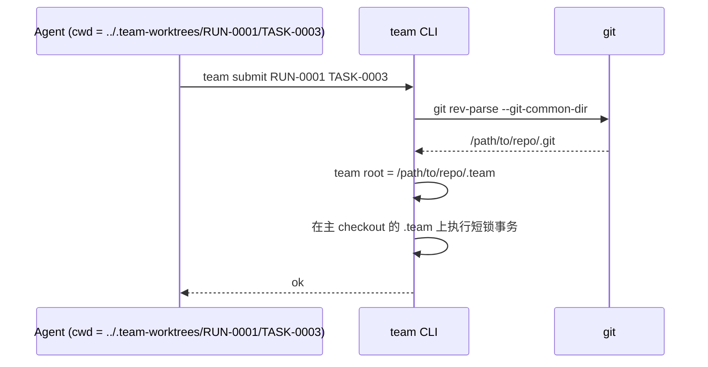
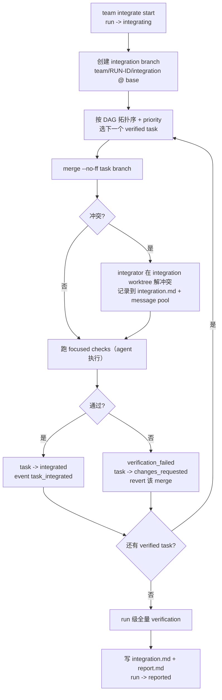

# 16. Git / Worktree Integration and Team Root

> 日期：2026-07-09
> 状态：v0.1 设计草案
> 依据：[13](13-design-audit-and-next-breakdown.md) M11–M15、决策 D4（`.team/` 全 gitignore）、D7（多 run 允许 + 警告）；[15](15-run-task-state-machine-and-lifecycle.md) reclaim / integrated 转换
> 目标：定死 `.team/` 与 git 的关系、worktree 全生命周期、integration/merge 流程、清理与故障恢复。这是 13 号认定"能让 MVP 当场分裂的单点"（M11）的闭合文档。

---

## 1. `.team/` 与 git 的关系（D4 落地）

### 1.1 规则

1. **`.team/` 整体 gitignore，永不入库。** `team init` 自动向仓库 `.gitignore` 追加：

```gitignore
# team-run-protocol local coordination state (D4)
.team/
```

2. worktree 根默认在**仓库外**（`../.team-worktrees/`），天然不涉及 ignore。
3. 留档走 `team export`（§7），导出物落在**不被 ignore** 的目录（默认 `docs/team-runs/`），由用户审阅后自行提交。
4. 历史遗留处理：若仓库曾把 `.team/` 提交入库（branch 里有 tracked 的 `.team/` 文件），gateway 检测到后**警告并拒绝写入 tracked 副本**，提示 `git rm -r --cached .team/`。

### 1.2 为什么不入库（记录裁决理由，防止未来反复）

- claims / locks / progress 高频变更 → 噪音提交与 merge 冲突。
- task branch 若携带 `.team` 变更，合并时会把"协调状态"当"代码"合并——事实源分裂。
- gitignore + 仓外 worktree 后，**untracked 的 `.team/` 不会出现在任何 linked worktree 里**，从物理上消除了"每个 worktree 一份 `.team`"的分叉。

---

## 2. Team Root 解析算法（M11 闭合）

任何 `team` 命令在任何目录（主 checkout、linked worktree、子目录）执行，都必须解析到**同一个** `.team/`。

### 2.1 解析顺序

```text
1. --team-root <path> 显式参数          （最高优先级，调试用）
2. TEAM_ROOT 环境变量
3. git 解析（默认路径）：
   a. git rev-parse --git-common-dir    -> 得到主仓库的 .git 目录
   b. common-dir 的父目录 = 主 checkout 根
   c. 主 checkout 根 / .team            -> 事实源
4. 全部失败 -> 结构化错误 team_root_not_found / not_a_git_repo
```

### 2.2 不变量与校验

| 不变量 | 校验时机 |
|---|---|
| 同一 repo 的所有 worktree / 所有 agent 解析到同一 `.team/` | `team doctor` 在主 checkout 与任一 worktree 分别运行，输出的 team root 必须一致 |
| 在 linked worktree 内发现本地 `.team/` 目录（历史提交或误建） | 每次命令启动时检查：警告"ignoring local .team in worktree"，只用主 checkout 副本；audit 规则登记 |
| bare repo | 拒绝（`not_a_git_repo` 变体 `bare_repo_unsupported`），MVP 不支持 |

### 2.3 时序示意



---

## 3. Worktree 生命周期

### 3.1 创建：agent 执行，gateway 记录（维持 [09](09-team-run-import-payload-schema.md) §2 边界，关闭 [05](05-mvp-feature-slices.md) 待决 4）

worktree 由 **dispatch agent** 按 adapter 模板中的固定命令创建；gateway 不执行 git 写操作，只记录与校验：

```text
# adapter 模板固定步骤（claim 成功后）
git worktree add ../.team-worktrees/RUN-0001/TASK-0003 -b team/RUN-0001/TASK-0003-auth-api-tests main
team worktree register --run RUN-0001 --task TASK-0003 \
  --path ../.team-worktrees/RUN-0001/TASK-0003 \
  --branch team/RUN-0001/TASK-0003-auth-api-tests
```

`team worktree register` 校验：路径存在、是 git worktree、branch 名符合规范、base 与 run.base_branch 一致；然后写 `worktrees.json` + `worktree_created` 事件，task 推进 `claimed -> working`（[15](15-run-task-state-machine-and-lifecycle.md) §3.3 的"worktree 已创建"前置由此兑现）。

### 3.2 `worktrees.json` schema（M12 闭合，`team.worktrees.v1`）

```json
{
  "schema_version": "team.worktrees.v1",
  "rev": 7,
  "run_id": "RUN-0001",
  "entries": [
    {
      "worktree_id": "WT-TASK-0003",
      "task_id": "TASK-0003",
      "path": "../.team-worktrees/RUN-0001/TASK-0003",
      "branch": "team/RUN-0001/TASK-0003-auth-api-tests",
      "base_branch": "main",
      "base_commit": "a1b2c3d",
      "status": "active",
      "owner_agent_id": "AGENT-codex-001",
      "previous_owner_agent_ids": [],
      "created_at": "2026-07-09T16:02:00+08:00"
    }
  ]
}
```

`status` ∈ `active` / `abandoned`（reclaim 后未被接手）/ `merged` / `removed`。

### 3.3 命名规范

| 对象 | 规范 |
|---|---|
| branch | `team/<RUN-ID>/<TASK-ID>-<slug>`（slug 来自 title，kebab-case，≤40 字符） |
| worktree 路径 | `<worktree_root>/<RUN-ID>/<TASK-ID>`，`worktree_root` 默认 `../.team-worktrees`（project.json 可改） |
| integration branch | `team/<RUN-ID>/integration` |

### 3.4 Commit 纪律（写进 adapter 模板）

1. worktree 内小步提交，commit message 前缀 `[TASK-0003]`。
2. 不改 `.team/`（本来就 ignored，双保险）；不改 claim 范围外文件（submit 时 in_scope 校验兜底，[14](14-evidence-review-verification-contract.md) §2.3）。
3. submit 前必须全部 commit（`git status --porcelain` 干净），evidence 的 changed_files 由 `git diff --name-status <base_commit>..HEAD` 机械生成，不由 agent 手填。

### 3.5 Reclaim 与 ownership 转移（对接 [15](15-run-task-state-machine-and-lifecycle.md) §5.3）

| 场景 | worktree 处理 |
|---|---|
| 回收发生 | worktree **保留**，entry 状态转 `abandoned`，原 owner 移入 `previous_owner_agent_ids` |
| 新 agent 选择续做 | `team worktree adopt --task TASK-0003`：entry 转回 `active`、owner 更新、事件 `worktree_adopted`；agent 在原 branch 继续 |
| 新 agent 选择重做 | 新开 worktree（路径追加 `-attempt-2`），旧 entry 保持 `abandoned` 等清理 |
| abandoned 清理 | `team worktree list --stale` 列出；清理**只给建议命令**（`git worktree remove`），有未提交改动时要求 `--force` 且必须用户执行 |

---

## 4. Integration / Merge 生命周期（M13 闭合）

### 4.1 流程总览



### 4.2 规则

| 规则 | 内容 |
|---|---|
| 合并顺序 | task-graph `blocks` 边拓扑序优先，同层按 priority desc、TASK-ID asc（确定性） |
| 合并方式 | `merge --no-ff`，保留 task branch 边界，便于按 TASK-ID 追溯与 revert |
| 冲突归属 | integrator（人或 agent）解决；解决方案摘要写 `integration.md`，重大取舍写 message pool（type `decision`） |
| base 前进 | integration branch 从**当前** base tip 创建；若 run 执行期间 base 前进导致 task branch 陈旧，冲突在 integration 阶段集中处理，**不要求** task owner 各自 rebase（MVP 简化） |
| 失败回退 | 某 task merge 后 checks 失败 → revert 该 merge commit，task 转 `changes_requested`，integration 继续下一个（不因单点卡死全 run） |
| 合入 main | **MVP 不自动合 main**（README 既定范围）：产出 integration branch + 报告，最后一步由用户发 PR / 手动合并 |
| 记录 | `integration.md`：合入清单（TASK-ID、merge commit、冲突说明）、未合入清单（原因）、全量验证结论 |

---

## 5. 跨 run 冲突（D7 落地，M14）

| 时机 | 行为 |
|---|---|
| 第二个 run publish 时 | gateway 扫描所有 `active/integrating` run 的 `paths.allow` 交集，有重叠 → 输出警告清单（哪两个 run、哪些 glob），事件 `cross_run_overlap_detected` |
| `/team-status` | 存在重叠时列为 run 级 risk |
| claim-next | 默认（`cross_run_path_policy: warn`）只查本 run；**policy 设 `block` 时对其他 active run 的 paths 交集执行硬阻断**（`cross_run_conflict`，D18）；project 级 path 索引优化为 P2 |
| integration | 后集成的 run 承担冲突解决（正常 git merge 语义） |

---

## 6. 清理与归档

| 时机 | 动作 |
|---|---|
| task `integrated` | 建议移除该 task worktree（给命令，不代删）；branch 保留 |
| run `reported -> archived` | `team run archive` 输出清理清单：残留 worktree、未删 branch（`git branch -d team/RUN-0001/...` 建议命令）、abandoned 条目 |
| 原则 | **gateway 永远不执行删除性 git 操作**；只登记状态、给建议命令、要求用户执行——与"被动 CLI + 合作式信任模型"一致 |

---

## 7. `team export`（M15 闭合，D4 的留档出口）

```text
team export --run RUN-0001 [--to docs/team-runs/RUN-0001] [--full]
```

| 规则 | 内容 |
|---|---|
| 默认内容 | `plan.md`、`report.md`、`integration.md`、`evidence/*/evidence.md`、`reviews/**/*.md`、verification 索引、run-memory.md |
| `--full` | 追加 evidence.json/outputs、events.jsonl、task-graph.json |
| 二次脱敏 | 导出前对全部内容再跑一遍 redaction 扫描（[24](24-security-permissions-and-data-hygiene.md)）——命中则**中止导出**并列出位置，因为导出物将进 git |
| 审阅 | 导出后打印文件清单与总大小，提示用户 review 后自行 `git add`；gateway 不代提交 |
| 目标目录 | 必须在 repo 内且不被 `.gitignore` 覆盖、且不在 `.team/` 内；已存在时要求 `--force` |

---

## 8. 故障场景与恢复

| 故障 | 检测 | 恢复 |
|---|---|---|
| worktree 被手动删除但 entry 仍 active | `worktree register/adopt/status` 时 path 不存在 → audit `worktree_missing` | 按 reclaim 流程回收 task；entry 转 `removed` |
| worktree 有未提交改动即被 reclaim | 回收时 gateway 机械记录 `git status` 快照到 previous_attempts（15 §5.3） | 新 owner adopt 后自行判断 |
| repo 被 fresh clone（`.team/` 不在 git 里，随克隆丢失） | 新 clone 无 `.team/` → 一切从零；旧机器的 `.team/` 仍在旧目录 | 文档明示：**`.team/` 是机器本地状态**（D4 的固有代价）；跨机器协作是 Phase 3 remote sync 的范围 |
| 主 checkout 切换 branch 导致 base 语义变化 | run.json 记录 `base_branch` + 每个 worktree 记录 `base_commit`，与主 checkout 当前 branch 解耦 | 无需恢复，integration 以记录为准 |
| linked worktree 里出现 tracked `.team/`（历史遗留） | 命令启动检查（§2.2） | 警告 + 忽略 + 提示 `git rm --cached` |

---

## 9. MVP 验收场景

| 场景 | 预期 |
|---|---|
| 在 worktree 子目录里执行 `team submit` | 写入主 checkout 的 `.team/`，worktree 内不产生任何 `.team` 文件 |
| `team doctor` 在主 checkout 与 worktree 分别运行 | 输出同一个 team root |
| 两个 active run 的 paths.allow 有交集 | 第二个 publish 时警告 + status risk（不阻断） |
| integration 中某 task checks 失败 | 该 merge 被 revert，task 转 changes_requested，其余 task 继续合入 |
| `team export` 内容含疑似 secret | 导出中止，列出命中位置 |
| reclaim 后新 agent adopt 原 worktree | worktrees.json owner 转移有记录，原 owner 进 previous_owner_agent_ids |
| 曾提交过 `.team/` 的旧仓库 | 启动警告 + 拒写 tracked 副本 + 给出 `git rm --cached` 指引 |

---

## 10. 对现有文档的修订指令

| 文档 | 修订 |
|---|---|
| [02](02-domain-model-and-team-storage.md) | §4 整节按 D4 重写（全 ignore + export 出口）；补 worktrees.json schema 引用 |
| [04](04-command-workflows.md) | §10 `/team-integrate` 按 §4 重写；primitive 清单补 `worktree register/adopt/list`、`integrate start`、`export` |
| [05](05-mvp-feature-slices.md) | 待决 4 关闭（agent 创建 + gateway register）；Slice 9 验收对齐 §4 |
| [07](07-skill-plugin-execution-form.md) | dispatch 模板补 §3.1 固定命令与 §3.4 commit 纪律 |
| [10](10-claim-next-lock-and-conflict-rules.md) | 待决 6 关闭（保留 + adopt/abandoned 机制）；D7 跨 run 注记 |
| [11](11-4-plus-1-architecture-view.md) | Physical View 补 team-root 解析与 export 出口 |

---

## 11. 遗留到其他文档的接口

- `not_a_git_repo` / `team_root_not_found` / `export_target_invalid` 等 reason code → [17](17-cli-mcp-contract-and-error-model.md)
- 审计规则编号已定（[18](18-audit-rule-catalog-and-trust-model.md) §4.E，2026-07-10 回填）：`worktree_missing`=AUD-029、`tracked_team_dir`=AUD-030、`cross_run_overlap`=AUD-031
- export 的 redaction 扫描规则 → [24](24-security-permissions-and-data-hygiene.md)
- adapter 模板中的固定 git 命令文案 → 19 号
