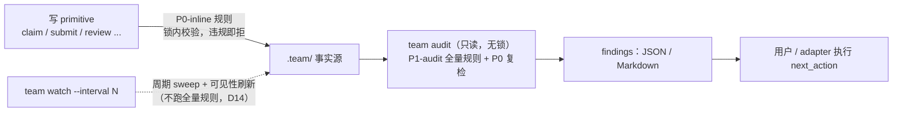

# 18. Audit Rule Catalog and Trust Model

> 日期：2026-07-09 ｜ 2026-07-10 增补 v0.2（补 `state_repaired` / `memory_promoted` / `memory_superseded` / `run_migrated` 事件、agent label 字段、AUD-036…040——同步 M30 / D17 / D19 / 21 号 migrate）
> 状态：v0.2 设计草案
> 依据：[13](13-design-audit-and-next-breakdown.md) M25–M27、§5.6、§6.1（P0 内嵌五条硬性要求）、决策 D6 / D7 / D9 / D14；[15](15-run-task-state-machine-and-lifecycle.md) §4.3 一致性矩阵与 §11 事件；[14](14-evidence-review-verification-contract.md) §7 事件与 §8 挂钩表；[16](16-git-worktree-and-team-root.md) §11；[17](17-cli-mcp-contract-and-error-model.md) §3 / §5；[08](08-core-gateway-capabilities.md) §5；[04](04-command-workflows.md) §11；[12](12-context-plane-task-dag-message-pool-memory.md) §11
> 目标：把散落在 04/08/12/14/15/16/17 的审计要求收敛为一份可实现的规则目录：先闭合事件目录与 event schema（M26），再给出全部规则的输入、字段级触发条件、severity、消息与修复建议（M25），最后声明信任模型（M27）。

---

## 1. 定位与边界

### 1.1 机械检查白名单 / 黑名单（13 §5.7 灰区规则落地）

gateway 无智能、无 LLM。本目录中每条规则的触发条件只允许以下判定手段：

| 允许（机械） | 禁止（语义） |
|---|---|
| 文件 / 目录 / 锚点存在性 | "这条 acceptance 写得好不好" |
| 字段值枚举匹配、逐条文本相等比对、计数 | "这份 evidence 是否真的证明了完成" |
| 状态组合合法性（对照 [15](15-run-task-state-machine-and-lifecycle.md) §4.3 矩阵） | "这个 review 结论是否公正" |
| glob 匹配与交集（minimatch，D3） | 代码质量、diff 语义判断 |
| 正则匹配（ID 格式、secret 模式）、时间与序号比较 | 任何需要读懂项目的判断 |

语义质量判断属于 planning agent 自检与 review agent 职责，永远不进本目录。

### 1.2 两级执行层次

audit 是**只读命令**（[17](17-cli-mcp-contract-and-error-model.md) §1：无锁），不改任何状态、不代修复，只输出 findings 与建议命令——与 D14 被动 CLI 架构一致。规则按执行位置分两层：

| 层级 | 执行位置 | 行为 |
|---|---|---|
| `P0-inline` | 写 primitive 的锁事务内 | 违规即拒绝（返回 [17](17-cli-mcp-contract-and-error-model.md) §3 reason code），事实不落盘 |
| `P1-audit` | `team audit *` 批量扫描 | 只读检出，报 finding，不阻断 |

所有 `P0-inline` 规则**同时被 audit 复检**：内嵌门禁只拦得住走 CLI 的写入，绕过 CLI 的直改要靠事后审计检出（§6 信任模型）。[13](13-design-audit-and-next-breakdown.md) §6.1 要求的最小内嵌集合为五条：**AUD-001（duplicate claim）、AUD-002（path overlap）、AUD-011（missing evidence）、AUD-015（self-approval）、AUD-021（DAG cycle）**。



`team watch` 只做 sweep 与派生刷新；完整规则扫描始终由 `team audit` 承担（是否让 watch 周期性跑轻量 audit 子集 → §9 遗留）。

---

## 2. 事件目录总表

合并 [04](04-command-workflows.md) §11、[15](15-run-task-state-machine-and-lifecycle.md) §11、[14](14-evidence-review-verification-contract.md) §7、[16](16-git-worktree-and-team-root.md)、[17](17-cli-mcp-contract-and-error-model.md) 引入的全部事件。"必带字段"指基础字段（§3）之外该事件还必须携带的字段。

| # | 事件 | 类别 | 触发者 actor.type | 必带字段 | 引入文档 |
|---|---|---|---|---|---|
| 1 | `run_created` | run | agent（planner）/ user | payload.mode、payload.base_branch | [04](04-command-workflows.md) |
| 2 | `run_activated` | run | user / agent（经首次 publish 隐式） | payload.published_count | [15](15-run-task-state-machine-and-lifecycle.md) |
| 3 | `run_paused` | run | user | — | [15](15-run-task-state-machine-and-lifecycle.md) |
| 4 | `run_resumed` | run | user | — | [15](15-run-task-state-machine-and-lifecycle.md) |
| 5 | `run_cancelled` | run | user | payload.cascaded_claim_ids[] | [15](15-run-task-state-machine-and-lifecycle.md) |
| 6 | `run_archived` | run | user | — | [15](15-run-task-state-machine-and-lifecycle.md) |
| 7 | `run_reported` | run | user / agent（integrator） | payload.report_ref | [04](04-command-workflows.md) |
| 8 | `integration_started` | run | user / agent（integrator） | — | [15](15-run-task-state-machine-and-lifecycle.md) |
| 9 | `integration_reopened` | run | user / agent（integrator） | payload.reason | [15](15-run-task-state-machine-and-lifecycle.md) |
| 10 | `task_created` | task | agent（planner） | task_id | [04](04-command-workflows.md) |
| 11 | `task_published` | task | user / agent | task_id | [04](04-command-workflows.md) |
| 12 | `task_claimed` | task | agent | task_id、claim_id、payload.lease_until | [04](04-command-workflows.md) |
| 13 | `task_started` | task | agent（owner） | task_id、claim_id | [04](04-command-workflows.md) |
| 14 | `task_blocked` | task | agent（owner） | task_id、payload.message_ref | [04](04-command-workflows.md) |
| 15 | `task_unblocked` | task | agent（owner）/ user | task_id、payload.message_ref 或 payload.reason | [15](15-run-task-state-machine-and-lifecycle.md) |
| 16 | `task_released` | task | agent（owner）/ user | task_id、claim_id、payload.attempt、payload.released_claim_ids[] | [15](15-run-task-state-machine-and-lifecycle.md) |
| 17 | `task_reclaimed` | task | sweep / user | task_id、claim_id、payload.reclaim_reason、payload.triggered_by | [15](15-run-task-state-machine-and-lifecycle.md) |
| 18 | `task_rework_started` | task | agent（owner） | task_id、claim_id | [15](15-run-task-state-machine-and-lifecycle.md) |
| 19 | `task_cancelled` | task | user | task_id、payload.released_claim_ids[] | [15](15-run-task-state-machine-and-lifecycle.md) |
| 20 | `task_integrated` | task | agent（integrator） | task_id、payload.merge_commit、payload.released_claim_ids[] | [04](04-command-workflows.md) |
| 21 | `task_done` | task | user / agent（integrator） | task_id | [15](15-run-task-state-machine-and-lifecycle.md) |
| 22 | `path_claimed` | claim | agent | task_id、claim_id、payload.paths | [04](04-command-workflows.md) / [10](10-claim-next-lock-and-conflict-rules.md) |
| 23 | `path_approval_requested` | claim | agent | task_id、payload.paths、payload.message_ref | [14](14-evidence-review-verification-contract.md) |
| 24 | `path_approval_granted` | claim | user / agent（integrator） | task_id、payload.approval_id、payload.paths、payload.granted_by | [14](14-evidence-review-verification-contract.md) |
| 25 | `path_approval_denied` | claim | user / agent（integrator） | task_id、payload.paths | [14](14-evidence-review-verification-contract.md) |
| 26 | `heartbeat` | claim | agent（owner） | task_id、claim_id、payload.lease_until（按 [10](10-claim-next-lock-and-conflict-rules.md) §9 采样写入） | [04](04-command-workflows.md) |
| 27 | `evidence_submitted` | evidence | agent（owner） | task_id、claim_id、payload.revision、payload.checks_pass_count、payload.out_of_scope_count | [04](04-command-workflows.md) / [14](14-evidence-review-verification-contract.md) |
| 28 | `evidence_invalid` | evidence | agent（owner） | task_id、payload.error_codes[]（可采样） | [14](14-evidence-review-verification-contract.md) |
| 29 | `review_requested` | review | agent（owner） | task_id | [04](04-command-workflows.md)（建议废弃并入 `evidence_submitted`，见 §8） |
| 30 | `review_claimed` | review | agent（reviewer） | task_id、claim_id、payload.round | [04](04-command-workflows.md) / [14](14-evidence-review-verification-contract.md) |
| 31 | `review_released` | review | agent（reviewer）/ sweep | task_id、claim_id | [14](14-evidence-review-verification-contract.md) |
| 32 | `review_approved` | review | agent（reviewer） | task_id、payload.review_id、payload.round | [04](04-command-workflows.md) |
| 33 | `changes_requested` | review | agent（reviewer） | task_id、payload.review_id、payload.must_fix_count | [04](04-command-workflows.md) |
| 34 | `review_blocked` | review | agent（reviewer） | task_id、payload.review_id | [14](14-evidence-review-verification-contract.md) |
| 35 | `review_skipped` | review | **policy** | task_id、payload.policy_source | [15](15-run-task-state-machine-and-lifecycle.md) |
| 36 | `verification_started` | verify | agent（verifier） | payload.verify_id、payload.target | [04](04-command-workflows.md) |
| 37 | `verification_passed` | verify | agent（verifier） | payload.verify_id、payload.target（task 级必带 task_id） | [04](04-command-workflows.md) |
| 38 | `verification_failed` | verify | agent（verifier） | payload.verify_id、payload.failures_mapped[] | [04](04-command-workflows.md) |
| 39 | `context_hydrated` | context | agent（owner） | task_id、payload.must_read[] | [13](13-design-audit-and-next-breakdown.md) M22（本文档定稿 schema） |
| 40 | `memory_updated` | context | agent | payload.target（run 或 task_id）、payload.refs[] | [12](12-context-plane-task-dag-message-pool-memory.md) §10（本文档补事件） |
| 41 | `agent_registered` | infra | agent | payload.tool、payload.capabilities、payload.mode、payload.label（D17：label 幂等复用时补 payload.reused=true） | [04](04-command-workflows.md) |
| 42 | `worktree_created` | infra | agent（owner） | task_id、payload.worktree_id、payload.branch、payload.base_commit | [04](04-command-workflows.md) / [16](16-git-worktree-and-team-root.md) |
| 43 | `worktree_adopted` | infra | agent（新 owner） | task_id、payload.worktree_id、payload.previous_owner | [16](16-git-worktree-and-team-root.md) |
| 44 | `lock_takeover` | infra | agent（接管者） | payload.lock、payload.old_meta | [17](17-cli-mcp-contract-and-error-model.md) |
| 45 | `cross_run_overlap_detected` | infra | **policy** | payload.other_run_id、payload.overlapping_globs[] | [16](16-git-worktree-and-team-root.md) |
| 46 | `state_repaired` | infra | user / agent | payload.repaired[]（文件×动作）、payload.backup_ref | [17](17-cli-mcp-contract-and-error-model.md) §5.3（M30） |
| 47 | `memory_promoted` | context | user / agent（user 确认后落盘） | payload.mem_id、payload.from_ref、payload.supersedes? | [25](25-project-memory-and-knowledge-promotion.md)（D19） |
| 48 | `memory_superseded` | context | user / agent | payload.old_mem_id、payload.new_mem_id | [25](25-project-memory-and-knowledge-promotion.md) |
| 49 | `run_migrated` | infra | user | payload.from_major、payload.to_major、payload.backup_ref | [21](21-schema-versioning-and-migration.md) §5 |

**目录外声明：不存在 `message_posted` 事件。** message 写入 `messages.jsonl`（自带 MSG-ID 与行内 seq），不重复镜像进 events——events 是审计账本、messages 是协作上下文（INV-011，[12](12-context-plane-task-dag-message-pool-memory.md) §9）。需要留审计痕迹的消息动作（如 block）通过携带 `message_ref` 的状态事件（#14）关联。

---

## 3. Event Schema（`team.event.v1`）

```json
{
  "schema_version": "team.event.v1",
  "ts": "2026-07-09T18:20:05+08:00",
  "seq": 143,
  "event": "task_claimed",
  "actor": { "type": "agent", "id": "AGENT-codex-001" },
  "run_id": "RUN-0001",
  "task_id": "TASK-0003",
  "claim_id": "CLAIM-task-0007",
  "payload": {}
}
```

| 字段 | 规则 |
|---|---|
| `seq` | run 内单调递增整数，run.lock 内从 `events.meta.json` 计数器分配（[17](17-cli-mcp-contract-and-error-model.md) §5.2）；断号 / 重号即审计证据（AUD-033） |
| `actor.type` | 枚举 `agent`（coding agent 会话）/ `user`（人工确认动作）/ `policy`（gateway 按策略机械触发，如 review_skipped）/ `sweep`（惰性回收，D9；payload.triggered_by 记录触发本次调用的 agent） |
| `actor.id` | agent → `AGENT-*`；user → `user`（MVP 无账号体系）；policy / sweep → 固定同名字符串 |
| `task_id` / `claim_id` | 可选；事件涉及 task / claim 时必带（按 §2"必带字段"列） |
| `payload` | 各事件私有字段；**写事务类事件必带 `rev_after`**：本次事务写入的每个状态文件的新 rev（`{"task_list": 18, "task_claims": 9}` 形态），供 AUD-032 对账——此约定回填 [17](17-cli-mcp-contract-and-error-model.md) §5.2（见 §8） |
| 采样 | 仅 `heartbeat`、`evidence_invalid` 允许采样写入；其余事件一次状态变更一条，缺失即 AUD-034 |

jsonl 示例（三种 actor）：

```jsonl
{"schema_version":"team.event.v1","ts":"2026-07-09T18:20:05+08:00","seq":143,"event":"task_claimed","actor":{"type":"agent","id":"AGENT-codex-001"},"run_id":"RUN-0001","task_id":"TASK-0003","claim_id":"CLAIM-task-0007","payload":{"lease_until":"2026-07-09T18:50:05+08:00","rev_after":{"task_list":18,"task_claims":9,"path_claims":7}}}
{"schema_version":"team.event.v1","ts":"2026-07-09T21:40:11+08:00","seq":201,"event":"task_reclaimed","actor":{"type":"sweep","id":"sweep"},"run_id":"RUN-0001","task_id":"TASK-0003","claim_id":"CLAIM-task-0007","payload":{"reclaim_reason":"stale_lease_auto","triggered_by":"AGENT-claude-004","rev_after":{"task_list":24,"task_claims":13}}}
{"schema_version":"team.event.v1","ts":"2026-07-09T19:02:44+08:00","seq":167,"event":"review_skipped","actor":{"type":"policy","id":"policy"},"run_id":"RUN-0001","task_id":"TASK-0005","payload":{"policy_source":"run.policy.require_review=false","rev_after":{"task_list":21}}}
```

---

## 4. 规则目录主表（AUD-001 … AUD-035）

编号连续、列结构统一，按主题分六组呈现。层级取值见 §1.2；`P0-inline` 规则的"依赖事件"同时是其拒绝时的留痕参考。severity 只取 `error` / `warn`。

### 4.A Claim / Path / Lease

| 规则ID | 名称 | 输入文件 | 触发条件（字段级） | severity | 消息模板 | next_action | 依赖事件 | 层级 |
|---|---|---|---|---|---|---|---|---|
| AUD-001 | duplicate_active_task_claim | claims/task-claims.json | 同一 task_id 下 status ∉ {released, reclaimed, cancelled} 的 claim 数 > 1（INV-003） | error | TASK-{t} 存在 {n} 个未终结 claim：{claim_ids} | `team reclaim` 裁决保留者；核对 events 判定先后 | task_claimed | P0-inline |
| AUD-002 | path_overlap_block | claims/path-claims.json、run.json（policy） | 不同 task 的两组 active path claim 的 paths.allow 存在 minimatch 交集，且冲突策略为 block（INV-004）；策略为 warn 时降 warn | error | TASK-{a} 与 TASK-{b} 的 path claim 重叠：{globs} | 等先占者 submit；或 `team approve-paths` 显式放行 | path_claimed | P0-inline |
| AUD-003 | stale_lease | claims/task-claims.json、claims/review-claims.json、tasks/*/task.json | （task claim status=active 且 now > lease_until 且 task.status ≠ blocked）或（review claim status=active 且 now > lease_until）；blocked 豁免见 [15](15-run-task-state-machine-and-lifecycle.md) §5.1 | warn | {claim_id}（TASK-{t}）lease 已过期 {min} 分钟 | 超 3×TTL 将被 sweep 自动回收（D9）；manual 策略下运行 `team reclaim RUN TASK` | task_claimed、review_claimed、heartbeat | P1-audit |
| AUD-004 | requires_approval_unapproved | tasks/*/task.json、claims/path-claims.json、evidence/*/evidence.json、claims/path-approvals.json | task.paths.requires_approval 的 glob 与（path claim paths 或 evidence.changed_files[].path）有交集，且 path-approvals.json 无覆盖该 path、未过期且 granted 的记录 | error | TASK-{t} 触碰需批准路径 {path}，无有效批准记录 | agent 发 `path_approval` 请求；user 运行 `team approve-paths RUN TASK --paths ...` | path_approval_granted | P0-inline |

### 4.B Task × Claim 一致性（[15](15-run-task-state-machine-and-lifecycle.md) §4.3 矩阵，每行非法组合一条）

本组输入统一为：team-task-list.json、tasks/*/task.json、claims/task-claims.json、claims/path-claims.json；依赖事件统一为 —（纯文件状态比对）；层级统一 P1-audit（合法写路径不会产生这些组合，出现即绕过或崩溃残留）。

| 规则ID | 名称 | 触发条件（字段级） | severity | 消息模板 | next_action |
|---|---|---|---|---|---|
| AUD-005 | unclaimed_task_has_claim | task.status ∈ {draft, ready} 且存在该 task 的 claim status ∉ {released, reclaimed, cancelled}（矩阵行 1） | error | TASK-{t} 状态 {s} 却持有未终结 claim {claim_id} | 核对 events 重放；`team reclaim` 清理残留 claim |
| AUD-006 | active_task_claim_mismatch | task.status ∈ {claimed, working, blocked} 且（status=active 的 task claim 数 ≠ 1，或 task.paths.allow 非空而无 active path claim）（矩阵行 2；review 型空 paths 豁免，[15](15-run-task-state-machine-and-lifecycle.md) §10） | error | TASK-{t} 在途但 claim 组合非法（active claim={n}，path claim={m}） | 按 events 判定真实 owner；缺失侧走 reclaim / 重新 claim |
| AUD-007 | submitted_task_claim_mismatch | task.status ∈ {submitted, reviewing, approved} 且（task claim status ≠ submitted，或 policy.path_release_on_submit=hold 时 path claim 非 active）（矩阵行 3） | error | TASK-{t} 已 submit 但 claim 状态为 {cs} / path claim 为 {ps} | 核对 submit 事务事件；人工修正前先 `team audit task` |
| AUD-008 | rework_claim_mismatch | task.status = changes_requested 且 task claim status ∉ {submitted, active}（矩阵行 4） | error | TASK-{t} 返工中但 claim 状态为 {cs} | owner 执行返工复活 claim；或 reclaim 后重派 |
| AUD-009 | terminal_task_claim_not_released | task.status ∈ {verified, integrated, done} 且存在 status ∈ {active, submitted} 的 claim（矩阵行 5：最终应为 released） | error | 终态 TASK-{t} 仍持有未释放 claim {claim_id} | 核对 integrate / release 事件是否缺失；人工补释放 |
| AUD-010 | cancelled_task_claim_mismatch | task.status = cancelled 且存在 status ∉ {cancelled, released, reclaimed} 的 claim（矩阵行 6） | error | 已取消 TASK-{t} 的 claim {claim_id} 未级联终结 | 核对 run/task cancel 事件的 cascaded_claim_ids |

### 4.C Evidence / Review / Verification（[14](14-evidence-review-verification-contract.md) §8 十条挂钩）

| 规则ID | 名称 | 输入文件 | 触发条件（字段级） | severity | 消息模板 | next_action | 依赖事件 | 层级 |
|---|---|---|---|---|---|---|---|---|
| AUD-011 | missing_evidence | tasks/*/task.json、evidence/TASK-ID/evidence.json | task.status ∈ {submitted, reviewing, approved, verified, integrated, done} 且（evidence.json 不存在，或 schema 校验失败，或 handoff_ref 指向的文件不存在）（INV-007 / INV-010） | error | TASK-{t} 状态 {s} 但 evidence 缺失或不完整：{missing} | owner 重新 `team submit`；直改状态则回退 task 状态 | evidence_submitted | P0-inline |
| AUD-012 | check_result_untrusted | evidence/TASK-ID/evidence.json、outputs/、tasks/*/task.json | required_checks_results 未逐条覆盖 task.required_checks；或某条 status=pass 而对应 commands[].exit_code ≠ 0；或 output_ref 文件不存在；或 status=skipped 无 note（D8 / D11） | error | TASK-{t} 的 check "{check}" 结果不可信：{why} | owner 重跑该 check 并重新 submit | evidence_submitted | P0-inline |
| AUD-013 | acceptance_misaligned | evidence/TASK-ID/evidence.json、tasks/*/task.json | evidence.acceptance[] 与 task.acceptance[] 数量不等或逐条文本不匹配；或 status ∉ {met, unmet, partial} | error | TASK-{t} acceptance 覆盖不对齐：{diff} | owner 按 task.json 逐条补齐后重 submit | evidence_submitted | P0-inline |
| AUD-014 | out_of_scope_change | evidence/TASK-ID/evidence.json、claims/path-claims.json | 以 path claim 的 allow glob 重算 changed_files[].path 的 in_scope（不信任存量 flag），存在 in_scope=false 条目；severity 按 run policy（默认 warn，可配 error） | warn | TASK-{t} 有 {n} 个越界改动：{paths} | reviewer 重点核查；必要时拆新 task 或申请扩 path | evidence_submitted、path_claimed | P0-inline |
| AUD-015 | self_approval | reviews/TASK-ID/REVIEW-*.json、claims/*、tasks/*/task.json（previous_attempts） | REVIEW-*.json.reviewer_agent_id 等于该 task 任一 claim 的 agent_id 或 previous_attempts[].agent_id（INV-008，不受 D6 开关影响） | error | REVIEW-{id} 的 reviewer {a} 是 TASK-{t} 的历任 owner | 作废该 review；换 reviewer 重新 `team review claim` | review_claimed、review_approved | P0-inline |
| AUD-016 | approved_without_review_record | tasks/*/task.json、reviews/TASK-ID/ | task.status ∈ {approved, verified, integrated, done} 且 reviews/TASK-ID/ 下无任何 REVIEW-*.json（含 decision=skipped_by_policy 的最小记录） | error | TASK-{t} 已 approved 但无 review 记录 | 核对 review 事件；补 review 或回退状态 | review_approved、review_skipped | P1-audit |
| AUD-017 | verified_without_pass_verification | tasks/*/task.json、verification/VERIFY-*.json | task.status ∈ {verified, integrated, done} 且不存在 target.kind=task、task_id=本 task、verdict=pass 的 VERIFY 记录 | error | TASK-{t} 已 verified 但无 pass 的 verification 记录 | verifier 补 `team verify --task`；或回退状态 | verification_passed | P1-audit |
| AUD-018 | secret_in_outputs | evidence/*/outputs/*.log、verification outputs | 输出文件命中 [24](24-security-permissions-and-data-hygiene.md) 定义的 secret 正则模式集，且未被替换为 `[REDACTED:*]`（redaction 漏网） | error | {file} 疑似含未脱敏 secret（{kind}） | 立即人工清理；修复 redaction 管道；export 前必须清零 | evidence_submitted | P1-audit |
| AUD-019 | review_skipped_policy_check | events.jsonl、tasks/*/task.json、run.json | 存在 review_skipped 事件：对应 task.review.required=true → error（违反"更严格者胜"，D6）；否则 → warn（留痕供复盘） | warn | TASK-{t} 的 review 被 policy 跳过（{policy_source}） | 复盘确认 require_review 配置符合预期 | review_skipped | P1-audit |
| AUD-020 | duplicate_review_claim | claims/review-claims.json | 同一 task_id 下 status=active 的 review claim 数 > 1（[14](14-evidence-review-verification-contract.md) §3.1 规则 3） | error | TASK-{t} 有 {n} 个并发 review claim | 保留先到者，其余 `review released`；核对 events | review_claimed | P0-inline |

### 4.D DAG / Context Plane（[12](12-context-plane-task-dag-message-pool-memory.md) §11 八条）

| 规则ID | 名称 | 输入文件 | 触发条件（字段级） | severity | 消息模板 | next_action | 依赖事件 | 层级 |
|---|---|---|---|---|---|---|---|---|
| AUD-021 | dag_cycle | task-graph.json | kind=blocks 的 edges 构成有向环（拓扑排序失败）（INV-013） | error | DAG 存在环：{cycle_path} | 修 payload 依赖后重 import / `team task add` | — | P0-inline |
| AUD-022 | dangling_edge | task-graph.json、tasks/ | edge.from 或 edge.to 不在 nodes[]，或对应 tasks/TASK-ID/ 目录不存在（node.status 不作输入——已裁决派生化，13 §5.5） | error | EDGE-{e} 指向不存在的 task {t} | `team graph validate` 定位；修图或补 task | — | P0-inline |
| AUD-023 | missing_required_context | task-graph.json、文件系统 | edge.required=true 且 kind ∈ {blocks, produces_context_for}、上游 task.status ∈ {submitted 及之后}、下游 task.status ∈ {ready, claimed, working}，而 edge.context_refs 中存在不存在的文件/锚点 | warn | TASK-{down} 的 required context ref 缺失：{refs} | 上游 owner 补 handoff 文件或修正 refs | evidence_submitted | P1-audit |
| AUD-024 | blocker_inconsistent | tasks/*/task.json、context/messages.jsonl | （a）task.status=blocked 且无 type ∈ {blocker, question}、status=open、task_id=本 task 的 message → error；（b）task.status ∈ {submitted 及之后} 且仍存在 status=open 的 blocker message → warn | error | TASK-{t} 的 blocked 状态与 blocker message 不一致（{case}） | （a）补 blocker message 或 `team unblock`；（b）resolve 该 message | task_blocked、task_unblocked | P1-audit |
| AUD-025 | stale_open_question | context/messages.jsonl、run.json（policy） | type ∈ {question, blocker} 且 status=open 且 now − created_at > policy.context.question_ttl_hours（默认 24h） | warn | MSG-{m}（TASK-{t}）已挂起 {h} 小时无人回答 | `team question list` 指派回答者；升级给 user | — | P1-audit |
| AUD-026 | memory_without_source_refs | context/run-memory.md、context/tasks/*.md | 文件缺少来源标注段（Source Refs），或标注的 ref 解析为不存在的文件/MSG-ID（INV-012；`team memory update` 原语侧已 inline 拒绝无效 refs，本条兜底直改） | warn | {file} 的内容无法追溯到来源 | agent 重写 memory 并附 refs（`team memory update --refs`） | memory_updated | P1-audit |
| AUD-027 | message_ref_missing | context/messages.jsonl | 任一行 refs[] 中的相对路径 / 锚点 / MSG-ID 解析失败（文件不存在或消息号不存在） | warn | MSG-{m} 引用了不存在的 {ref} | 发送者修正引用；下游勿依赖该 ref | — | P1-audit |
| AUD-028 | handoff_not_acknowledged | events.jsonl、evidence/*/evidence.json、task-graph.json | task 存在 required 的入边 context（blocks / produces_context_for），且（无该 task 的 context_hydrated 事件，或 evidence.context_ack[] 未覆盖 hydrate 事件 payload.must_read[] 的全部条目）（M22 可执行版） | warn | TASK-{t} 未确认读取上游 handoff：缺 {refs} | owner 复读上游 context 并在返工/下轮 submit 补 ack；reviewer 重点核查 | context_hydrated、evidence_submitted | P1-audit |

### 4.E Git / Worktree / 跨 run（[16](16-git-worktree-and-team-root.md) §11）

| 规则ID | 名称 | 输入文件 | 触发条件（字段级） | severity | 消息模板 | next_action | 依赖事件 | 层级 |
|---|---|---|---|---|---|---|---|---|
| AUD-029 | worktree_missing | worktrees.json、文件系统 | entries[].status=active 且 path 不存在或不是 git worktree | error | WT-{t} 的 worktree 路径已丢失：{path} | 按 [16](16-git-worktree-and-team-root.md) §8 走 reclaim；entry 转 removed | worktree_created、worktree_adopted | P1-audit |
| AUD-030 | team_dir_contamination | git index（ls-files）、各 worktree 目录 | （a）git index / HEAD 含 `.team/` 路径 → error（D4 违反）；（b）linked worktree 内存在物理 `.team/` 目录 → warn（[16](16-git-worktree-and-team-root.md) §2.2） | error | 仓库存在被 track 的 .team 文件：{paths} | `git rm -r --cached .team/`；确认 .gitignore 含 `.team/`；worktree 内副本手动删除 | — | P0-inline |
| AUD-031 | cross_run_path_overlap | 所有 run 的 run.json、tasks/*/task.json（paths.allow 聚合） | 存在 ≥2 个 status ∈ {active, integrating} 的 run，其 paths.allow 聚合集合两两存在 glob 交集（D7：警告不阻断） | warn | RUN-{a} 与 RUN-{b} 修改范围重叠：{globs} | 协调两 run 集成顺序；后集成者承担冲突解决 | cross_run_overlap_detected | P1-audit |

### 4.F 账本与派生完整性（[17](17-cli-mcp-contract-and-error-model.md) §5 + [08](08-core-gateway-capabilities.md) §5.3）

| 规则ID | 名称 | 输入文件 | 触发条件（字段级） | severity | 消息模板 | next_action | 依赖事件 | 层级 |
|---|---|---|---|---|---|---|---|---|
| AUD-032 | direct_state_edit_suspected | 全部带 rev 的状态文件、events.jsonl | 文件当前 rev ≠ 最近一次相关写事务事件的 payload.rev_after 对应值；或文件 updated_at 早于该事件 ts（rev 倒退/跳变）。写事务内的同类检出即 [17](17-cli-mcp-contract-and-error-model.md) `rev_conflict` | error | {file} 的 rev={r} 与账本记录 {r'} 不符，疑似绕过 CLI 直改 | 人工比对内容与 events；以事件重放结果为准修复；追查改动来源 | 全部写事务事件（rev_after） | P1-audit |
| AUD-033 | event_seq_gap | events.jsonl、events.meta.json | 相邻行 seq 差 ≠ 1、seq 重复、或 max(seq) ≠ meta 计数器值 | error | events.jsonl 在 seq {a}→{b} 处断号/重号 | 视为篡改或半写证据；结合 AUD-032 与 §6 信任模型人工介入 | — | P1-audit |
| AUD-034 | event_gap_state_replay_mismatch | events.jsonl、tasks/*/task.json、team-task-list.json | 按 §2 目录重放某 task 的全部事件所得终态 ≠ task.json.status，或存在无对应事件可解释的状态跃迁（[15](15-run-task-state-machine-and-lifecycle.md) 通用原则 1：无事件的转换 = error） | error | TASK-{t} 状态 {s} 无法由事件链重放得出（重放结果 {s'}） | `team audit task` 看逐事件明细；以事件链为准人工修正 | 全部状态事件 | P1-audit |
| AUD-035 | progress_mismatch | progress.json、team-task-list.json、claims/* | progress.json 存在且与按 [03](03-team-task-list-and-task-schema.md) §9 +[15](15-run-task-state-machine-and-lifecycle.md) §3.4 权重重算的结果字段级不一致（INV-006） | warn | progress.json 与事实重算不一致：{fields} | `team progress` 重建派生文件 | — | P1-audit |

### 4.G Project Memory 与 Agent 上限（2026-07-10 增补，D17/D19）

| 规则ID | 名称 | 输入文件 | 触发条件（字段级） | severity | 消息模板 | next_action | 依赖事件 | 层级 |
|---|---|---|---|---|---|---|---|---|
| AUD-036 | memory_entry_missing_refs | `project_memory_path` 文件（默认 docs/team/MEMORY.md） | 任一 managed 条目缺出处戳，或 refs 解析为不存在的文件 / MSG-ID / 归档锚点（INV-012 项目级；promote 原语 inline 已拒，本条兜底手改与 PR 直改） | error | MEM-{id} 无可追溯出处：{refs} | 经 `team memory promote --supersedes` 重立或删除该条 | memory_promoted | P1-audit |
| AUD-037 | memory_file_oversize | 同上 | 文件 > 200 行 或 > 25KB（[25](25-project-memory-and-knowledge-promotion.md) §5 体积纪律） | warn | 项目记忆超限（{lines} 行 / {kb}KB） | 合并/淘汰条目（--supersedes 移入 Superseded 区） | — | P1-audit |
| AUD-038 | memory_supersedes_dangling | 同上 | 条目 supersedes 指向不存在的 MEM-ID | error | MEM-{a} 替代链断裂：MEM-{b} 不存在 | 修正 supersedes 或补录旧条 | memory_promoted、memory_superseded | P1-audit |
| AUD-039 | memory_misplaced | `.team/` 目录树、project.json | `.team/` 内出现 project memory 文件（违反 [25](25-project-memory-and-knowledge-promotion.md) §3.1 git-tracked 要求，将随 D4 丢失） | error | 项目记忆位于 .team/ 内：{path} | 迁移至 project_memory_path 并核对 project.json | — | P1-audit |
| AUD-040 | agent_claim_limit_violation | claims/task-claims.json、agents/*.json、run.json（policy） | 同一 agent_id 的 active task claim 数 > policy.max_active_claims_per_agent（默认 1）（M36/D17；claim-next inline 已拒 `agent_claim_limit`，本条检出绕过与 label 幂等失效造成的多身份囤积） | error | AGENT-{a} 持有 {n} 个 active claim 超上限 | 核对 label 注册幂等性；多余 claim 走 release / reclaim | task_claimed、agent_registered | P1-audit |

### 4.H 子命令映射

| `team audit` 子命令 | 覆盖规则 |
|---|---|
| `claims` | AUD-001、003、005–010、020、040 |
| `paths` | AUD-002、004、014、031 |
| `evidence` | AUD-011–019 |
| `progress` | AUD-035 |
| `memory` | AUD-036–039 |
| `task <RUN> <TASK>` | 上述规则中按单 task 过滤的子集 + AUD-021–028 相关项 |
| `run <RUN>` | 全部 40 条（含 AUD-029–034、036–040） |

---

## 5. Audit 输出契约

### 5.1 JSON（沿 [17](17-cli-mcp-contract-and-error-model.md) §2 envelope，findings 在 data 内）

audit 执行成功即 `ok=true, code="OK"`、exit 0——**findings 是数据不是命令失败**；审计自身失败（io_error、team_root_not_found 等）才走 [17](17-cli-mcp-contract-and-error-model.md) §3 错误 envelope。CI 门禁参数（如 `--fail-on error`）为 P1 增补（§9）。audit 无锁读取：meta 携带快照区间，期间检测到 events seq 前进则置 `concurrent_writes_detected: true` 并建议重跑。

```json
{
  "ok": true,
  "code": "OK",
  "message": "audit run RUN-0001: 2 errors, 1 warning.",
  "data": {
    "run_id": "RUN-0001",
    "status": "error",
    "summary": { "errors": 2, "warnings": 1, "rules_evaluated": 40, "snapshot_seq": 214, "concurrent_writes_detected": false },
    "findings": [
      {
        "rule_id": "AUD-011",
        "kind": "missing_evidence",
        "severity": "error",
        "task_id": "TASK-0003",
        "message": "TASK-0003 状态 submitted 但 evidence 缺失或不完整：evidence.json not found",
        "next_action": "owner 重新执行 team submit RUN-0001 TASK-0003 --evidence <file>",
        "refs": ["tasks/TASK-0003/task.json", "events.jsonl#seq=188"]
      },
      {
        "rule_id": "AUD-019",
        "kind": "review_skipped_policy_check",
        "severity": "warn",
        "task_id": "TASK-0005",
        "message": "TASK-0005 的 review 被 policy 跳过（run.policy.require_review=false）",
        "next_action": "复盘确认 require_review 配置符合预期",
        "refs": ["events.jsonl#seq=167"]
      }
    ]
  },
  "warnings": [],
  "next_actions": ["team audit task RUN-0001 TASK-0003", "team status RUN-0001"],
  "meta": { "gateway_version": "0.1.0", "envelope_version": "team.envelope.v1", "run_id": "RUN-0001", "elapsed_ms": 118 }
}
```

### 5.2 Markdown 报告（人读，`--md` 或默认附带）

```markdown
# Audit Report: RUN-0001（2026-07-09 21:55, snapshot seq 214）

**结论：ERROR** — 2 errors / 1 warning（40 rules evaluated）

## Errors
| 规则 | 对象 | 问题 | 建议动作 |
|---|---|---|---|
| AUD-011 missing_evidence | TASK-0003 | submitted 但 evidence.json 缺失 | owner 重新 `team submit RUN-0001 TASK-0003` |
| AUD-032 direct_state_edit_suspected | claims/task-claims.json | rev=13 与账本 rev_after=12 不符 | 比对 events 重放结果，追查直改来源 |

## Warnings
| 规则 | 对象 | 问题 | 建议动作 |
|---|---|---|---|
| AUD-019 review_skipped_policy_check | TASK-0005 | review 被 policy 跳过 | 复盘 require_review 配置 |
```

---

## 6. 信任模型（M27 声明）

1. **MVP 信任模型 = 合作式 agent + 事后审计（audit-not-prevent），不是拜占庭防御。** 参与协作的 coding agent 被假定遵守 adapter 模板走 CLI 原语；协议防的是**过失**（并发竞态、崩溃残留、忘写记录），不是恶意。
2. `.team/` 是普通文件，任何 agent 技术上可绕过 gateway 直改——设计不试图阻止，只保证绕过**可检出**：rev 对账（AUD-032）、seq 连号（AUD-033）、事件重放（AUD-034）共同构成篡改证据链。
3. evidence 与 checks 输出是 agent 自报事实：gateway/audit 只验结构一致性（exit_code × status、输出文件存在），**不验真伪**——命令输出可以是幻觉。防伪造手段（events 哈希链、独立 runner 亲自执行 checks）是 Phase 3 选项，不进 MVP（D11、13 §7 P2）。
4. §1.2 的 P0-inline 五条是协作卫生门禁，**不是安全边界**；audit 发现即人工介入，gateway 永不自动"纠正"事实。
5. 威胁模型（STRIDE 六维表见其 §1.4）、权限分层、secret 卫生与 export 脱敏细则 → [24](24-security-permissions-and-data-hygiene.md)（已定稿，本文不展开）。

---

## 7. MVP 验收场景

| 场景 | 预期 |
|---|---|
| 手改 task-claims.json 伪造第二个 active claim 后运行 `team audit claims` | AUD-001 error + AUD-032 error（rev 对账不符）同时检出 |
| 直接把 task.json 改成 submitted（无 evidence 目录） | AUD-011 error 且 AUD-034 error（事件链无法重放出该状态） |
| owner 直改文件给自己写 approve 的 review 记录 | 走 CLI 时 inline 拒（self_approval_forbidden）；直改后 `team audit evidence` 报 AUD-015 error |
| import 含环 DAG 的 payload | inline 拒绝（AUD-021），run 不创建；`team graph validate` 可复现定位 |
| 删除 events.jsonl 中间一行 | AUD-033 error（seq 断号），报告标注篡改证据 |
| progress.json 手改为 80% | AUD-035 warn；`team progress` 可重建（INV-006） |
| `require_review=false` 的 run 跑完整链路 | 每个跳过任务有 skip review 记录；audit 仅 AUD-019 warn，无 error |
| task.review.required=true 但出现 review_skipped 事件 | AUD-019 升级为 error（更严格者胜，D6） |
| 两个 active run 的 paths.allow 有交集 | AUD-031 warn，且 events 中存在 cross_run_overlap_detected |
| 曾把 `.team/` 提交入库的仓库 | AUD-030 error + 全部写命令拒绝写 tracked 副本（[16](16-git-worktree-and-team-root.md) §1.4） |
| blocked 任务 lease 过期 3×TTL | AUD-003 不报（blocked 豁免生效），sweep 不回收 |
| `team audit run --json` | 单个合法 envelope，findings 逐条含 rule_id / next_action；exit 0 |

---

## 8. 对现有文档的修订指令

| 文档 | 修订 |
|---|---|
| [02](02-domain-model-and-team-storage.md) | §8 事件示例升级为 `team.event.v1`（补 schema_version / seq / actor / payload.rev_after） |
| [04](04-command-workflows.md) | §11 整节替换为本文 §2 总表；`review_requested` 标注废弃——submit 即视为请求 review，语义并入 `evidence_submitted` |
| [08](08-core-gateway-capabilities.md) | §5.1 输入清单按 [14](14-evidence-review-verification-contract.md) §1 目录结构更新（`evidence/*/evidence.json`、`reviews/TASK-ID/`、`verification/`——现文仍引用已废弃的单文件路径）；§5.3 检查表替换为 AUD 编号引用；§5.4 输出示例替换为本文 §5；"Event gap" 严重度统一为 error（从 warn/error，依 [15](15-run-task-state-machine-and-lifecycle.md) 通用原则 1） |
| [10](10-claim-next-lock-and-conflict-rules.md) | §8.3 的 override 批准事件统一命名为 `path_approval_granted`（13 号 M26 所提 `path_override_approved` 作废，对齐 [14](14-evidence-review-verification-contract.md) §5 与本文 §2） |
| [12](12-context-plane-task-dag-message-pool-memory.md) | §11 整节替换为 AUD-021–028 引用；`team memory update` 补 `memory_updated` 事件 |
| [14](14-evidence-review-verification-contract.md) | §8 表回填正式编号（AUD-011–020、AUD-004、AUD-018） |
| [15](15-run-task-state-machine-and-lifecycle.md) | §3.2/§3.3 **补 `reviewing -> submitted` 转换**（review claim 过期被 sweep 回收或 reviewer 主动 released 后，task 须回 submitted 供再认领——[14](14-evidence-review-verification-contract.md) §3.1 已定义回收但 15 无对应出边）；§4.3 矩阵为 submitted/reviewing/approved 行增加 review claim 列；§4.3 行 2 补 review 型任务空 paths 豁免注记（对齐 §10） |
| [16](16-git-worktree-and-team-root.md) | §11 规则编号回填：worktree_missing=AUD-029、tracked_team_dir=AUD-030、cross_run_overlap=AUD-031 |
| [17](17-cli-mcp-contract-and-error-model.md) | §5.2 增补约定"写事务事件 payload 必带 rev_after"（AUD-032 的对账输入）；§10 合同回归用例覆盖本文 §7 场景 |
| [05](05-mvp-feature-slices.md) | Slice 7（status/audit）验收补 P0-inline 五条内嵌校验场景与 `team audit --json` envelope 断言 |

---

## 9. 遗留到其他文档的接口

- secret 正则模式集与熵启发式（AUD-018 的判定输入）、redaction 管道、export 二次扫描 → [24](24-security-permissions-and-data-hygiene.md)
- audit 自身失败沿用 [17](17-cli-mcp-contract-and-error-model.md) §3 既有 reason code，无新增；`--fail-on error` CI 门禁参数与"watch 周期跑轻量 audit 子集"是否纳入 → [17](17-cli-mcp-contract-and-error-model.md) 命令面的 P1 增补裁决
- audit engine 组件接口（规则注册、只读快照、finding 流）→ [20](20-c4-l2-l3-component-contracts.md)
- 规则集随 schema_version 演进的兼容策略（旧 run 用旧规则集校验）→ [21](21-schema-versioning-and-migration.md)
- findings 的风险面板呈现与刷新 → [23](23-dashboard-information-architecture.md)
- `/team-audit` slash command 文案、findings 的 next_action 转述模板 → 19 号 adapter
- 防伪造增强（events 哈希链、独立 runner）的触发条件评估 → Phase 3（与 [24](24-security-permissions-and-data-hygiene.md) 联动）
