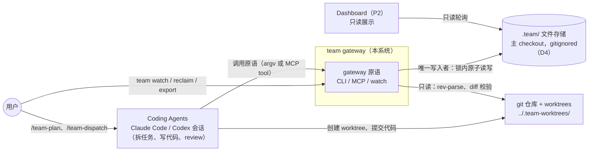
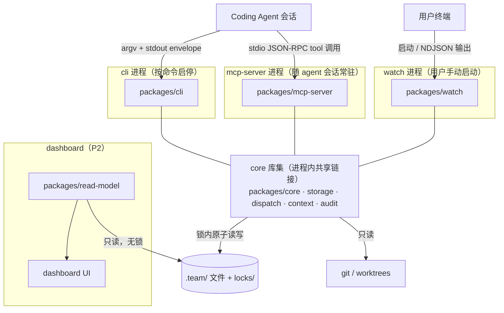
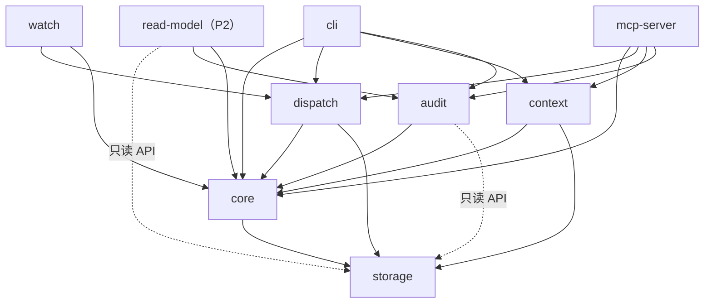

# 20. C4 L2/L3 and Component Contracts

> **修订注（2026-07-15，D23 + 整改 R3 回写）**：①§4.6 的「audit 只读」契约修订为 **audit=«规则+重放+修复»**——`repair` 与检测共用 foldLedger 单真值源而留在 audit 包，其约束为「audit 的唯一写路径是 repair，且必须经 TxKernel（acquireRunWriteLock）+ 备份」。②§4.2/§4.5 的 `RunTx` 类型强制持锁按 R3 实况落地为：唯一事务骨架 `core/tx.ts::withRunTx` + 架构对账测试断言全仓仅一处 `tryAcquireLock(runLockPath())`（副本长不回来）；完整写句柄类型化列为 P2。③§5 依赖矩阵以 `architecture.test.ts` 为机检权威：watch 不再依赖 audit（EVENT_STATUS 下沉 core/state-machine）；adapters 是 cli 的运行时依赖（仅写模板文件，不触 .team）。④R4 的 withSweep 全量前置改判为按命令语义选择性开启（claim/watch/gate 侧已内联）。


> 日期：2026-07-09
> 状态：v0.1 设计草案
> 依据：[13](13-design-audit-and-next-breakdown.md) §6.1（20 号章节要求）与 §5.1 裁决（memory-builder → memory-store）、决策 D1（形态 C 与 CLI 同核）/ D3（TypeScript/Node，glob 用 minimatch）/ D14（被动 CLI 唯一权威 + `team watch`）；[11](11-4-plus-1-architecture-view.md) §5 Development View；[17](17-cli-mcp-contract-and-error-model.md) §1/§3/§4/§5/§7/§9；[15](15-run-task-state-machine-and-lifecycle.md)（状态机归 core）；[14](14-evidence-review-verification-contract.md) / [16](16-git-worktree-and-team-root.md) 引入的记录与命令
> 目标：[11](11-4-plus-1-architecture-view.md) 是 4+1 视图，本篇补 C4 三层，并把 Development View 的模块树压成**可实现的 TS monorepo 包契约**——每个 component 有职责、接口签名、依赖白名单、触碰的状态文件与 reason code。实现仓库以本文为包骨架，19 号 adapter 以 §6 违例清单为红线。

---

## 1. C4 L1：System Context

系统 = `team gateway`（无智能、无 LLM 的协作原语层）。智能在外部 coding agents；事实在 `.team/` 文件。



L1 边界判断（沿用各文档一致口径）：

| 关系 | 约束 | 依据 |
|---|---|---|
| Agents → gateway | agent 只经原语改状态，slash command / skill 模板（19 号）不直接写 `.team` 文件 | [07](07-skill-plugin-execution-form.md) §5、[11](11-4-plus-1-architecture-view.md) §5.3 |
| gateway → `.team/` | 唯一权威写入者；任何目录执行都解析到主 checkout 的 `.team/` | D14、[16](16-git-worktree-and-team-root.md) §2 |
| gateway → git | 只读解析与校验；**永不执行删除性 / 网络性 git 操作** | [16](16-git-worktree-and-team-root.md) §6 |
| Dashboard → `.team/` | 只读，不派活、不取锁 | [11](11-4-plus-1-architecture-view.md) §5.3 |

---

## 2. C4 L2：Container

同一台机器、同一 repo 内的进程边界。**cli / mcp-server / watch 是同一套 core 库的三个前端**（D1、[17](17-cli-mcp-contract-and-error-model.md) §9），跨进程一致性完全靠文件锁 + `rev`，不靠进程内存。



| Container | 职责 | 技术 | 通信方式 | MVP |
|---|---|---|---|---|
| cli 进程 | 命令入口：解析 argv → 调用 primitive → 打印 envelope + exit code；被动、按次执行 | Node ≥ 20，TypeScript，npx/npm bin | stdin/argv 入，stdout 单 JSON envelope（`--json`），stderr 诊断（[17](17-cli-mcp-contract-and-error-model.md) §2） | ✓ |
| mcp-server 进程 | 形态 C：tool 一一映射 primitive；与 CLI 共用同一 core 库，envelope 逐字节同构；多实例并存是常态 | Node + MCP SDK（stdio） | JSON-RPC over stdio；tool result 的 structured content 即 envelope（[17](17-cli-mcp-contract-and-error-model.md) §9） | **contract only**：tool 面与 envelope 映射随 17 §9 在 MVP 定稿，**server 实现不在 MVP**（形态 C，D1；2026-07-10 review 修正） |
| watch 进程 | 只读巡检器：每 N 秒取 run.lock 跑一次 sweep（与 claim-next 同段代码）+ 无锁重算 progress + 打印增量；不派活不 claim | Node 长跑进程，`watch.lock` advisory 单实例 | 终端人读输出；`--json` 时 NDJSON 事件流（dashboard 数据入口） | ✓（D14） |
| dashboard read-model + UI | 把 `.team` 文件聚合成只读视图（RUN 列表 / DAG / message pool / 风险） | Node read-model + 本地 Web UI | 只读文件轮询 + 可选消费 watch NDJSON；**无任何写路径** | P2 |
| core 库集 | 全部领域规则与原语实现：core / storage / dispatch / context / audit 五包（§3） | TS workspace 包，进程内链接 | 进程内函数调用；对外唯一副作用是经 storage 写 `.team/` | ✓ |
| `.team/` 文件存储 | repo-local 事实源：run/task/claims/evidence/reviews/context/events | JSON + JSONL + md，`rev`/`seq` 防绕改 | 文件系统；锁目录（mkdir 原子性，[17](17-cli-mcp-contract-and-error-model.md) §4） | ✓ |
| git（repo + worktrees） | 代码事实源；worktree 隔离执行；common-dir 用于 team root 解析 | git CLI | gateway 只读调用；写操作全部由 agent / 用户执行 | ✓ |

---

## 3. C4 L3：TS Monorepo 包结构

把 [11](11-4-plus-1-architecture-view.md) §5.1 的模块树落成 workspace（包名前缀占位 `@team/*`，正式 scope 归 22 号，D12）。三处**再归置**：`lock-manager` 从 dispatch/ 迁入 storage/（锁是文件系统原语、零业务规则，且 core 侧写原语也需要它——留在 dispatch 会造成 core → dispatch 反向依赖）；`mcp-server` 从 adapters/ 升为独立前端包（D1 同核）；`memory-builder` 更名 `memory-store`（13 §5.1 裁决，只做机械 rollup 与 refs 校验）。

```text
packages/
  core/          # 纯领域 + 生命周期原语（可用 storage，不做进程/UI 假设）
    ids | schemas | state-machine | path-glob(minimatch) | events
    graph | progress | envelope | lifecycle
  storage/       # 路径、锁、原子读写、模板、脱敏——无业务规则
    team-dir | lock-manager | atomic-write(jsonl 并入) | templates | redaction
  dispatch/      # 认领域：筛选、租约、回收、路径冲突
    claim-engine(lease/reclaim/sweep 并入) | path-conflict
  context/       # Context Plane
    message-pool | memory-store | context-hydrator | graph-validator
  audit/         # 规则引擎与报告
    audit-engine(rules + report)
  cli/           # 前端一：命令注册表 → primitive → envelope 打印
  mcp-server/    # 前端二：tool 注册表 → 同一批 primitive（形态 C）
  watch/         # 前端三：巡检循环（sweep + progress + 增量打印）
  read-model/    # P2：dashboard 只读聚合
adapters/        # 19 号交付物：.claude/commands + codex skills 模板
                 # 不在运行时依赖图内——只生成调用 gateway 的文本
```

组合规则（保证三前端行为同构）：

| # | 规则 |
|---|---|
| R1 | **primitive 层**（与 [17](17-cli-mcp-contract-and-error-model.md) §1 命令一一对应的函数）返回 `Promise<TeamEnvelope<T>>`，跨边界永不 throw；envelope 在 core/envelope 内构造，前端只做序列化与 exit code / tool result 映射 |
| R2 | 内部组件抛 `GatewayError(code, detail)`（code ∈ [17](17-cli-mcp-contract-and-error-model.md) §3 枚举），由 primitive 层捕获转 envelope；前端禁止自造 reason code |
| R3 | 所有原语首参为 `TeamCtx`（teamRoot）或 `RunCtx`（teamRoot + runId），由 storage/team-dir 解析构造（[16](16-git-worktree-and-team-root.md) §2） |
| R4 | 所有写原语必须经 `dispatch.withSweep(primitive)` 包装后暴露给前端——兑现"任一写 primitive 前置 sweep"（[15](15-run-task-state-machine-and-lifecycle.md) §5.1），watch 的周期 sweep 调同一函数 |
| R5 | 写 `.team` 的唯一通道是 storage/atomic-write；锁的唯一通道是 storage/lock-manager |

---

## 4. Component 契约（七个核心组件全签名）

### 4.1 dispatch / claim-engine

| 项 | 内容 |
|---|---|
| 职责 | claim-next 筛选与原子认领；task/review claim 生命周期；lease 续租、过期 sweep、reclaim（[10](10-claim-next-lock-and-conflict-rules.md)、[15](15-run-task-state-machine-and-lifecycle.md) §4–§5） |
| 允许依赖 | core（state-machine / ids / events / graph 拓扑）、storage（lock-manager / atomic-write / team-dir）、dispatch/path-conflict |
| 禁止依赖 | context、audit、任何前端包；读项目源代码 |
| 状态文件 | claims/task-claims.json、claims/review-claims.json、claims/path-claims.json、team-task-list.json、tasks/*/task.json、agents/*.json、runs/&lt;RUN&gt;/counters.json、events.jsonl |
| reason code | no_claimable_task、deps_blocked、capability_mismatch、parallel_limit_reached、task_already_claimed、path_conflict、requires_approval、run_not_active、run_paused、agent_not_registered、self_approval_forbidden、invalid_transition |

```ts
function claimNext(ctx: RunCtx, req: ClaimRequest): Promise<TeamEnvelope<ClaimNextData>>;      // req: agentId, role?, capability?, taskId?, dryRun?
function claimReview(ctx: RunCtx, taskId: TaskId, reviewer: AgentId): Promise<TeamEnvelope<ReviewClaimData>>; // INV-008 含历任 owner
function heartbeat(ctx: RunCtx, taskId: TaskId, agent: AgentId): Promise<TeamEnvelope<LeaseData>>;
function releaseClaim(ctx: RunCtx, taskId: TaskId, agent: AgentId, note?: ProgressNoteRef): Promise<TeamEnvelope<ReleaseData>>;
function reclaimTask(ctx: RunCtx, taskId: TaskId, actor: Actor, mode: ReclaimMode): Promise<TeamEnvelope<ReclaimData>>; // 'manual' 或 'sweep'
function sweepExpired(tx: RunTx, now: IsoTime): SweepReport;   // 内部函数：须已持 run.lock；watch 与 withSweep 共用（R4）
```

### 4.2 storage / lock-manager

| 项 | 内容 |
|---|---|
| 职责 | mkdir 锁目录、指数退避、stale 检测与 takeover、`meta.json` 登记（[17](17-cli-mcp-contract-and-error-model.md) §4）；对业务语义零感知 |
| 允许依赖 | Node fs/path，仅此 |
| 禁止依赖 | core / dispatch / context / audit（任何业务包）——含类型引用 |
| 状态文件 | .team/locks/project.lock/、runs/&lt;RUN&gt;/locks/run.lock/、runs/&lt;RUN&gt;/locks/watch.lock/ |
| reason code | lock_timeout、io_error |

```ts
function withProjectLock<T>(root: TeamRoot, meta: LockMeta, fn: (tx: ProjectTx) => Promise<T>): Promise<T>;
function withRunLock<T>(root: TeamRoot, runId: RunId, meta: LockMeta, fn: (tx: RunTx) => Promise<T>): Promise<T>; // 50ms 起指数退避，总超时 5s
function inspectLock(path: LockDirPath): LockStatus;                       // held / free / stale(prevMeta)
function takeoverStaleLock(path: LockDirPath, meta: LockMeta): TakeoverResult; // 返回 prevMeta；lock_takeover 事件由事务首步追加（core/events）
```

持锁纪律由类型强制：`RunTx` / `ProjectTx` 是 atomic-write 写 API 的必需参数（§4.5），锁外拿不到写句柄。

### 4.3 dispatch / path-conflict

| 项 | 内容 |
|---|---|
| 职责 | path claim 冲突判定（block/warn/allow）、requires_approval 命中、跨 run 重叠扫描（[10](10-claim-next-lock-and-conflict-rules.md) §8、[16](16-git-worktree-and-team-root.md) §5）；**纯函数组件，数据由调用方注入** |
| 允许依赖 | core/path-glob（minimatch 语义，D3）、core 类型 |
| 禁止依赖 | storage（不做 IO）、context、audit |
| 状态文件 | 无直接读写；输入来自 claims/path-claims.json、claims/path-approvals.json（由 claim-engine / lifecycle 读入） |
| reason code | 产出 verdict 供调用方转 path_conflict / requires_approval |

```ts
function checkPathConflict(candidate: PathClaimCandidate, active: PathClaim[], policy: PathPolicy): ConflictVerdict; // allow / warn / block(blockedBy[])
function globsOverlap(a: GlobSet, b: GlobSet): OverlapReport;               // 委托 core/path-glob 的 minimatch 语义
function evaluatePathApproval(candidate: PathClaimCandidate, approvals: PathApproval[], now: IsoTime): ApprovalVerdict; // [14] §5
function scanCrossRunOverlap(runs: RunPathSummary[]): CrossRunOverlap[];    // publish 时警告，不阻断（D7）
```

### 4.4 core / state-machine

| 项 | 内容 |
|---|---|
| 职责 | run/task/claim 三层状态机的转换表、执行者权限矩阵、必写记录与事件清单、task×claim 一致性矩阵、stale 派生（[15](15-run-task-state-machine-and-lifecycle.md) 全文）；**纯函数，不做 IO** |
| 允许依赖 | core 内类型（ids、events 的事件名枚举） |
| 禁止依赖 | storage、dispatch、context、audit、任何前端 |
| 状态文件 | 无（读写由调用方按返回的 TransitionPlan 执行） |
| reason code | invalid_transition、run_not_active、run_paused |

```ts
function checkTransition(kind: EntityKind, from: StateName, to: StateName, actor: Actor): TransitionCheck; // kind: run/task/claim
function planTaskTransition(task: TaskRecord, to: TaskStatus, actor: Actor, refs: TransitionRefs): TransitionPlan; // 返回必写记录 + 必写事件（15 §3.3）
function planRunTransition(run: RunRecord, to: RunStatus, actor: Actor): TransitionPlan;                   // 15 §2.3
function checkTaskClaimMatrix(task: TaskRecord, claims: ClaimBundle): MatrixViolation[];                   // 15 §4.3，audit 直接输入
function deriveStale(claim: TaskClaim, now: IsoTime): StaleMark | null;    // 派生标注不落盘（13 §5.2）；blocked 豁免
```

### 4.5 storage / atomic-write

| 项 | 内容 |
|---|---|
| 职责 | temp+rename 原子写、`rev` 乐观锁递增与校验、jsonl 锁内 append、schema_version 握手、派生文件写（[17](17-cli-mcp-contract-and-error-model.md) §5/§11） |
| 允许依赖 | Node fs、storage/team-dir（路径） |
| 禁止依赖 | 任何业务包；**是 `.team` 文件系统写的唯一出口（R5）** |
| 状态文件 | 全部 `.team` JSON / JSONL / md |
| reason code | rev_conflict、io_error、schema_invalid、unsupported_schema_version |

```ts
function readState<T>(file: StateFilePath, schemaId: SchemaId): VersionedDoc<T>;   // major 不识别 → unsupported_schema_version；保留未知字段
function writeStateAtomic<T>(tx: LockTx, file: StateFilePath, mutate: (cur: VersionedDoc<T>) => T): WriteReceipt; // 锁内 read rev -> mutate -> write rev+1
function appendJsonl(tx: LockTx, file: JsonlFilePath, line: JsonObject): AppendReceipt; // 行内 seq 由 core/events 预分配
function readJsonl<T>(file: JsonlFilePath, filter?: LineFilter): T[];               // 无锁只读
function writeDerived<T>(file: StateFilePath, doc: T): void;                        // progress.json 等可重建派生物，无 rev 语义
```

### 4.6 audit / audit-engine

| 项 | 内容 |
|---|---|
| 职责 | 加载事实（只读、无锁）→ 逐规则求值 → 报告；导出 P0 内嵌子集给 primitive 在锁内直接阻断（13 M25）；规则目录与编号归 [18](18-audit-rule-catalog-and-trust-model.md) |
| 允许依赖 | core（state-machine 一致性矩阵、graph、path-glob）、storage（只读 API） |
| 禁止依赖 | dispatch、context 写接口、lock-manager 写锁、atomic-write 写 API |
| 状态文件 | 只读全部 `.team` 文件；不写（报告经 envelope 输出，落盘归 export） |
| reason code | io_error（自身）；findings 携带规则编号与 severity，如 direct_state_edit_suspected |

```ts
function auditRun(ctx: RunCtx, scope: AuditScope): Promise<TeamEnvelope<AuditReport>>; // scope: run/task/claims/paths/evidence/progress
function loadFacts(ctx: RunCtx, selector: FactSelector): FactBundle;
function evalRule(rule: AuditRule, facts: FactBundle): RuleFinding[];
function inlineGuardRules(): AuditRule[];   // duplicate claim / missing evidence / self approval / DAG cycle / path overlap
function renderAuditReport(report: AuditReport, fmt: ReportFormat): string; // 'json' 或 'md'
```

### 4.7 context / context-hydrator

| 项 | 内容 |
|---|---|
| 职责 | 为 task 组装 context pack（must_read、messages、open questions、risks、previous_attempts 进展），锁内追加 `context_hydrated` 事件（M22）；供 submit 校验 context_ack（[14](14-evidence-review-verification-contract.md) §2.1、[12](12-context-plane-task-dag-message-pool-memory.md) §8） |
| 允许依赖 | core（graph / events / envelope）、storage（读 + 事件 append）、context/message-pool 与 memory-store 的读接口 |
| 禁止依赖 | dispatch、audit |
| 状态文件 | 读 task-graph.json、context/**、evidence/**、tasks/*/task.json；写 events.jsonl（context_hydrated） |
| reason code | run_not_found、task_not_found、io_error（must_read ref 缺失降级为 warning） |

```ts
function hydrate(ctx: RunCtx, taskId: TaskId, agent: AgentId): Promise<TeamEnvelope<ContextPack>>;
function buildMustRead(graph: TaskGraph, task: TaskRecord, memory: MemoryIndex, attempts: PreviousAttempt[]): ContextRef[]; // produces_context_for 边 + attempt 进展
function collectPoolMessages(ctx: RunCtx, taskId: TaskId, filter: MessageFilter): PoolMessage[];
function diffContextAck(pack: ContextPack, ack: ContextRef[]): AckGap[];    // submit 时对比 must_read，缺失记 warning
```

### 4.8 context / memory-store（13 §5.1 裁决落地）

| 项 | 内容 |
|---|---|
| 职责 | 存储 **agent 生成**的 memory 内容并校验 source refs 存在（INV-012）；机械 rollup 索引（最近完成 task、open questions、refs 目录）。**禁止任何语义压缩/总结——gateway 无 LLM** |
| 允许依赖 | core（envelope / ids）、storage |
| 禁止依赖 | dispatch、audit；任何 LLM/网络调用 |
| 状态文件 | context/run-memory.md、context/tasks/*.md、context/context-index.json（派生索引） |
| reason code | schema_invalid（refs 指向不存在文件即拒绝）、run_not_found、task_not_found |

```ts
function storeMemory(ctx: RunCtx, target: MemoryTarget, content: MarkdownBody, refs: ContextRef[]): Promise<TeamEnvelope<MemoryReceipt>>;
function rollupIndex(ctx: RunCtx): MemoryIndex;                             // 确定性拼接，可重建
function showMemory(ctx: RunCtx, target: MemoryTarget): Promise<TeamEnvelope<MemoryView>>;
```

### 4.9 其余组件契约速览

| 组件（包） | 职责 | 关键接口（草图） | 状态文件 | 主要 reason code |
|---|---|---|---|---|
| core/ids | ID 正则与分配（前置条件：调用方持对应锁） | `allocateRunId(tx)`、`allocateIds(tx, kind, n)`、`parseId(s)` | counters.json（两级） | io_error |
| core/schemas | payload/evidence/review/verification/task 的机械校验（长度、枚举、glob 语法、引用存在性；不做语义判断，13 §5.7） | `validatePayload(p)`、`validateEvidence(e, task)`、`validateReviewRecord(r)`、`validateVerification(v)` | 无（纯校验） | schema_invalid、evidence_invalid |
| core/path-glob | minimatch 语义封装（D3）：单文件命中、glob 集合重叠 | `matchScope(file, globs)`、`globSetsOverlap(a, b)` | 无 | — |
| core/events | 事件类型表、seq 分配、append/查询（经 atomic-write） | `appendEvent(tx, ev)`、`listEvents(ctx, filter)`、`nextSeq(tx)` | events.jsonl、events.meta.json | io_error |
| core/progress | 从事实重算派生进度（INV-006，cancelled 剔除分母） | `rebuildProgress(ctx)`、`riskScan(ctx, now)` | progress.json（派生） | io_error |
| core/graph | DAG 模型、边类型、拓扑序（integration 合并序用） | `topoOrder(g)`、`hasCycle(g)`、`edgesInto(g, taskId)` | task-graph.json（读） | schema_invalid |
| core/envelope | TeamEnvelope 构造、reason code 枚举、exit code 映射、GatewayError | `ok(data, meta)`、`fail(err, meta)`、`toExitCode(code)` | 无 | —（枚举宿主） |
| core/lifecycle | record 侧原语编排：runImport、publishTasks、submitEvidence、recordReview、recordVerification、run pause/resume/cancel/archive、registerWorktree、exportRun、report | `runImport(ctx, payload)`、`submitEvidence(ctx, taskId, bundle)`、`exportRun(ctx, opts)` … 均返回 `TeamEnvelope` | run.json、team-task-list.json、tasks/**、evidence/**、reviews/**、verification/**、worktrees.json、integration.md | payload_*、evidence_invalid、invalid_transition、export_* |
| storage/team-dir | team root 解析（git common-dir）、布局初始化、tracked `.team` 检测 | `resolveTeamRoot(cwd, override?)`、`ensureLayout(root)`、`detectTrackedTeamDir(root)` | `.team/` 目录树 | not_a_git_repo、bare_repo_unsupported、team_root_not_found |
| storage/templates | evidence/review/verification/task md 骨架渲染（[14](14-evidence-review-verification-contract.md) §6） | `renderTemplate(name, data)` | templates/ | io_error |
| storage/redaction | 机械脱敏管道（写盘前、export 前二次扫描；规则表归 [24](24-security-permissions-and-data-hygiene.md)） | `redact(text, rules)`、`scan(text, rules)` | outputs/*.log 等 | export_redaction_hit |
| context/message-pool | typed message 追加与查询、open questions 派生 | `postMessage(ctx, msg)`、`listMessages(ctx, q)`、`resolveMessage(ctx, msgId, res)`、`listOpenQuestions(ctx)` | context/messages.jsonl | run_not_found、schema_invalid |
| context/graph-validator | cycle / dangling edge / missing context refs 校验（import 时内嵌阻断 cycle） | `validateGraph(ctx)` | task-graph.json（读） | schema_invalid |
| cli / mcp-server / watch / read-model | 前端与视图：仅注册表 + 序列化，无业务规则 | `main(argv)`、`registerTools(server)`、`watchLoop(ctx, opts)`、`loadRunView(root, runId)` | 无直接写（watch 经 R4 sweep 除外） | usage_error |

---

## 5. 依赖规则

[11](11-4-plus-1-architecture-view.md) §5.3 的规则全部保留，按包细化：



**违例即架构错误清单**（CI 以依赖白名单强制，工具选型归 22 号）：

| # | 违例 | 依据 |
|---|---|---|
| V1 | read-model import dispatch、core/lifecycle、lock-manager 或 atomic-write 写 API——dashboard 永远拿不到写原语与锁 | [11](11-4-plus-1-architecture-view.md) §5.3 细化 |
| V2 | adapters（Claude commands / Codex skills，19 号）直接读写 `.team` 文件、绕过 envelope 解析或自造 reason code | [07](07-skill-plugin-execution-form.md) §5、R2 |
| V3 | storage import 任何业务包（业务规则下渗到存储层） | [11](11-4-plus-1-architecture-view.md) §5.3 |
| V4 | core import dispatch/context/audit/前端（方向倒置） | §3 |
| V5 | dispatch、context、audit 相互 import（横向耦合；协作只经 core 类型或前端编排） | §3 |
| V6 | 任何组件绕过 atomic-write 直接 `fs.writeFile` 到 `.team`，或绕过 lock-manager 自建锁 | R5、[17](17-cli-mcp-contract-and-error-model.md) §4/§5 |
| V7 | 锁内执行 git / 网络 / 项目命令 | [17](17-cli-mcp-contract-and-error-model.md) §4 |
| V8 | watch 调用 sweep 合法回收之外的任何写原语（派活、claim、submit） | [17](17-cli-mcp-contract-and-error-model.md) §7 |
| V9 | mcp-server 在内存中缓存权威状态或假设单实例独占——文件才是事实源 | D14、[17](17-cli-mcp-contract-and-error-model.md) §9 |
| V10 | 任何包引入 LLM/语义总结调用（memory-store 首当其冲）；dispatch 读项目代码重拆任务 | 13 §5.1、[11](11-4-plus-1-architecture-view.md) §5.3 |

---

## 6. 追踪表：4+1 模块 → C4 component → 命令 → 状态文件

| [11](11-4-plus-1-architecture-view.md) §5.1/§5.2 模块 | C4 L3 component（包） | [17](17-cli-mcp-contract-and-error-model.md) §1 命令 | 主要状态文件 |
|---|---|---|---|
| cli | packages/cli（L2 container） | 全部命令入口 | 无直接 |
| core/ids | core/ids | run import、claim-next 等的 ID 分配 | counters.json |
| core/schemas | core/schemas | run import、submit、verify、review | 校验输入，不落盘 |
| core/state-machine | core/state-machine | publish / pause / resume / cancel / submit / review / verify / unblock | task.json、run.json（经 lifecycle 落盘） |
| core/events | core/events | 所有写命令的事件追加 | events.jsonl、events.meta.json |
| progress | core/progress | team progress、status、watch | progress.json |
| core/graph | core/graph | graph show、claim-next（拓扑）、integrate（合并序） | task-graph.json |
| core/context（领域模型） | context 包三组件共享的 core 类型 | — | — |
| —（新增，[17](17-cli-mcp-contract-and-error-model.md) §2/§3） | core/envelope | 全部命令的输出合同 | 无 |
| —（新增，收口 11 中散落的命令逻辑） | core/lifecycle | run import/show/list、task publish/cancel、submit、review、verify、worktree register/adopt、integrate、report、export | run.json、tasks/**、evidence/**、reviews/**、verification/**、worktrees.json |
| dispatch/claim-engine + lease-manager + reclaim | dispatch/claim-engine（三者并入） | claim-next、heartbeat、release、reclaim、agent register、review claim | claims/*.json、agents/*.json |
| dispatch/lock-manager | **storage/lock-manager（迁移，§3）** | 所有写命令 | locks/project.lock、locks/run.lock、locks/watch.lock |
| dispatch/path-conflict | dispatch/path-conflict | claim-next、task publish（跨 run 扫描）、approve-paths | claims/path-claims.json、claims/path-approvals.json（输入） |
| storage/team-dir | storage/team-dir | 全部命令的 root 解析；init、doctor | `.team/` 布局 |
| storage/atomic-write + jsonl | storage/atomic-write（jsonl 并入） | 所有写命令 | 全部 JSON/JSONL |
| storage/templates | storage/templates | init、submit（md 骨架）、export | templates/ |
| —（新增，[14](14-evidence-review-verification-contract.md) §2.2） | storage/redaction | submit（outputs 落盘）、export | outputs/*.log |
| audit/rules + report | audit/audit-engine | team audit run/task/claims/paths/evidence/progress | 只读全部 |
| context/message-pool | context/message-pool | message post/list、question list | context/messages.jsonl |
| context/memory-builder | **context/memory-store（更名，13 §5.1）** | memory update/show | context/run-memory.md、context/tasks/*.md |
| context/context-hydrator | context/context-hydrator | context hydrate | context/**（读）、events.jsonl（写） |
| context/graph-validator | context/graph-validator | graph validate、run import（内嵌） | task-graph.json |
| adapters/mcp-server | **packages/mcp-server（升为前端 container）** | [17](17-cli-mcp-contract-and-error-model.md) §9 全部 tool | 无直接 |
| adapters/claude-commands、codex-skills | adapters/（19 号模板产物，运行时零依赖） | 触发 slash command 流程 | 无（只调 gateway） |
| —（新增，D14） | packages/watch | team watch | 经 sweep 触碰 claims；progress.json |
| dashboard/read-model + ui | packages/read-model + UI（P2） | —（读文件 + 消费 watch NDJSON） | 只读 |

---

## 7. MVP 验收场景

| 场景 | 预期 |
|---|---|
| cli 与 mcp-server 对同一 primitive（同一 `.team` 快照下触发 path_conflict 的 claim-next）各调一次 | 两个 envelope 除 `meta.elapsed_ms` 外逐字段相等（同一 core，R1/R2 合同测试） |
| read-model 包内新增 `import { claimNext } from '@team/dispatch'` | CI 依赖白名单直接失败（V1） |
| 在 linked worktree 子目录经 mcp-server 调 submit | 只有主 checkout `.team/` 变更（team-dir 唯一解析，[16](16-git-worktree-and-team-root.md) §9 同场景跨前端成立） |
| 删除 progress.json 后调 `team progress` | 重算结果与删除前一致（core/progress 派生视图） |
| `memory update` 不带 refs 或 refs 指向不存在文件 | 拒绝（INV-012），envelope 列出缺失 ref |
| 16 并发 claim-next（cli 与 mcp-server 实例混合） | 零双认领、rev 严格递增、events seq 无断号（[17](17-cli-mcp-contract-and-error-model.md) §10 压测的跨前端版本） |
| watch `--once` 触发的回收与 claim-next 前置 sweep | 走同一 `sweepExpired` 函数（R4，代码路径断言） |
| owner 经任一前端 approve 自己的 task | primitive 内被 inline guard 阻断（self_approval_forbidden），不等 audit |

---

## 8. 对现有文档的修订指令

| 文档 | 修订 |
|---|---|
| [11](11-4-plus-1-architecture-view.md) | §5.1 模块树以本文 §3 为准：lock-manager 迁入 storage、lease-manager/reclaim 并入 claim-engine、memory-builder → memory-store、mcp-server 移出 adapters、新增 envelope/lifecycle/path-glob/redaction/watch；§5.3 依赖图替换为本文 §5；§9 第 3 点（C4 待拆）标记已由本文闭合 |
| [07](07-skill-plugin-execution-form.md) | §9 "后续再把 CLI 包成 MCP server" 更正为 "mcp-server 是同一 core 库的第二前端，不是 CLI 的包装"（D1、本文 §2）；形态 C 工具面指向 [17](17-cli-mcp-contract-and-error-model.md) §9 |
| [17](17-cli-mcp-contract-and-error-model.md) | §9 "同核" 行补引用本文 §2/§3 的 container 与包边界；§14 第 2 条（component 签名遗留）标记关闭 |
| [12](12-context-plane-task-dag-message-pool-memory.md) | §10 `team memory update` 语义修订（13 §5.1 既定 pass）执行时，接口以本文 §4.8 memory-store 签名为准 |
| README | 文档索引补 14 / 16 / 17 / 20 行（当前索引止于 15 且缺 14） |

---

## 9. 遗留到其他文档的接口

- 各包 package.json、构建链（tsup/turborepo 等）、依赖白名单工具选型（dependency-cruiser / eslint no-restricted-imports）、npm scope 定名 → 22 号（D12）
- audit 规则的正式编号、inlineGuardRules 子集的规则表 → [18](18-audit-rule-catalog-and-trust-model.md)
- adapter 模板如何消费 envelope 与 next_actions（V2 红线的正面写法） → 19 号
- schema_version × gateway 版本兼容矩阵（readState 握手的全策） → [21](21-schema-versioning-and-migration.md)
- read-model 视图 schema 与 watch NDJSON 消费约定 → 23 号
- redaction 规则表与熵启发式 → [24](24-security-permissions-and-data-hygiene.md)
