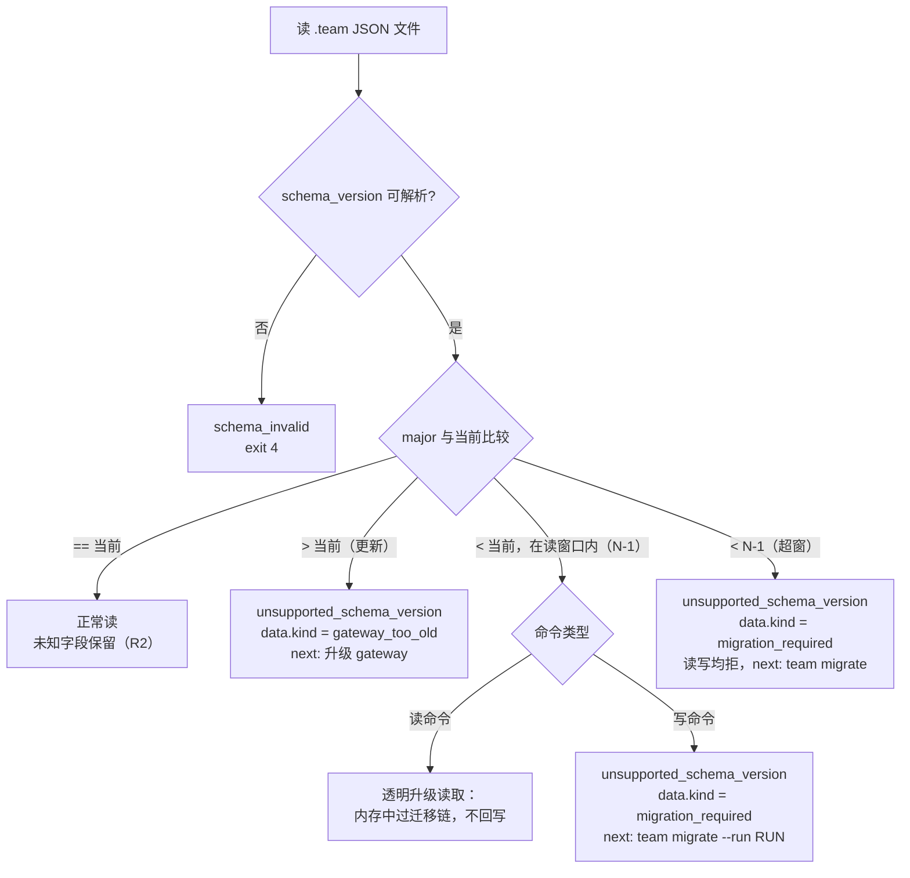

# 21. Schema Versioning and Migration

> 日期：2026-07-09
> 状态：v0.1 设计草案
> 依据：[13](13-design-audit-and-next-breakdown.md) M28–M29、§6.1 对本文档的章节要求；[17](17-cli-mcp-contract-and-error-model.md) §11 版本握手最低规则（本文**展开而不推翻**）；决策 D3（TS/Node 栈）、D4（`.team/` 全 gitignore、机器本地状态）
> 目标：盘点全部 schema、定死版本字符串格式与 breaking/additive 判据、读写兼容规则与未知字段保留实现、`team migrate` 全设计、gateway × schema 兼容矩阵、payload 版本协商、多工具并存策略、config.toml 移除决议。

---

## 1. 范围与前提

1. **迁移是"本机升级"场景，不是跨机同步。** D4 已定 `.team/` 全 gitignore、是机器本地状态；schema 版本问题只发生在"同一台机器上 gateway 升级后读旧 run"与"同一 repo 上多个工具带着不同版本 gateway"两种情形。远端同步的版本问题属 Phase 3，不在本文范围。
2. **[17](17-cli-mcp-contract-and-error-model.md) §11 的三条最低规则是本文的公理**，全文所有设计都是它们的展开：
   - R1：读任何 `.team` 文件，`schema_version` 的 major 不认识 → `unsupported_schema_version`（exit 8），提示 `team migrate` 或升级 gateway。
   - R2：minor 级新增字段：读时**保留未知字段**原样写回（forward-compat）。
   - R3：`project.json.min_gateway_version`：低于此版本的 gateway 拒绝写操作（防旧工具破坏新状态）。
3. **MVP 落地量**：协议当前只有一个 major（全部 v1），因此 MVP 只需实现 R1–R3 + `team doctor` 的版本矩阵输出 + §9 的 config.toml 处理；`team migrate` 的完整机器（§5）是 P1，但**必须在第一次 major bump 发布之前就位**——这与 [17](17-cli-mcp-contract-and-error-model.md) §1 命令总表中 `team migrate` 的 MVP 列留空一致。

---

## 2. Schema 清单盘点

扫描 README + 01–17 全部文档收集所得。可变性取值：`mutable`（就地更新，带 `rev` 乐观锁）、`append-only`（只追加，永不重写）、`derived`(可删除重算)。

| # | schema id | 载体文件 | 可变性 | 定义文档 |
|---|---|---|---|---|
| 1 | `team.project.v1` | `.team/project.json` | mutable | [02](02-domain-model-and-team-storage.md) §6（`min_gateway_version` 字段由本文档 §6.2 补定） |
| 2 | `team.run.v1` | `runs/<RUN>/run.json` | mutable | [02](02-domain-model-and-team-storage.md) §5（status 值域经 [15](15-run-task-state-machine-and-lifecycle.md) §2 扩为七态） |
| 3 | `team.task_list.v1` | `runs/<RUN>/team-task-list.json` | mutable（索引，与 task.json 同锁双写） | [03](03-team-task-list-and-task-schema.md) §3 |
| 4 | `team.task.v1` | `runs/<RUN>/tasks/<TASK>/task.json` | mutable（权威详情） | [03](03-team-task-list-and-task-schema.md) §5（[15](15-run-task-state-machine-and-lifecycle.md) §5.3 增 `previous_attempts`） |
| 5 | `team.task_graph.v1` | `runs/<RUN>/task-graph.json` | mutable | [12](12-context-plane-task-dag-message-pool-memory.md) §5（nodes/edges 的 status 字段按 13 §5.5 裁决待派生化） |
| 6 | `team.plan_payload.v1` | import 输入文件（一次性，不落 `.team/`） | —（输入合同） | [09](09-team-run-import-payload-schema.md) §3 |
| 7 | `team.agent.v1` | `runs/<RUN>/agents/AGENT-*.json` | mutable | [02](02-domain-model-and-team-storage.md) §7 |
| 8 | `team.task_claims.v1` | `runs/<RUN>/claims/task-claims.json` | mutable | [10](10-claim-next-lock-and-conflict-rules.md) §3.1 |
| 9 | `team.path_claims.v1` | `runs/<RUN>/claims/path-claims.json` | mutable | [10](10-claim-next-lock-and-conflict-rules.md) §3.2 |
| 10 | `team.review_claims.v1` | `runs/<RUN>/claims/review-claims.json` | mutable | [14](14-evidence-review-verification-contract.md) §3.1 |
| 11 | `team.path_approvals.v1`（**本文档补定 id**） | `runs/<RUN>/claims/path-approvals.json` | mutable | [14](14-evidence-review-verification-contract.md) §5 只列了字段未给 schema id |
| 12 | `team.worktrees.v1` | `runs/<RUN>/worktrees.json` | mutable | [16](16-git-worktree-and-team-root.md) §3.2 |
| 13 | `team.evidence.v1` | `evidence/<TASK>/evidence.json`（旧 revision 归档进 `history/`） | mutable + revision 归档 | [14](14-evidence-review-verification-contract.md) §2.1 |
| 14 | `team.review.v1` | `reviews/<TASK>/REVIEW-*.json` | append-only（每轮新文件，永不覆盖） | [14](14-evidence-review-verification-contract.md) §3.2 |
| 15 | `team.verification.v1` | `verification/VERIFY-*.json` | append-only | [14](14-evidence-review-verification-contract.md) §4.1 |
| 16 | `team.progress.v1` | `runs/<RUN>/progress.json` | derived | [02](02-domain-model-and-team-storage.md) §10 |
| 17 | `team.event.v1`（**预留，行级**） | `runs/<RUN>/events.jsonl` 每行 | append-only | 示例见 [02](02-domain-model-and-team-storage.md) §8；schema 全文归 [18](18-audit-rule-catalog-and-trust-model.md)（M26） |
| 18 | `team.message.v1`（**预留，行级**） | `runs/<RUN>/context/messages.jsonl` 每行 | append-only | [12](12-context-plane-task-dag-message-pool-memory.md) §6 未声明版本字段，随 18 号补全 |
| 19 | `team.envelope.v1` | CLI/MCP stdout（`meta.envelope_version`，不落盘） | —（接口合同） | [17](17-cli-mcp-contract-and-error-model.md) §2 |
| 20 | `team.counters.v1`（**本文档补定 id**） | `.team/counters.json`、`runs/<RUN>/counters.json`、`events.meta.json` | mutable（内部簿记） | [17](17-cli-mcp-contract-and-error-model.md) §5.2/§6 未声明 |
| 21 | —（无版本 markdown） | `plan.md`、`task.md`、`evidence.md`、`REVIEW-*.md`、`VERIFY-*.md`、`run-memory.md`、`context/tasks/*.md` | 跟随其权威 json | 人读载体，不参与版本握手 |
| 22 | —（派生索引） | `context-index.json`、`verification.md`（索引）、`open-questions.jsonl`、`run-decisions.jsonl` | derived | [02](02-domain-model-and-team-storage.md)/[12](12-context-plane-task-dag-message-pool-memory.md)/[14](14-evidence-review-verification-contract.md)；M23 已裁决派生化 |
| 23 | —（移除） | `.team/config.toml` | — | [02](02-domain-model-and-team-storage.md) §3 目录树遗留，按 M29 移除，见 §9 |

盘点规则：**凡 mutable JSON 状态文件必须携带 `schema_version` 顶层字段**；derived 文件也带（重算时自动写当前版本，永不迁移）；append-only 的 jsonl 用**行级 `v` 字段**（缺省视为 1），不用文件级 `schema_version`——否则 R1 的"读任何 `.team` 文件"对 jsonl 无法执行（本次盘点发现的空隙，见 §3.4）。

---

## 3. 版本字符串格式决策

### 3.1 格式：`team.<object>.v<major>`，major-only

现有 17 个 schema id 已全部采用该格式，本文档将其固化为规范：

| 决策 | 内容 |
|---|---|
| 格式 | `team.<object>.v<major>`，`<major>` 为正整数；**不引入 minor/patch**（`team.task.v1.2` 非法） |
| 理由 1 | 版本字符串是**兼容性闸门**，不是 changelog：additive 变更按 R2 天然安全，写进字符串只会制造无意义的迁移决策 |
| 理由 2 | "谁认识哪个可选字段"由 gateway 自身的 npm semver（envelope `meta.gateway_version`）追踪，足够定位问题 |
| 理由 3 | major-only 让 R1 的判定变成一次整数比较，misparse 面最小 |
| 对齐 R2 | [17](17-cli-mcp-contract-and-error-model.md) §11 R2 所说"minor 级新增字段"= **同 major 内的 additive 变更，不改版本字符串** |

### 3.2 什么算 breaking（必须 bump major）

判据：**旧 gateway 按旧合同读/写会得出错误结论或写坏状态**。具体包括：字段删除或改名；新增必填字段（旧写者产出即非法）；字段语义/单位/默认值变更；枚举收窄或状态机图变更；ID 格式变更；载体文件拆分合并。

| # | 例子 | 为什么 breaking |
|---|---|---|
| B1 | `team.task_claims` 把 `lease_until` 改名 `expires_at` | 旧 gateway 读不到租约字段，惰性 sweep（D9）判定全部 claim 永不过期，回收机制失效 |
| B2 | `team.task` 的 `paths.allow` 语义从"推荐修改范围"改为"硬白名单，越界即 error" | 字段形状未变但读者行为必须改：旧 gateway 在 submit 校验（[14](14-evidence-review-verification-contract.md) §2.3）会漏拦越界文件 |
| B3 | `team.task` 的 `status` 枚举收窄：移除 `stale` 持久态（[03](03-team-task-list-and-task-schema.md) §7 → [15](15-run-task-state-machine-and-lifecycle.md) §3 的那类修订） | 旧 gateway 可能写出新合同不认的状态值；状态机是多方共同执行的协议，图变即合同变 |

注：B3 这次真实发生的修订**不 bump major**，因为协议尚未发布（v1 仍是 pre-release 草案，修订 pass 在实现前完成）；发布后同类变更一律 v2。

### 3.3 什么算 additive（同 major，不改字符串）

判据：**新增"可选、有缺省语义、旧写者不写也合法、旧读者忽略也无害"的字段**。

| # | 例子 | 为什么 additive |
|---|---|---|
| A1 | `team.task` 增加 `previous_attempts[]`（[15](15-run-task-state-machine-and-lifecycle.md) §5.3） | 旧读者忽略即回到"无前次进展"的保守行为；旧写者不写即空数组语义 |
| A2 | `team.run` 的 `default_policy` 增加 `reclaim_policy`、`path_release_on_submit` | 缺省值即旧行为，policy 读取处统一 fallback |
| A3 | `team.evidence` 的 `commands[]` 元素增加可选 `env_fingerprint`（记录执行环境指纹） | 纯附加事实，无任何读者依赖 |

灰区裁决：**状态类字段新增枚举值算 breaking**（旧 gateway 的 claim-next 过滤、状态机校验不认识新值）；**标注类字段新增枚举值算 additive**，前提是该字段合同已声明"未知值按 `note`/忽略处理"（如 `message.type`）。合同未声明容忍规则的枚举，默认按 breaking 处理。

### 3.4 jsonl 行级版本（盘点发现的空隙，本文档补定）

`events.jsonl` / `messages.jsonl` 每行增加可选字段 `"v": 1`（缺省 1）。读者按行解释：`v` 的 major 超出读窗口 → 该行按 `unsupported_schema_version` 处理（audit 报告，读命令跳过并计 warning，不整体拒绝——历史账本里个别新版本行不应让整个 run 不可读）。行 schema 全文随 [18](18-audit-rule-catalog-and-trust-model.md) 的 event/message schema 定稿。

---

## 4. 读写兼容规则

### 4.1 读路径判定



| 规则 | 内容 |
|---|---|
| 透明升级读取 | 读命令（status/show/list/audit/export）对窗口内旧 major 文件**在内存中执行迁移链后使用，不回写磁盘**——保证只读命令永不改状态 |
| 写命令拦截 | 任何写事务发现目标 run 内存在旧 major 文件 → 整体拒绝并提示 migrate；**不做"顺手迁移"**（写事务的锁窗口应保持毫秒级，[17](17-cli-mcp-contract-and-error-model.md) §4） |
| run 内 major 一致性 | 目标状态是**一个 run 内所有 mutable 文件同 major**；migrate 以 run 为原子单位（§5）；audit 增加规则：run 内 major 混杂 → warning（迁移中断的证据） |
| reason code 复用 | 不新增 code，统一 `unsupported_schema_version`（exit 8，[17](17-cli-mcp-contract-and-error-model.md) §2.2/§3），用 `data.kind` 细分：`gateway_too_old` / `migration_required` / `unknown_major`（无法解析出整数 major 时） |
| payload 特例 | `team.plan_payload` 是一次性输入，不存在"迁移文件"，协商规则见 §7 |

### 4.2 未知字段保留的 TS 实现注意（R2 落地）

| # | 纪律 | 说明 |
|---|---|---|
| 1 | **禁止 DTO 白名单重建对象** | 不得 `JSON.parse` 后经 class 构造器 / `pick` / 解构重组再序列化——这是 TS 里丢字段的头号来源。读入的 plain object 就是写回的对象，变更用**就地 mutate 或浅拷贝展开**（`{ ...doc, status: "working" }`） |
| 2 | 校验器配置 | zod 用 `.passthrough()`（禁 `.strict()`/`.strip()`）；ajv 保持 `additionalProperties: true` 且 `removeAdditional: false`。校验的职责是"已知字段合法"，不是"只允许已知字段" |
| 3 | 类型层表达 | 已知字段类型 + `& { [k: string]: unknown }`（或 zod passthrough 推导类型），让"还有未知字段"在类型上可见，防止后人顺手改成 strict |
| 4 | 例外：import 边界 | `team run import` 对 payload 的**运行态伪造字段**按 [09](09-team-run-import-payload-schema.md) §9 主动拒绝——那是安全校验，不是字段保留的反例；payload 中其余未知字段照常透传进 `task.json.metadata` |
| 5 | round-trip 回归测试 | 对每类 schema：构造带未知字段（含嵌套、数组元素内）的样本 → 读 → 执行一次典型写事务 → diff 结果，**除预期变更与 `rev`/`updated_at` 外必须逐字节等价**。进 [17](17-cli-mcp-contract-and-error-model.md) §10 测试矩阵 |
| 6 | jsonl 透传 | 追加新行不触碰旧行；派生索引重算时从权威文件取数，未知字段不需进索引（索引本身 derived，无保留义务） |

---

## 5. `team migrate` 设计

```text
team migrate [--run RUN-0001 | --all] [--dry-run] [--json]
```

| 维度 | 设计 |
|---|---|
| 作用域 | **逐 run**：先迁移 project 级文件（`project.json`、`counters.json`），再逐个 run 迁移；`--run` 只迁指定 run（project 级文件仍会先检查）。每个 run 是独立原子单位 |
| 锁 | project 级文件在 `project.lock` 内；每个 run 在其 `run.lock` 内完成全部文件迁移（短事务原则不变：迁移是纯本地文件变换，无 git/网络操作） |
| 执行前备份 | 迁移任何文件前，整目录复制到 `.team/backup/<timestamp>/`：project 文件进 `backup/<ts>/project/`，run 目录进 `backup/<ts>/RUN-0001/`；备份目录随 `.team/` 一并 gitignore（D4，本机语义）；备份内写 `migration.json`（从/到 major 清单、gateway 版本、结果） |
| 幂等 | 文件已是当前 major → 跳过；全部最新 → `ok=true` + "nothing to migrate"（exit 0）。重复运行无副作用；上次中断的 run（major 混杂）重跑时从备份恢复后重迁 |
| `--dry-run` | 不写任何文件，输出变更清单：每文件 `path / from_major / to_major / 迁移步骤链 / 预计字段变更摘要`；envelope `data.plan[]` 结构化承载，供 adapter 转述给用户确认 |
| 迁移脚本链 | 每个 schema 每次 major 跃迁一个**纯函数**：`migrate.task.v1_to_v2(doc)`，注册进静态 registry 表；v1→v3 = 链式复合。函数禁止 I/O、禁止读项目代码、必须透传不相关未知字段。**registry 保留全历史链**（脚本是廉价纯函数），因此超出 N-1 读窗口的古老 run 仍可由当前 gateway 一次迁到位 |
| 失败回滚 | 单文件迁移函数抛错或产物 schema 校验失败 → 中止该 run，从备份整目录恢复（现场先 rename 为 `<RUN>.failed-<ts>` 供诊断），envelope 报失败文件与原因；**已成功的其他 run 保持新版本**（per-run 原子性使部分成功是合法状态） |
| append-only 文件 | `events.jsonl` / `messages.jsonl` **永不重写**（审计账本不可篡改）：迁移不触碰历史行，新行按新 `v` 写；行级 major 升级设计上尽力避免（见 §3.4） |
| derived 文件 | `progress.json`、`context-index.json`、`verification.md` 索引、`open-questions.jsonl`/`run-decisions.jsonl`：**不迁移，直接删除**，下次命令重算即当前版本 |
| 收尾 | 每个 run 迁移成功后 append `run_migrated` 事件（from_majors、to_majors、gateway_version、backup ref）；全部完成后按 §6.2 规则提升 `project.json.min_gateway_version` |
| 在途保护 | 目标 run 存在未过期 active claim 时警告（在途 agent 的旧 gateway 将被 R3 拦写），建议先 `team run pause`；`--force` 可越过。终态 run（archived/cancelled）默认跳过，`--all` 加 `--include-archived` 才迁 |

---

## 6. 兼容矩阵：gateway 版本 × schema major

### 6.1 支持窗口策略

| 策略 | 内容 |
|---|---|
| 读窗口 | **N-1**：当前 major N 与前一个 major 均可读（透明升级读取，§4.1）；更老的 major 读写均拒、导向 migrate |
| 写窗口 | **仅当前 major N**：所有写事务只产出当前 major 文件 |
| 迁移链 | 全历史保留（v1→…→N），迁移能力不受读窗口限制（§5） |
| 发布纪律 | gateway 每个发布版本在 `team doctor --json` 输出支持矩阵：`data.schemas = { "team.task": { "read": [1, 2], "write": 2 }, ... }`（[17](17-cli-mcp-contract-and-error-model.md) §8 doctor 的"schema 版本矩阵"即此）；adapter/agent 用它做 §7 的协商 |

示例矩阵（假想的未来演进，说明窗口如何滑动；当前一切为 v1）：

| gateway（npm semver） | task 写 | task 读 | plan_payload 接受 | 备注 |
|---|---|---|---|---|
| 0.1.x（MVP） | v1 | v1 | v1 | 单 major，migrate 未启用 |
| 0.4.x（首次 bump） | v2 | v1, v2 | v1, v2 | 携带 v1→v2 迁移链 |
| 0.7.x | v3 | v2, v3 | v2, v3 | v1 run 读拒但可 migrate（链全保留） |

### 6.2 `min_gateway_version`（R3 展开）

| 规则 | 内容 |
|---|---|
| 字段 | `project.json.min_gateway_version`（semver 字符串）——[17](17-cli-mcp-contract-and-error-model.md) §11 引用了它，但 [02](02-domain-model-and-team-storage.md) §6 的 schema 尚无此字段，本文档补定（additive，v1 内合法） |
| 语义 | **写闸门**：gateway 每次写命令启动时自检 `自身版本 >= min_gateway_version`，否则拒绝写（`unsupported_schema_version`，`data.kind=gateway_too_old`）。读命令不看它，只按 §4.1 的 major 窗口判定 |
| 提升时机 | 仅三处：① `team init`（设为该 gateway 系列的最低兼容版本，而非当前版本——避免无谓收紧）② `team migrate` 成功收尾（设为能写新 major 的最低版本）③ 未来某命令首次启用需要新 gateway 才能安全并存的特性时（显式声明，逐案登记） |
| 禁止 | **日常命令永不自动提升**。additive 变更不提升（R2 保证旧 gateway 同 major 内安全并存）——否则任何一个工具升级都会立刻锁死同 repo 的其他工具，违背多工具共存的产品前提 |
| 降级 | 不支持自动降级；用户强行回退 gateway 后写被拦，出路是升级回来或从 `.team/backup/` 人工恢复旧状态（文档明示，不提供命令） |

---

## 7. Payload 版本协商（`/team-plan` → `team run import`）

场景：planning agent（可能由更新的 adapter 模板驱动）生成的 `team.plan_payload.v2`，交给只支持 v1 的 gateway。

| 步骤 | 规则 |
|---|---|
| 校验 | `import` 首查 `schema_version`：major > 支持上限 → 拒绝，`unsupported_schema_version`（exit 8），`data = { payload_major: 2, supported_payload_majors: [1] }` |
| 双向建议 | `next_actions` **必须同时给两条出路**，由用户选择：① 升级 gateway：`npm i -g <pkg>@latest`（正式包名归 [22](22-packaging-installation-and-evolution.md)，D12）；② 让 agent 降版重出：向 planning agent 转述"regenerate the plan payload as team.plan_payload.v1（当前 gateway 支持上限）" |
| 事前防线 | [19](19-agent-adapter-pack-claude-codex.md) 的 `/team-plan` 模板固化第一步：先 `team doctor --json` 读 `data.schemas["team.plan_payload"].write/read`，按 gateway 支持上限生成 payload——协商失败应是异常路径，不是常规路径 |
| 旧 payload | major 在读窗口内的旧 payload（如 v1 交给支持 [1,2] 的 gateway）→ 接受，import 时经迁移链转为当前内部格式落盘，envelope `warnings[]` 记 `payload_schema_downlevel` |
| 留痕 | `run_created` 事件记录 `payload_schema_version`，便于事后解释"这个 run 是哪个版本合同导入的" |

payload 是一次性输入合同，**没有 migrate 命令介入的余地**——协商失败只有"换一边的版本"两条路，这正是 next_actions 必须双向的原因。

---

## 8. 多工具并存场景（同 repo、不同版本 gateway）

场景：同一 repo，Claude Code 侧插件带新 gateway 0.4.x（写 task v2），Codex 侧还是 0.1.x（只认 v1）。这是 D2（双工具矩阵）+ 形态 A/B 分发（D1，各工具各自带 gateway 副本）下的必然状态。

| 时点 | 行为 |
|---|---|
| 升级前 | 两侧同写 v1：additive 差异由 R2 吸收（0.4 写入的新可选字段，0.1 读时保留原样写回），**无需任何协调** |
| 用户在 Claude Code 侧执行 `team migrate` | run 文件升至 v2；`min_gateway_version` 提升为 `0.4.0`；备份留存 |
| Codex 侧旧 gateway 读 | v2 超出其读窗口 → `unsupported_schema_version`（`gateway_too_old`），status/claim 均不可用 |
| Codex 侧旧 gateway 写 | 双保险拦截：R3 的 `min_gateway_version` 闸门在**读文件之前**就拒绝（这正是 R3 存在的意义——防旧工具在只认旧 major 的情况下把新状态写坏） |
| 提示文案（写进 0.1.x 起的每个 gateway，供未来生效） | `This repo's .team state requires gateway >= 0.4.0 (you have 0.1.2). Writes are blocked to protect newer state. Fix: upgrade this tool's team gateway (npm i -g <pkg>@latest). State was migrated by another tool on <ts>; backup at .team/backup/<ts>/.` |
| 顺序建议（文档 + migrate 输出提示） | migrate 前先把**本 repo 会用到的所有工具**的 gateway 升级到同一系列，最后跑 migrate——把"一边锁死"窗口压到最短；`team migrate` 执行时打印该提醒 |

关键结论：**闸门必须从第一版就实现**（R3 是 MVP 规则），否则未来的 0.1.x 存量安装无法被新状态拦住——版本握手的价值恰恰在于它先于版本分裂存在。

---

## 9. `config.toml` 移除决议（M29 落文）

| 项 | 决议 |
|---|---|
| 裁决 | **`.team/` 只留 `project.json` 一个项目级配置文件**；`config.toml` 从 [02](02-domain-model-and-team-storage.md) §3 目录树移除。理由：它自出现起无任何文档定义职责（M29）；双配置文件必然漂移；TS 栈下 JSON 无解析依赖 |
| 一次性迁移 | `team migrate`（及 `team doctor` 检测）遇到存量 `.team/config.toml`：重命名移入 `.team/backup/<ts>/config.toml`，报 warning `legacy_config_present`；**不解析其内容**（从无 schema，无可迁移语义）；提示"若曾手工配置，请人工并入 project.json" |
| `team init` | 不再创建该文件（[17](17-cli-mcp-contract-and-error-model.md) §8 的 init 清单本就没有它，无需改） |

---

## 10. MVP 验收场景

| # | 场景 | 预期 |
|---|---|---|
| 1 [MVP] | 手工把某 run 的 `task.json` 改为 `team.task.v9` 后执行任意命令 | `unsupported_schema_version`，exit 8，`data.kind=gateway_too_old`，next_actions 含升级指引 |
| 2 [MVP] | 手工在 `task.json` 塞入未知字段 `x_custom`，随后经 CLI 完成一次 claim→submit | 全程后该字段仍在文件中原样保留（round-trip 测试的端到端版） |
| 3 [MVP] | `project.json.min_gateway_version` 设为高于当前版本，执行写命令 / 读命令 | 写拒（`gateway_too_old`）；读命令正常 |
| 4 [MVP] | `.team/config.toml` 存在时 `team doctor` | 报 `legacy_config_present` warning 与处理指引 |
| 5 [MVP] | `team doctor --json` | `data.schemas` 输出全部 §2 mutable/append-only schema 的 read/write 矩阵 |
| 6 [P1] | 构造 v1 fixture run，用带 v1→v2 链的 gateway 跑 `team migrate --dry-run` / 实跑 | dry-run 零写入且列出全部文件变更；实跑后 run 内无 v1 文件、备份完整、`run_migrated` 事件在案、重跑 no-op |
| 7 [P1] | 迁移函数对某文件注入异常 | 该 run 从备份整体恢复，现场留 `.failed-<ts>`，其他 run 不受影响 |
| 8 [P1] | 迁移后用旧 gateway 执行写命令 | 被 min_gateway_version 拦截，文案含备份路径与升级命令 |

---

## 11. 对现有文档的修订指令

| 文档 | 修订 |
|---|---|
| [02](02-domain-model-and-team-storage.md) | §3 目录树删除 `config.toml`、增加 `backup/`；§6 `project.json` 增加 `min_gateway_version` 字段与说明 |
| [12](12-context-plane-task-dag-message-pool-memory.md) | §6 message 行增加可选 `v` 字段（缺省 1），随修订 pass 执行 |
| [14](14-evidence-review-verification-contract.md) | §5 `path-approvals.json` 补 `schema_version: "team.path_approvals.v1"`；`evidence.json` 的 `rev` 字段与 [17](17-cli-mcp-contract-and-error-model.md) §5.2 的 rev 覆盖清单二者取一对齐（建议：17 清单增列 evidence.json） |
| [17](17-cli-mcp-contract-and-error-model.md) | §3 `unsupported_schema_version` 行补注 `data.kind` 取值（gateway_too_old / migration_required / unknown_major）；§8 doctor 的 schema 矩阵输出格式指向本文 §6.1；§10 测试矩阵增加 round-trip 未知字段保留用例（§4.2-5） |
| [18](18-audit-rule-catalog-and-trust-model.md)（编写时） | event/message 行级 schema 采用 §3.4 的 `v` 字段约定；audit 增加"run 内 major 混杂"规则 |
| [19](19-agent-adapter-pack-claude-codex.md)（编写时） | `/team-plan` 模板首步加 doctor 版本握手（§7）；`unsupported_schema_version` 的用户话术模板 |
| [22](22-packaging-installation-and-evolution.md)（编写时） | npm 版本号与 schema major 的发布纪律（§6.1 发布纪律行）、升级 UX 与 §8 顺序建议 |

---

## 12. 遗留到其他文档的接口

- `team.event.v1` / `team.message.v1` 行级字段全文 → [18](18-audit-rule-catalog-and-trust-model.md)
- 迁移函数 registry 的包内代码结构与接口签名 → [20](20-c4-l2-l3-component-contracts.md)
- 包发布节奏、dist-tag、`team doctor` 升级提示文案 → [22](22-packaging-installation-and-evolution.md)
- dashboard read-model 对旧 major run 的展示（只读，同 N-1 窗口） → [23](23-dashboard-information-architecture.md)
- 备份目录的磁盘占用治理（backup 清理建议命令） → [22](22-packaging-installation-and-evolution.md) `team doctor` 检查项
