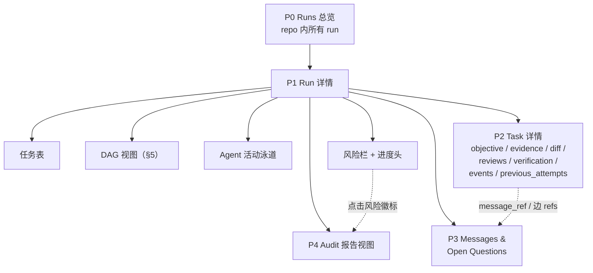

# 23. Dashboard Information Architecture（Read-only Viewer）

> 日期：2026-07-09
> 状态：v0.1 设计草案
> 依据：[13](13-design-audit-and-next-breakdown.md) §6.1（23 号范围）、§7 P2 裁剪（DAG 边 MVP 只留三种）、D14（`team watch`）；[08](08-core-gateway-capabilities.md) §6.2 dashboard 定位（不可违背）；[12](12-context-plane-task-dag-message-pool-memory.md) §12–13（DAG、message pool、open questions、context handoff 是必展对象）；[15](15-run-task-state-machine-and-lifecycle.md) 状态机与风险语义；[17](17-cli-mcp-contract-and-error-model.md) §7 `team watch --json`；[14](14-evidence-review-verification-contract.md) / [16](16-git-worktree-and-team-root.md) 目录结构与 git 事实；[21](21-schema-versioning-and-migration.md) §6.1 读窗口、[24](24-security-permissions-and-data-hygiene.md) §2/§5（两文档留给 23 号的接口在 §9 接住）
> 目标：定义 read-only dashboard 的信息架构与数据映射：页面树、每页回答的用户问题、"元素 → 事实源 → read-model 聚合 → CLI 等价命令"四方对照、DAG 视图规格、刷新模型、只读边界落地清单与风险徽标体系。**不做视觉稿、不选前端框架**；进程形态只约定为"本地 read-model server + 浏览器"，container 边界归 [20](20-c4-l2-l3-component-contracts.md)。

---

## 1. 定位与硬边界

| # | 边界 | 依据 |
|---|---|---|
| B1 | **纯只读 viewer，无任何写路径**：不派活、不改状态、不编辑文本；权威入口永远是 slash command → gateway primitive | [08](08-core-gateway-capabilities.md) §6.2、[11](11-4-plus-1-architecture-view.md) §5.3 |
| B2 | 数据只来自 `.team/` 文件（经 read-model 聚合）与 git 只读命令（diff / log / branch 列表）；**不发明新的状态文件** | [02](02-domain-model-and-team-storage.md)、[16](16-git-worktree-and-team-root.md) |
| B3 | dashboard 不向 `.team/` 写任何缓存、布局或偏好；缓存只存在于 read-model 进程内存 | B1/B2 推论 |
| B4 | 允许的交互仅三类：查看详情、触发只读刷新、**复制命令文本**（§7 允许清单） | [08](08-core-gateway-capabilities.md) §6.2 原文 |
| B5 | P2 优先级：MVP 主链路不依赖 dashboard；**每个视图都有 CLI 等价命令**（各页标注），dashboard 挂了协议照跑 | [13](13-design-audit-and-next-breakdown.md) §7 |
| B6 | read-model 与 CLI 共享同一 core 读逻辑（派生规则只实现一次），进程形态为本地 server + 浏览器 | [20](20-c4-l2-l3-component-contracts.md)（container 边界） |

---

## 2. 信息架构总览

导航约定：

- 主路径 `总览 → run → task`；messages / audit 是 run 级平行页，task 详情内的 `message_ref`、context refs 跳转到 P3 对应锚点。
- 顶栏全局元素：team root 路径、gateway_version、**数据时刻**（"截至 events seq N / HH:MM:SS"）、刷新状态、watch 存活指示（§6）。只读产品必须诚实标注数据新鲜度。
- 术语、状态名、风险名与 [15](15-run-task-state-machine-and-lifecycle.md)/[17](17-cli-mcp-contract-and-error-model.md) 完全一致，不另造展示层词汇。

---

## 3. Read-model 聚合类型

所有页面的数据映射引用下表编号；聚合的接口签名与实现归 [20](20-c4-l2-l3-component-contracts.md)。

| 编号 | 聚合 | 输入 | 说明 |
|---|---|---|---|
| A1 | run 索引 | `runs/*/run.json` + 各 run task-list | 总览列表；跨 run 路径交集复算（[16](16-git-worktree-and-team-root.md) §5） |
| A2 | task join | `team-task-list.json` × `tasks/*/task.json` × claims 三件套 | 索引与详情合一；两处状态不一致时以 task.json 为准并标 audit 风险（[13](13-design-audit-and-next-breakdown.md) §5.5） |
| A3 | lease 派生 | claims + `agents/*.json` + now | stale = `now > lease_until`（blocked 豁免，[15](15-run-task-state-machine-and-lifecycle.md) §5.1）；只标注、不回收 |
| A4 | progress 重算 | [02](02-domain-model-and-team-storage.md) §10 列出的全部事实 | 按 [03](03-team-task-list-and-task-schema.md) §9 + [15](15-run-task-state-machine-and-lifecycle.md) §3.4 权重现算；`progress.json` 只作对照信号，显示值一律重算（INV-006） |
| A5 | DAG join | `task-graph.json` × A2 | 节点状态由 join 得出，忽略 graph 文件内残留 status 字段（[13](13-design-audit-and-next-breakdown.md) §5.5）；`blocks` 边满足状态按 claim-next 同规则派生 |
| A6 | message 线程 | `context/messages.jsonl` | 按 `in_reply_to` 串线程；open questions 以 messages 为权威聚合，`open-questions.jsonl` 仅作加速索引（[13](13-design-audit-and-next-breakdown.md) M23） |
| A7 | audit 透传 | `team audit * --json`（只读命令） | findings 原样入视图，不改写 severity；与内嵌同库调用二选一，归 [20](20-c4-l2-l3-component-contracts.md) |
| A8 | git 事实 | `git diff/log/status --porcelain`（只读） | branch / base_commit 取自 `worktrees.json`（[16](16-git-worktree-and-team-root.md) §3.2） |
| A9 | events 游标 | `events.jsonl`（行内 seq） | tail 增量拉取；seq 断号显示为 audit 风险（[17](17-cli-mcp-contract-and-error-model.md) §5.2） |

---

## 4. 页面规格

### 4.1 P0 Runs 总览

**回答的问题：** ① 这个 repo 现在有哪些 run，各处于什么状态？② 哪个 run 是 active、有几个 agent 在干活？③ 两个 active run 的路径有没有重叠（cross_run_overlap）？④ 上周那个 run 结束了吗、报告在哪？⑤ 我该复制哪条命令加入某个 run？

| 元素 | 事实源 | 聚合 | CLI 等价 |
|---|---|---|---|
| run 行：RUN-ID、title、mode、status、created_by/at | `runs/*/run.json` | A1 | `team run list` |
| 进度条 + by_status 微缩计数 | task-list + 事实重算 | A4 | `team progress <RUN>` |
| active agents 数 / 最近活动时刻 | `agents/*.json`、events tail | A3/A9 | `team run show <RUN>` |
| 风险徽标汇总（最高 severity + 计数） | §8 各风险源 | A3/A7 | `team audit run <RUN>` |
| 跨 run 路径重叠警示条 | 各 active run 的 `paths.allow` 交集 + `cross_run_overlap_detected` 事件 | A1 | `/team-status`（run 级 risk） |
| 复制命令：`/team-dispatch RUN-ID`、`team export --run RUN-ID` | — | — | §7 允许清单 |

**视图整体等价于：** `team run list` + 逐 run 的 `team progress`。

### 4.2 P1 Run 详情

**回答的问题：** ① 现在谁在做什么、谁卡住了？② TASK-0003 为什么没人领（draft 未发布？依赖未满足？路径被占？能力不匹配？）③ 进度多少、还有几个 ready、review 积压几个？④ 有哪些风险需要用户出手（stale 回收、路径批准、unblock）？⑤ agent 是"完成即停"还是 loop 模式，停了还是断了？

四个子视图共用一个进度头（weighted_progress、by_status、run status、base_branch、mode、policy 摘要：require_review / claim_ttl / reclaim_policy / path_release_on_submit）。

| 元素 | 事实源 | 聚合 | CLI 等价 |
|---|---|---|---|
| 任务表行：TASK-ID、title、type、status、owner、priority、lease 剩余 | task-list、task.json、task-claims | A2/A3 | `team task list <RUN>` |
| "为什么不可领"tooltip：逐条列出未满足的可领取条件（[08](08-core-gateway-capabilities.md) §4.2 七条） | task-graph、claims、agents、run.json | A2/A5 | `team claim-next <RUN> --dry-run` |
| evidence / review / verify 摘要列（有无、轮次、verdict） | `evidence/*/evidence.json`、`reviews/*/REVIEW-*.json`、`verification/VERIFY-*.json` | A2 | `team task show <RUN> <TASK>` |
| Agent 活动泳道：每 agent 一行，时间轴段 = claim→submit 事件区间，心跳新鲜度、`mode: loop/single` | `agents/*.json`、events、claims | A3/A9 | `team run show` + events |
| 风险栏：run 级风险汇聚（§8），每行带复制命令 | §8 | A3/A7 | `/team-status <RUN>` |
| DAG 视图 | §5 | A5 | `team graph show <RUN>` |

**视图整体等价于：** `/team-status RUN-ID`（底层为 `team run show` + `team task list` + `team progress` 组合）。

### 4.3 P2 Task 详情

**回答的问题：** ① 这个 task 的目标、验收标准、允许路径是什么？② 到底改了哪些文件（diff）、checks 过了没有、原始输出在哪？③ review 走了几轮、每轮要求改什么、改完了吗？④ 这个 task 为什么回到 ready（previous_attempts 谁做过、留下什么进展）？⑤ 它依赖的上游 context 是什么，owner 声明读过了吗（context_ack vs must_read）？

| 元素 | 事实源 | 聚合 | CLI 等价 |
|---|---|---|---|
| objective 面板：task.md、acceptance、required_checks、paths（allow/avoid/requires_approval） | `tasks/TASK-ID/task.json`、`task.md` | A2 | `team task show <RUN> <TASK>` |
| 状态与 claim 历史（task × claim 一致性对照 [15](15-run-task-state-machine-and-lifecycle.md) §4.3） | task-claims、review-claims、path-approvals | A2/A3 | 同上 |
| evidence 面板：summary、changed_files（含 in_scope 标注）、commands + exit_code、acceptance 覆盖矩阵、risks/deviations、revision 历史 | `evidence/TASK-ID/evidence.json`、`history/`、`outputs/*.log`（展示已截断脱敏文件） | A2 | `team task show` + `team audit task` |
| diff 面板：文件级 diffstat 与逐文件 diff | `git diff --name-status <base_commit>..<branch>`、`git log --oneline`；branch/base_commit 取自 `worktrees.json`；未提交改动经 `git status --porcelain`（worktree 存在时） | A8 | 同款 git 命令 |
| reviews 面板：REVIEW-*-01/-02… 逐轮列出（decision、checklist、findings 含 must_fix、message_ref 跳转 P3） | `reviews/TASK-ID/REVIEW-*.json` + 同名 `.md` | A2 | `team task show`（review 段） |
| verification 面板：VERIFY-* gates、verdict、failures_mapped | `verification/VERIFY-*.json`（filter target.task_id） | A2 | `team task show`（verify 段） |
| events 时间线（按 task_id 过滤，含 seq） | `events.jsonl` | A9 | `team audit task` 输入 |
| previous_attempts：attempt、原 agent、reclaim_reason、progress_note 链接、原 worktree 状态（active/abandoned） | `task.json.previous_attempts`、`worktrees.json`、`context/tasks/TASK-ID.attempt-N.md` | A2 | `team task show` |
| context 面板：上游 `produces_context_for` 边与 refs、handoff memory、context_ack 与 hydrate must_read 的差集 | `task-graph.json`、`context/tasks/*.md`、evidence.context_ack | A5/A6 | `team memory show <RUN> --task <TASK>` |

**diff 回退链：** worktree 已删 → 用 branch 直接 diff（branch 保留，[16](16-git-worktree-and-team-root.md) §6）；branch 也已删 → 仅展示 evidence.changed_files 并标注"live diff 不可用"。

### 4.4 P3 Messages & Open Questions

**回答的问题：** ① 哪些 open question 没人答、挂了多久（超 TTL 的标红）？② TASK-0003 的 blocker 被回答了吗，答案在哪？③ 上游给下游留了什么 handoff？④ run 中形成了哪些 decision，出处可追吗？⑤ reviewer 的 must_fix findings 有没有对应消息线程？

| 元素 | 事实源 | 聚合 | CLI 等价 |
|---|---|---|---|
| 消息流：按 type（question/answer/blocker/handoff/decision/risk/finding/request_changes）与 task 过滤，`in_reply_to` 线程化 | `context/messages.jsonl` | A6 | `team message list <RUN> [--task --type]` |
| open questions 看板：open/resolved、owner、age、stale 角标 | messages 派生（权威）；`open-questions.jsonl` 作加速索引 | A6 | `team question list <RUN>` |
| decisions 列表（带 source refs） | messages（type=decision）；`run-decisions.jsonl` 同上作索引 | A6 | `team message list --type decision` |
| handoff 列表（按 task 分组，链到 context memory） | messages（type=handoff）、`context/tasks/*.md` | A6 | `team memory show <RUN>` |
| run memory 快照（只读渲染，source refs 可跳转） | `context/run-memory.md` | A6 | `team memory show <RUN>` |
| **L4 项目记忆面板**（2026-07-10 增补，D19）：MEM 条目按分区渲染、出处戳跳转 refs、Superseded 折叠、超限 warning（AUD-037） | `project_memory_path`（默认 `docs/team/MEMORY.md`，git-tracked） | A6 同款只读渲染 | `sigmarun memory promote`（复制命令）；直接读文件 |

### 4.5 P4 Audit 报告视图

**回答的问题：** ① 这个 run 的过程可信吗，有几个 error / warning？② missing evidence / self approval 落在哪个 task？③ progress 与事实一致吗？④ 有没有绕过 CLI 直改状态的迹象（rev_conflict、events seq 断号）？⑤ 每条 finding 的修复命令是什么？

| 元素 | 事实源 | 聚合 | CLI 等价 |
|---|---|---|---|
| findings 表：severity、kind、task_id、message、next_action（可复制） | audit JSON 输出（[08](08-core-gateway-capabilities.md) §5.4） | A7 | `team audit run <RUN> --json` |
| 分维度入口：claims / paths / evidence / progress 四个子报告 tab | 同上 | A7 | `team audit claims/paths/evidence/progress <RUN>` |
| task × claim 一致性偏离列表 | [15](15-run-task-state-machine-and-lifecycle.md) §4.3 矩阵 | A7 | `team audit run` |
| progress mismatch 对照（progress.json 值 vs 重算值） | `progress.json` + A4 | A4/A7 | `team audit progress <RUN>` |

规则编号、severity 定稿以 [18](18-audit-rule-catalog-and-trust-model.md) 为准；在 18 号落地前，MVP 沿用 [08](08-core-gateway-capabilities.md) §5.3 的建议严重度。

---

## 5. DAG 视图规格

| 项 | 规格 |
|---|---|
| 数据 | `task-graph.json`（nodes/edges）经 A5 join task 状态；graph 文件内残留的 node status / edge `satisfied` 一律忽略、以派生为准（[13](13-design-audit-and-next-breakdown.md) §5.5） |
| **MVP 只渲染三种边** | `blocks`、`produces_context_for`、`soft_depends_on`（[13](13-design-audit-and-next-breakdown.md) §7 P2 裁剪结论）。三者必须视觉可区分且有图例；具体样式留实现 |
| 其他边 kind | `reviews` / `verifies` / `integrates` / `conflicts_with` / `supersedes` **不入主图**，在 P2 task 详情"关系"列表中可见；是否入图属 P2 增强 |
| 节点内容 | TASK-ID + 短标题 + owner 缩写 + 状态色组 + 风险角标 |
| 状态着色（语义分组，不定色值） | 计划 `draft` ／ 就绪 `ready` ／ 执行 `claimed`,`working` ／ 返工 `changes_requested` ／ 评审验证 `submitted`,`reviewing`,`approved` ／ 完成 `verified`,`integrated`,`done` ／ 异常 `blocked` ／ 终止 `cancelled` |
| 风险角标 | `stale`（A3 派生）、`blocked`、`path_conflict`、`out_of_scope`、`review_skipped`；多个风险取最高 severity 显示 + 计数 |
| `blocks` 边标注 | 满足/未满足（派生规则与 claim-next 依赖判断一致：上游 `done` 或 policy 放行，[08](08-core-gateway-capabilities.md) §4.2）；未满足的边是"TASK 为什么没人领"的可视答案 |
| 边上 context refs 计数 | `produces_context_for` / `soft_depends_on` 边显示 `context_refs` 数量徽标；点击展开 refs 清单并跳转 evidence / message / handoff 锚点 |
| 布局 | 按 `blocks` 拓扑分层（与 [16](16-git-worktree-and-team-root.md) §4.2 合并序同源），层内按 priority desc、TASK-ID asc——同一数据永远渲染同一张图（确定性） |
| 交互（全部只读） | hover 摘要卡（status/owner/lease/依赖）；点击进 task 详情；按状态或风险过滤高亮 |
| 规模退化 | 节点 > 50 时折叠"完成"分组为聚合节点；minimap 属 P2 |
| 结构问题 | cycle / dangling edge 不由 dashboard 判定，透传 `team graph validate` 的 findings 显示 |
| CLI 等价 | `team graph show <RUN>` / `team graph validate <RUN>` |

---

## 6. 刷新模型

| 维度 | 方案 A：轮询 `.team/` | 方案 B：订阅 `team watch --json` NDJSON 流（[17](17-cli-mcp-contract-and-error-model.md) §7） |
|---|---|---|
| 机制 | 默认 5s 一个轻量 tick：读 `events.jsonl` tail（seq 游标，A9）+ 关键文件 mtime/`rev`（progress.json、task-list、claims）；有变化才重算受影响聚合 | read-model server 消费用户启动的 watch 进程的 NDJSON 行，增量更新视图 |
| 新鲜度 | 上限 = 轮询间隔（5s） | 上限 = watch interval（默认 30s，可调）+ 行推送延迟 |
| 写路径 | **零写**，dashboard 全链路只读 | dashboard 自身仍只读，但数据链路包含会写的进程：watch 的 sweep 会执行合法回收（D9/D14） |
| stale 处理 | 只能派生**标注**（A3），不能推进回收；回收要靠用户复制 `team reclaim` 或自行运行 watch | sweep 自动回收，回收结果通过文件对 A 同样可见 |
| 依赖与故障 | 无外部依赖 | 依赖用户先启动 watch；单实例 advisory lock；断流需降级回轮询 |
| 前提合同 | 已具备（文件 schema 即合同） | **watch `--json` 的 NDJSON 行 schema 尚未定义**（见 §10 修订指令） |

**MVP 建议：方案 A 是唯一数据链路。** 理由：零写路径最干净地兑现 B1；5s 轮询新鲜度已优于 watch 默认 30s；watch 的价值（sweep 推进回收）通过文件自然流入轮询结果——**watch 负责推进事实，dashboard 只负责看**，两者经 `.team/` 文件解耦而非直连。dashboard 顶栏展示 watch 存活状态（`locks/watch.lock` 存在性 + meta），未运行时提示复制 `team watch RUN-ID` 命令。方案 B 作为 P2 增强（形态 C 的 MCP server 常驻后自然获得推送通道，D1）。

补充纪律：`progress.json` 仅作变更信号与 mismatch 对照，**展示的进度永远来自 A4 重算**（INV-006）；"触发只读刷新"按钮只是立即执行一个 tick，不调用任何写 primitive（包括 `team progress`——它按 [17](17-cli-mcp-contract-and-error-model.md) §1 是写命令）。

---

## 7. 只读边界落地清单

### 7.1 禁止的交互（逐条）

| # | 禁止项 | 说明 |
|---|---|---|
| N1 | 分派/认领任务 | 无 assign、claim、"开始做"按钮；派活只经 `/team-dispatch` → `claim-next` |
| N2 | 任何状态变更 | 无 publish / pause / resume / cancel / unblock / release / reclaim / approve / request-changes / verify 按钮 |
| N3 | 编辑任何文本 | task.md、evidence、review、verification、memory、messages 全部只读；**无发消息输入框**（message post 是写 primitive） |
| N4 | 触发 sweep / heartbeat / hydrate | 即使"合法权威操作"也不代跑；不后台调用 `team watch --once` |
| N5 | 执行 git 写操作 | 不 merge、不删 branch、不 remove worktree；worktree 清理只复制 [16](16-git-worktree-and-team-root.md) 给出的建议命令 |
| N6 | 执行用户粘贴的命令 | 只有"复制"，没有"运行"——命令必须回到终端/agent 会话执行 |
| N7 | 写 `.team/` 任何文件 | 含缓存、UI 偏好、已读标记（B3） |
| N8 | 调用任何写 primitive | read-model 进程不 import 写模块（[11](11-4-plus-1-architecture-view.md) §5.3 既有约束，由 [20](20-c4-l2-l3-component-contracts.md) 的包结构强制） |

### 7.2 "复制命令"允许清单

| 场景 | 复制文本模板 | 出处 |
|---|---|---|
| 加入 run 干活 | `/team-dispatch RUN-0001` | [04](04-command-workflows.md) |
| 发布 draft 任务 | `/team-publish RUN-0001` | [15](15-run-task-state-machine-and-lifecycle.md) §6 |
| stale 回收 | `team reclaim RUN-0001 TASK-0003` | [15](15-run-task-state-machine-and-lifecycle.md) §5.2 |
| 暂停/恢复 run | `team run pause/resume RUN-0001` | [15](15-run-task-state-machine-and-lifecycle.md) §2 |
| 解除阻塞 | `team unblock RUN-0001 TASK-0003` | [15](15-run-task-state-machine-and-lifecycle.md) §3.3 |
| 路径批准 | `team approve-paths RUN-0001 TASK-0003 --paths "src/users/**"` | [14](14-evidence-review-verification-contract.md) §5 |
| 认领 review | `/team-review RUN-0001 TASK-0003` | [04](04-command-workflows.md) |
| 跑审计 / 留档 | `team audit run RUN-0001`、`team export --run RUN-0001` | [08](08-core-gateway-capabilities.md) §5.2、[16](16-git-worktree-and-team-root.md) §7 |
| 启动巡检 | `team watch RUN-0001` | [17](17-cli-mcp-contract-and-error-model.md) §7 |
| 版本迁移（超窗 run） | `team migrate` | [21](21-schema-versioning-and-migration.md) §5 |
| worktree 清理 | `git worktree remove …`（原样转抄 gateway 建议） | [16](16-git-worktree-and-team-root.md) §3.5/§6 |
| audit finding 修复 | finding 的 `next_action` 字符串原样复制 | [08](08-core-gateway-capabilities.md) §5.4、[17](17-cli-mcp-contract-and-error-model.md) §2.1 |

**生成规则：** 复制文本只能取自 [17](17-cli-mcp-contract-and-error-model.md) §1 命令总表、[07](07-skill-plugin-execution-form.md) §8 slash 清单，或 envelope / audit 输出的 `next_actions` 字段——dashboard 不自造命令语法，避免展示层与合同漂移。

---

## 8. 风险与徽标体系

| 风险 | 判定来源 | task 级 | run 级（风险栏） | 总览级 | severity（暂按 [08](08-core-gateway-capabilities.md) §5.3，定稿归 [18](18-audit-rule-catalog-and-trust-model.md)） |
|---|---|---|---|---|---|
| `stale_claim` | A3 派生：`now > lease_until`，blocked 豁免（[15](15-run-task-state-machine-and-lifecycle.md) §5.1） | 任务行 + DAG 角标 + 泳道 | 计数 + reclaim 复制命令 | 徽标计数 | warn |
| `path_conflict` / `out_of_scope` | path-claims 重叠（warn 策略下）；evidence `in_scope=false`（[14](14-evidence-review-verification-contract.md) §2.3） | 角标 | 计数 | 徽标 | warn/error（按 policy） |
| `review_skipped` | skip review record + 事件（D6，[15](15-run-task-state-machine-and-lifecycle.md) §9） | 任务行标注 | warning 汇总 | — | warn |
| `cross_run_overlap` | A1 复算 paths 交集 + `cross_run_overlap_detected` 事件（[16](16-git-worktree-and-team-root.md) §5） | — | 警示条 | **主要展示层**：总览警示条 | warn |
| `rev_conflict` / `direct_state_edit_suspected` / events seq 断号 | audit + [17](17-cli-mcp-contract-and-error-model.md) §5.2 | — | error 徽标 | 徽标 | error |
| `missing_evidence` / `self_approval` / 一致性矩阵偏离 | audit（[08](08-core-gateway-capabilities.md) §5.3、[15](15-run-task-state-machine-and-lifecycle.md) §4.3） | 角标 + 详情面板 | 计数 | 徽标 | error |
| `unresolved_blocker` / `stale_open_question` | A6 派生（[12](12-context-plane-task-dag-message-pool-memory.md) §11） | 任务行 | P3 入口徽标 | — | warn |
| `worktree_missing` / abandoned worktree | `worktrees.json` + audit（[16](16-git-worktree-and-team-root.md) §8） | previous_attempts 面板 | 清理提示 | — | warn |

汇聚规则：

1. 每一层显示**最高 severity 着色 + 总计数**；error > warn > info。
2. 徽标点击即跳 P4 audit 视图并按该 kind 过滤——徽标是 audit findings 的索引，不是第二套风险判定。
3. 派生型风险（stale、claimability）由 read-model 按与 status/audit 相同的规则现算（A3/A5 与 CLI 共库，B6），保证 dashboard 与 `/team-status` 永不打架。

---

## 9. 版本与脱敏边界（接 [21](21-schema-versioning-and-migration.md)/[24](24-security-permissions-and-data-hygiene.md) 留给本文档的接口）

| 项 | 规则 |
|---|---|
| 旧 major run 的展示 | 与读命令同规则（[21](21-schema-versioning-and-migration.md) §4.1/§6.1）：读窗口（N-1）内的旧 major 文件在**内存中迁移后展示，绝不回写**；超窗 run 在 P0 总览显示"不可读，需迁移"占位行（保留 RUN-ID 与文件时间）+ 复制 `team migrate` 命令，不尝试半解析 |
| events / messages 行级版本 | 行内 `v` 超出读窗口 → 该行跳过并计 warning（[21](21-schema-versioning-and-migration.md) §3.4），warning 汇入 §8 风险栏与顶栏数据时刻标注 |
| `.team/` 内容的脱敏边界 | dashboard 展示的 outputs 日志、message body 等均为**写入时已经过 redaction 管道的落盘内容**（[14](14-evidence-review-verification-contract.md) §2.2、[24](24-security-permissions-and-data-hygiene.md) §5）；dashboard 不做二次脱敏、也无法还原原文；audit 的 secret 漏网检出（`secret_leak_suspected`）照常经 A7 透传显示 |
| git diff/log 的脱敏边界 | diff 内容来自用户仓库本身、不经 gateway 管道，与用户在终端跑同一 git 命令等价——dashboard 不新增泄漏面，也不承担 diff 内 secret 检测责任 |
| 权限矩阵定位 | dashboard 在 [24](24-security-permissions-and-data-hygiene.md) §2 权限矩阵中与 watch 同列且**全线无写权**（连 sweep 也没有，比 watch 更窄——见 §7 N4） |

---

## 10. MVP（P2 首版）验收场景

| 场景 | 预期 |
|---|---|
| 只知道 repo 路径打开 dashboard | P0 列出全部 run，内容与 `team run list` 一致 |
| agent 断线超 TTL 且无人运行 watch | 下一个 tick 内该 claim 标 stale（派生），风险栏给出可复制的 `team reclaim` 命令；dashboard 不执行回收 |
| TASK-0003 无人领取 | 任务表 tooltip 给出的原因与 `team claim-next --dry-run` 输出一致 |
| review 走了两轮 | task 详情 reviews 面板并列显示 `-01` / `-02` 两条记录，互不覆盖 |
| 手改 `progress.json` | 展示进度不受影响（A4 重算），P4 显示 progress mismatch |
| DAG 渲染 | 只出现三种边；上游未完成的 `blocks` 边标"未满足"；节点色随 task 状态变化；`produces_context_for` 边显示 refs 计数 |
| 用户在终端启动 `team watch` | 顶栏指示变为存活；watch sweep 回收的结果在下一 tick 可见 |
| blocker 消息被 answer | P3 线程闭合，open question 转 resolved，task 详情联动 |
| **零写验证** | dashboard 全程运行前后 `.team/` 内容哈希不变、git 无新对象（N1–N8 的机械验收） |
| gateway 升级后打开含旧 major 文件的 run | 窗口内正常展示（内存迁移、零回写）；超窗 run 显示占位行 + `team migrate` 复制命令 |
| dashboard 进程被 kill | 协议与 CLI 全部功能不受影响（B5） |

---

## 11. 对现有文档的修订指令

| 文档 | 修订 |
|---|---|
| README | 文档索引追加 23 号行；"Out of Scope: Web dashboard 完整 UI"保留，注明信息架构已定于本文档 |
| [08](08-core-gateway-capabilities.md) | §6.1 Task progress 行的 `stale` 从状态计数改为"风险栏派生标注"（对齐 [15](15-run-task-state-machine-and-lifecycle.md) §3.1 移除 stale 状态）；§6.2 三栏布局描述标注"IA 以 23 号为准" |
| [11](11-4-plus-1-architecture-view.md) | §5.3 read-model 行补"本地 server + 浏览器"形态，指针指向 [20](20-c4-l2-l3-component-contracts.md)/23 |
| [12](12-context-plane-task-dag-message-pool-memory.md) | §12 "dashboard 展示 task DAG"验收行补注：MVP 只渲染三种边（引本文 §5） |
| [17](17-cli-mcp-contract-and-error-model.md) | §7 定义 `--json` NDJSON 行 schema（event / risk / progress 三类行 + seq 游标字段），作为本文 §6 方案 B 的输入合同 |

---

## 12. 遗留到其他文档的接口

- read-model container 边界、与 CLI core 的共库方式、A1–A9 聚合的接口签名 → [20](20-c4-l2-l3-component-contracts.md)
- 风险规则正式编号、severity 定稿、徽标↔rule_id 映射 → [18](18-audit-rule-catalog-and-trust-model.md)
- `team watch --json` NDJSON 行 schema → [17](17-cli-mcp-contract-and-error-model.md) 修订
- dashboard 启动入口与打包（独立 npx 包还是 `team` 子命令、随形态 A→B→C 的演进位置） → [22](22-packaging-installation-and-evolution.md)
- read-model 本地 server 的网络暴露面（仅绑定 localhost 等进程级安全） → [20](20-c4-l2-l3-component-contracts.md) container 规格，按 [24](24-security-permissions-and-data-hygiene.md) 原则约束
