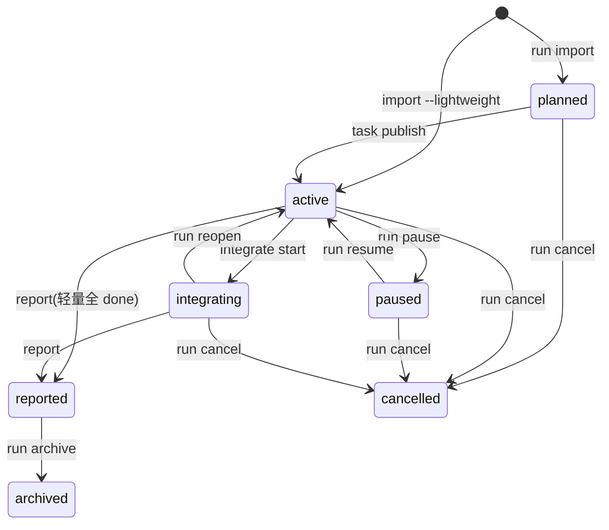
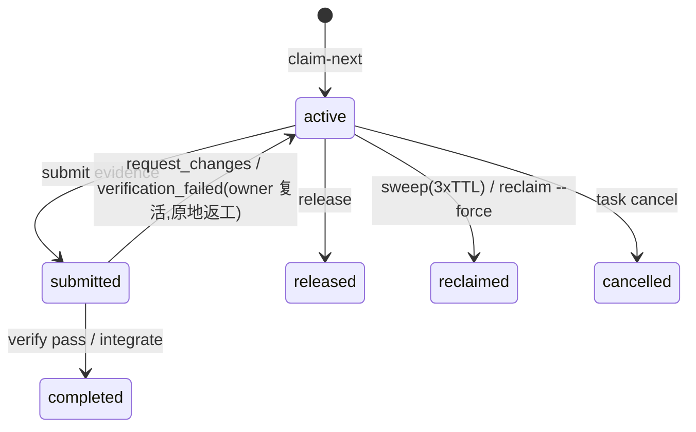

# 29. 架构速览 · 用户旅程 × 状态机 · 实测快速上手

> 日期:2026-07-18(v0.2.1)
> 目标:给新读者(人或 AI 窗口)一页入门——三条地基、领域关系、旅程怎么落在状态机上、一份**实测过**的端到端用例。图基于 [11](11-4-plus-1-architecture-view.md)(mermaid,GitHub 原生渲染);细节以 [15](15-run-task-state-machine-and-lifecycle.md)/[17](17-cli-mcp-contract-and-error-model.md) 为准。

---

## 1. 三条地基(全系统挂在这上面)

1. **它是 CLI,不是服务器。** 无常驻进程;每条 `sigmarun` 命令 = 开 `.team/` 文件柜 → 读或写 → 退出。状态全在磁盘,运行态永远在 AI 窗口那边。
2. **它不思考。** 拆任务、写码、判断价值都是 AI 窗口干的;网关只做记录 · 分发 · 锁 · 校验 · 审计(无 LLM)。
3. **真相是事件账本。** `events.jsonl` 是 append-only 唯一权威;`task.json`/claims/progress 都是**派生缓存**(INV-005/006)。`EVENT_STATUS`(`core/state-machine.ts`)把"事件 → 蕴含状态"定成单源表,repair 据此把一切滚回账本。

八包依赖栈:`storage → core → dispatch · context → watch · audit · adapters → cli`(cli 门面,storage 地基;记忆属 context)。

---

## 2. 领域关系(run/task 怎么挂)

**Project 装多个 Run,Run 装多个 Task;Task 是万物挂靠点。**

| 关系 | 基数 | 讲清楚 |
|---|---|---|
| Project → Run | 1→多 | 一个仓库多次协作运行,各有 `RUN-ID` |
| Run → Task | 1→多 | 任务清单在 `team-task-list.json`,不在聊天里 |
| Task → TaskClaim | 0..1(活) | **同一任务同时最多一个活 claim**(INV-003,防撞车之根);claim 属于一个 AgentSession |
| Task → PathClaim | 1→多 | 任务**在途期间**占用要改的路径;`block`(默认)下同一路径**同时**最多一个活占用(INV-004)。**多个任务改同一文件完全正常——是被串行化,不是被禁止**:A integrate 成功(轻量:done)释放占用,B 才领得动。"同时最多一个",不是"永远只属于一个"。submit 时仍持有(docs/15 §4.2),`path_release_on_submit` 策略可提前 |
| Task → Worktree | 0..1 | 每任务可有隔离 worktree;claim-next 会给 `worktree.recommend`(`local`/`isolated`)建议 |
| Task → Evidence/Review/Verification | 门链 | submitted 必有 evidence(INV-010);owner 不能自评(INV-008)、不能自标 done(INV-007) |
| Task ↔ Task | DAG | `depends_on` 依赖 + handoff 顺依赖传播(hydrate 自动读上游交接);无环(INV-013) |
| Run 级挂件 | — | 消息池 / 记忆(L1/L2/L4,见 [25](25-project-memory-and-knowledge-promotion.md))/ 事件账本 / 进度快照 / 任务图 |

---

## 3. 四台状态机(词表单源 `core/state-machine.ts`)

Task 层 13 态见 [11 §3.4](11-4-plus-1-architecture-view.md);这里补 run 层与 claim 层。

**Run(7 态)——一次运行的大阶段:**



**Task-claim(6 态)——"谁租着这个任务":**



**互锁:** Task `claimed/working` ⟺ claim `active`;Task `submitted` ⟺ claim `submitted`(路径仍占);返工两层同步回退(claim 复活 + task→changes_requested);掉线 reclaim 两层同步(claim→reclaimed + task→ready,worktree 转 abandoned 不删、`previous_attempts` 留接管线索)。Gate-claim(3 态)管 review/verify 租约。

---

## 4. 用户旅程 × 状态(你打什么 → 状态机走哪步)

用户面三件套:`/team-plan`(建需求)· `/team-do`(做需求)· `/team-status`(看进度)。AI 背后调 gateway:

| 你做什么 | 你打什么 | AI 背后调 | task 状态 |
|---|---|---|---|
| ① 装 | `init` + `adapter install --tool=all` | — | — |
| ② 拆需求 | `/team-plan <目标>` | run import (+publish) | `[*]→draft→ready` |
| ③ 开始做 | `/team-do <RUN>` | claim-next | `ready→claimed` |
| ④a 轻量做完 | (干活;按 `worktree.recommend` 选本地/隔离) | done | `claimed→done` ✅ |
| ④b full 流水线 | (同上,自动转 dispatch 流) | worktree→submit→review→verify→integrate | `claimed→working→submitted→reviewing→approved→verified→integrated→done` |
| ⑤ 结束 | `/team-status` | report→archive | run→reported;**交还 git:commit/PR** |

管理旁路:`task cancel`(非终态→cancelled)· `run cancel`(**红线:先预览,`--yes` 才执行**)· `block/release/unblock` · `run pause/resume` · 掉线=租约 3×TTL 惰性 sweep 回收(人可 `reclaim --force --agent=user` 即时收)· 返工=`resume`(changes_requested→working)。

---

## 5. 实测快速上手(轻量端到端;每步期望均真机核过)

```bash
npm i -g sigmarun@next        # 或本地:npm i -g ./release/sigmarun-<ver>.tgz
mkdir demo && cd demo && git init && git commit --allow-empty -m init
```

| 步 | 命令 | 实测期望 |
|---|---|---|
| 1 | `sigmarun init` | 建 `.team/`;next_actions 串 doctor→adapter→/team-plan |
| 2 | `sigmarun doctor` | 10/10,exit 0 |
| 3 | `sigmarun adapter install --tool=all` | Claude→`.claude/commands`(13 个)+ **Codex→`.agents/skills`**(12 个);`--tool=claude-code`/`codex`/逗号列表亦可 |
| 4 | `sigmarun run import plan.json --lightweight --json` | RUN-0001,run `active`,任务 `ready` |
| 5 | `sigmarun agent register RUN-0001 --tool=claude-code --json` | 返回 `AGENT-claude-code-001`(**后续用返回的 id,不是 label**) |
| 6 | `sigmarun claim-next RUN-0001 --agent=<AID> --json` | TASK-0001;`data.worktree.recommend="local"`(单人轻量→本地做;并行时变 `isolated`) |
| 7 | (本地 checkout 干活) | — |
| 8 | `sigmarun done RUN-0001 TASK-0001 --agent=<AID> --json` | task→done |
| 9 | `sigmarun status RUN-0001` | 进度 100% |
| 10 | `sigmarun report RUN-0001` | run→reported,生成 `report.md`,提示交还 git |

`plan.json`(轻量最小 payload;字段规格见 [09](09-plan-payload-contract.md)):

```json
{ "schema_version":"team.plan_payload.v1",
  "source":{"tool":"claude-code","command":"/team-plan","prompt":"demo","agent_id":"AGENT-claude-001"},
  "run":{"title":"demo","mode":"feature","goal":"试跑一遍"},
  "plan":{"summary":"一个小任务"},
  "tasks":[{"client_task_key":"t1","title":"改个小东西","type":"implementation",
            "objective":"随便改点","acceptance":["能跑"],"paths":{"allow":["**"]}}] }
```

**附加用例(均实测):**
- **worktree 建议**:同一 run 并行领第二个任务 → 第二次 `recommend="isolated"`。
- **cancel 红线**:`run cancel <RUN>` 不加 `--yes` → 只返回预览(`would_cancel_tasks` + 确认提示,run 仍 active);`--yes` 才真删。
- **踩坑注意**:相同 plan.json 导两次 → `duplicate_payload`(指纹去重);测多 run 换 goal 或 `--force`。
- **真实体验版**:装完 adapter 后直接在 Claude Code / Codex 里 `/team-plan <目标>` → `/team-do` → `/team-status`,AI 驱动全程(上表是"看机制"的手动版)。
